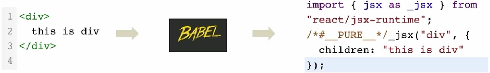
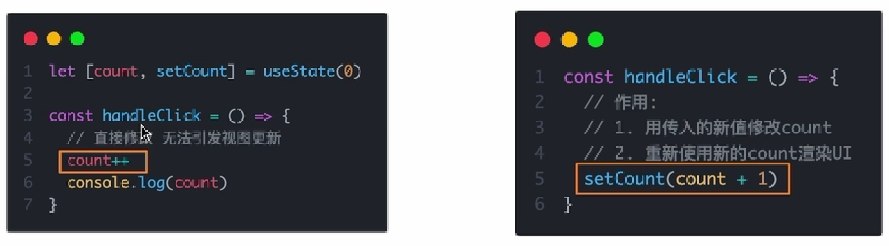
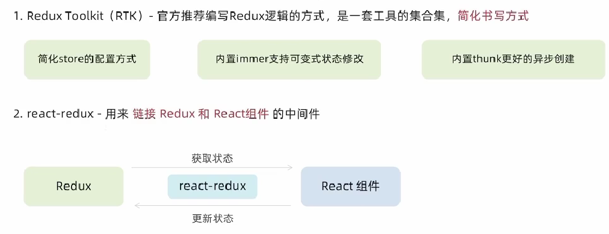

# React

**作者：YanShijie**

---

## 1. React 简介

**（1）React 是什么？**

​	React 由Meta公司研发，是一个用于构建Web和原生交互界面的库。

**（2）React 优势**

​	**相较于传统的基于DOM开发的优势：**组件化的开发模式、不错的性能

​	**相较于其他前端框架的优势：**丰富的生态、跨平台支持

**（3）市场情况**

​	全球最流行、大厂必备

---

## 2. React 开发环境搭建

### 2.1 `create-react-app`快速搭建开发环境

​	`create-react-app` 是一个快速创建 **React开发环境的工具**，底层由Webpack构建，**封装了配置细节**，开箱即用。

**执行命令：**

```cmd
npx create-react-app [项目名]
```

> 命令解释：
>
> - **npx：** Node.js 工具命令，查找并执行后续的命令包
> - **create-react-app：**核心包（固定写法），用于创建React项目

**项目启动命令：**

```cmd
npm run(可省略) start
```

**项目目录文件：**

```cmd
src
	App.js # 项目的根组件
	index.js # 整个项目的入口 从这里开始运行
```

---

## 3. JSX基础

### 3.1 概念和本质

​	**1. 概念：**JSX是JavaScript和XML（HTML）的缩写，表示在JS代码中编写HTML模板的结构，它是React中编写UI模板的方式。

​	**2. 优势：**HTML的声明式模板写法、JS可编程能力。

​	**3. 本质：**JXS并不是表中的JS语法，它式**JS语法扩展**，浏览器本身不能识别，它需要通过**解析工具做解析**之后才能在浏览器中运行。



> **Babel网址：**https://babeljs.io

### 3.2 高频场景

​	在JSX中可以通过 **大括号语法{}** 识别JavaScript中的表达式，比如常见的变量、函数调用、方法调用等等。

```jsx
// 项目的根组件
// App -> index.js -> public/index.html(root)

const count = 100

const getName = () => {
    return 'jack'
}

function App() {
    return (
        <div className="App">
            This is App!
            {/*{1. 使用引号传递字符串}*/}
            {'this is message'}
            {/*{2. 识别js变量}*/}
            {count}
            {/*3. 函数调用*/}
            {getName()}
            {/*4. 方法调用共*/}
            {new Date().getDate()}
            {/*5. 使用Js对象*/}
            <div style={{color: 'red'}}> this is red! </div>
        </div>
    );
}

export default App;
```

### 3.3 实现列表渲染

1. **语法：**在JSX中可以使用原生JS中的map方法便利渲染列表

```jsx
const list = [
    {id: '1', name: 'Vue'},
    {id: '2', name: 'React'},
    {id: '3', name: 'Angular'},
]

function App() {
    return (
        <div className="App">
            this is APP
            {/*渲染列表*/}
            {/*map 循环哪个结构 return结构*/}
            {/*注意事项：加上一个独一无二的key 字符串或者式number id*/}
            {/*key的作用：React框架内部使用的一个东西，用来提升列表的更新性能*/}
            <ul>
                {list.map(item => <li key={item.id}>{item.name}</li>)}
            </ul>
        </div>
    );
}

export default App;
```

### 3.4 基础条件渲染

1. **语法：**可以通过**逻辑与运算&&、三元表达式（？：）**实现基础条件渲染

```jsx
const isLogin = false

function App() {
    return (
        <div className="App">
            {/*逻辑与 &&*/}
            {isLogin && <span>this is span </span>}
            {/*三元运算*/}
            {isLogin ? <span>this is span </span> : <span>loading...</span>}
        </div>
    );
}

export default App;

```

### 3.5 复杂条件渲染

1. **解决方案：**自定义函数 + if 判断语句

```jsx
const articleType = 2

// 定义核心函数（根据文章类型返回不同的JSX模板）
const getArticleType = () => {
    if (articleType === 0) {
        return <div>我是无图文章</div>
    } else if (articleType === 1) {
        return <div>我是单图模式</div>
    } else {
        return <div>我是多图模式</div>
    }
}

function App() {
    return (
        <div className="App">
            {getArticleType()}
        </div>
    );
}

export default App;
```

---

## 4. React 基础事件绑定

1. **语法**：**on + 事件名称 = {事件处理程序}**，整体上遵循驼峰命名法。

```jsx
// 基础使用
// const handleClick = () => {
//     console.log('click');
// }

// 事件参数e
// const handleClick = (e) => {
//     console.log('button 被点击了！', e);
// }

// 传递自定义参数
// const handleClick = (name) => {
//     console.log('button 被点击了！', name);
// }

// 既要传递自定义参数，而且还要事件对象e
const handleClick = (name, e) => {
    console.log('button 被点击了！', name, e);
}
function App() {
    return (
        <div className="App">
            <button onClick={(e) => handleClick('jack', e)}>click me!</button>
        </div>
    );
}

export default App;
```

---

## 5. React 组件基础使用

1. **概念：**一个组件就是用户界面的一部分，它可以由自己的逻辑和外观，组件之间**可以相互嵌套，也可以复用多次。**


2. **语法：**在React中一个组件就是一个**首字母大写的函数**，内部存放了组件的逻辑和视图UI，渲染组件只需要把组件当成**标签书写即可**。

```js
// 1. 定义组件
const Button = () => {
    // 业务逻辑组件逻辑
    return <button>click me !</button>
}

function App() {
    return (
        <div className="App">
            {/*2. 使用组件（渲染组件）*/}
            {/*自闭和*/}
            <Button />
            {/*成对标签*/}
            <Button></Button>
        </div>
    );
}

export default App;
```

---

## 6. useState 基础使用

### 6.1 基础使用

1. **概念：**useState 是一个 React Hook 函数，它运行我们向组件添加一个**状态变量**，从而控制影响组件渲染结果。

2. **本质：**和普通Js变量不同的是，状态变量一旦发生变化组件的视图UI也会跟着变化（**数据驱动视图**）

3. **语法：**


4. **案例（计数器）**

```jsx
import {useState} from "react";

function App() {
    // 1.调用useState添加一个状态变量
    const [count, setCount] = useState(0)

    // 2. 点击事件回调
    const handleClick = () => {
        // 作用
        // 1：用传入的新值修改count
        // 2.重新使用新的count渲染UI
        setCount(count + 1)
    }
    return (
        <div className="App">
            <button onClick={handleClick}>{count}</button>
        </div>
    );
}

export default App;
```

### 6.2 修改状态规则

1. **状态不可变：**在React中，状态被认为是只读的，我们应该始终**替换它而不是修改它**，直接修改不能引发视图更新。



2. **修改对象状态：**对于对象类型的状态变量，应该始终传给set方法一个**全新的对象**来进行修改。


3. **示例代码：**

```jsx
import {useState} from "react";

function App() {
    // 1.调用useState添加一个状态变量
    const [count, setCount] = useState(0)

    // 2. 点击事件回调
    const handleClick = () => {
        setCount(count + 1);
    }

    // 修改对象状态
    const [form, setForm] = useState({name:'tom'})

    const changeForm = () => {
        // 错误写法
        // form.name = 'jack'
        // 正确写法
        setForm({
            ...form,
            name:'jack'
        })
    }
    return (
        <div className="App">
            <button onClick={handleClick}>{count}</button>
            <button onClick={changeForm}>{form.name}</button>
        </div>
    );
}

export default App;
```

---

## 7. 基础样式控制

1. 样式控制方式

   - 行内样式（不推荐）

   - class 类名控制 `className`

2. 代码示例

```jsx
// 导入样式
import './index.css'

const style = {
    color: 'red',
    fontSize: '50px',
}

function App() {
    return (
        <div className="App">
           {/*行内样式控制两种方式*/}
            <span style={{color:'red', fontSize:'50px'}}>This is span</span>
            <br/>
            <span style={style}>This is span</span>
            {/*通过class类名控制*/}
            <span className="foo">This is class foo</span>
        </div>
    );
}

export default App;
```

```css
<!-- index.css -->
.foo {
    color: blue;
    font-size: large;
}
```

---

## 8. classnames 优化类名控制

1. **作用：**是一个简单的JS库，可以非常方便的**通过条件动态控制clss类名的显示**。
2. **安装:**

```cmd
 npm install classnames
```

3. **优势：**

- 基础

```jsx
className={`nav-item ${type === item.type && 'active'}`}
```

- 改进

```jsx
className={classNames('nav-item', {active: type === item.type})}
```

---

## 9. 表单受控绑定

1. **概念：**使用React组件的状态控制表单状态
2. **示例：**

```jsx
// 受控绑定表单
import {useState} from "react";

// 1. 声明一个react状态 -useState

// 2. 核心绑定流程
// （1）通过value属性绑定react状态
// （2）绑定onChange事件 通过事件参数e拿到输入框最新的值 反向修改到react状态
function App() {
    const [value, setValue] = useState('');
    return (
        <div className="App">
            <input
                value={value}
                onChange={(e) => setValue(e.target.value)}
                type="text"
            >
            </input>
        </div>
    );
}
export default App;
```

---

## 10. React 中获取DOM

1. **用法：**

   - 使用useRef创建ref对象，并与JSX绑定。

   - 在DOM可用时，通过inputRef.current拿到DOM对象。 

2. **示例：**

```jsx
// React中获取DOM

// 1. useRef生成ref对象 绑定到dom标签上

// 2. dom可用时，ref.current获取dom
// 渲染完毕（dom生成）之后才可用
import {useRef} from "react";

function App() {
    const inputRef = useRef(null)
    const showDom = () => {
        // 普通对象的字符串形式
        console.log(inputRef.current)
        // 对象的可枚举属性形式
        console.dir(inputRef.current)
    }
    return (
        <div className="App">
            <input type="text" ref={inputRef} />
            <button onClick={showDom}>获取dom</button>
        </div>
    );
}

export default App;
```

---

## 11. 组件通信

### 11.1 父传子

1. **基础实现**

```jsx
// 父传子
function Son(props) {
    // props：对象里面包含了父组件传递过来的所有数据
    console.log(props)
    return <div>this is son {props.name}</div>
}

function App() {
    const name = "this is app name"
    return (
        <div className="App">
            <Son name={name}/>
        </div>
    );
}

export default App;
```

2. **props 说明**

- props可传递任意数据
- props是只读对象：子组件**只能读props中的数据**，不能直接进行修改，父组件的数据只能由父组件修改。

3. **children 说明**

```jsx
function Son(props) {
    console.log(props)
    return <div>this is son，{props.children}</div>
}

function App() {
    const name = "this is app name"
    return (
        <div className="App">
            <Son>
                <span>this is span</span>
            </Son>
        </div>
    );
}

export default App;
```

### 11.2 子传父

> 在子组件中调用父组件中的函数并传递参数

```jsx
import {useState} from "react";

function Son({onGetSonMsg}) {
    const sonMsg = 'this is son msg'
    return (
        <div>
            this is son
            <button onClick={() => onGetSonMsg(sonMsg)}>sendMsg</button>
        </div>
    )
}

function App() {
    const [msg, setMsg] = useState('')
    const getMsg = (msg) => {
        console.log(msg)
        setMsg(msg)
    }
    return (
        <div className="App">
            this is App,{msg}
            <Son onGetSonMsg = {getMsg} />
        </div>
    );
}

export default App;
```

### 11.3 兄弟组件通信

> 借助“状态提升”机制，通过父组件进行兄弟组件之间的数据传递

```jsx
import {useState} from "react";

// 1. 通过子传父 A -> APP
// 2. 通过父传子 App -> B
function A({onGetAName}) {

    const name = 'this is A name'

    return (
        <div>
            this is A component,
            <button onClick={() => onGetAName(name)}>send</button>
        </div>
    )
}

function B(props) {
    return (
        <div>
            this is B component,{props.Aname}
        </div>
    )
}

function App() {

    const [name, setName] = useState()


    const getAName = (name) => {
        console.log(name)
        setName(name)
    }

    return (
        <div className="App">
            this is App
            <A onGetAName={getAName}/>
            <B Aname={name}/>
        </div>
    );
}

export default App;
```

### 11.4 context 机制跨层传递数据

1. **示例：**

```jsx
// APP -> A -> B
// 1. createContext方法创建一个上下文对象
// 2. 在顶层组件 通过Provider组件提供数据
// 3. 在底层组件 通过useContext钩子函数使用数据

import {createContext, useContext} from "react";

const MsgContext = createContext(undefined, undefined)

function A() {
    const name = 'this is A name'
    return (
        <div>
            this is A component
            <B/>
        </div>
    )
}

function B(props) {
    const msg = useContext(MsgContext)
    return (
        <div>
            this is B component,{msg}
        </div>
    )
}

function App() {

    const msg = 'this is app msg'
    return (
        <div className="App">
            <MsgContext.Provider value={msg}>
                this is App
                <A/>
            </MsgContext.Provider>
        </div>
    );
}

export default App;
```

## 12. useEffect函数

> useEffect是一个React Hook函数，用于在React组件中创建不是由事件引起而是**由渲染本身引起的操作**，比如发送AJAX请求，更改DOM等等。

1. **基础使用**

```jsx
import {useEffect, useState} from "react";

const URL = 'http://geek.itheima.net/v1_0/channels';

function App() {
    const [list, setList] = useState([])
    useEffect(() => {
        // 额外的操作，获取频道列表
        const getList = async () => {
            const res = await fetch(URL)
            const jsonRes = await res.json()
            setList(jsonRes.data.channels)
        }
        getList()
    }, []);
    return (
        <div className="App">
            this is APP
            <ul>
                {list.map(item => <li key={item.id}>{item.name}</li>)}
            </ul>
        </div>
    );
}
export default App;
```

2. **useEffect 依赖项参数说明**

| 依赖项         | 副作用函数执行时机                  |
| -------------- | ----------------------------------- |
| 没有依赖项     | 组件初始渲染 + 组件更新时执行       |
| 空数组依赖     | 只在初始渲染时执行一次              |
| 添加特定依赖项 | 组件初始渲染 + 特性依赖项变化时执行 |

- 没有依赖项

```jsx
import {useEffect, useState} from "react";


function App() {
    // 1. 没有依赖项 初始 + 组件更新
    const [count, setCount] = useState(0)

    useEffect(() => {
        console.log('副作用函数执行了')
    });
    return (
        <div className="App">
            this is APP
            <button onClick={() => setCount(count + 1)}>+{count}</button>
        </div>
    );
}

export default App;
```

- 空数组依赖项

```jsx
import {useEffect, useState} from "react";


function App() {
    // 2. 空数组依赖 初始
    const [count, setCount] = useState(0)

    useEffect(() => {
        console.log('副作用函数执行了')
    }, []);
    return (
        <div className="App">
            this is APP
            <button onClick={() => setCount(count + 1)}>+{count}</button>
        </div>
    );
}

export default App;
```

- 特定依赖项

```jsx
import {useEffect, useState} from "react";


function App() {
    // 3. 特定依赖项 初始 + 依赖项变化
    const [count, setCount] = useState(0)

    useEffect(() => {
        console.log('副作用函数执行了')
    }, [count]);
    return (
        <div className="App">
            this is APP
            <button onClick={() => setCount(count + 1)}>+{count}</button>
        </div>
    );
}

export default App;
```

3. **清除副作用**

> 在useEffect中编写的**由渲染本身引起的对外接组件外部的操作**，社区也经常把它叫做**副作用操作**，比如在useEffect中开启了一个定时器，我们想在组件卸载时把这个定时器再清理掉，这个过程就是清理副作用。
>
> 最常见的执行时期就是组件**卸载时自动执行**。

```jsx
import {useEffect, useState} from "react";

const Son = () => {
    // 1. 渲染时开启一个定时器
    useEffect(() => {
        // 定时器
        const timer = setInterval(() => {
            console.log('定时器执行中')
        }, 1000)

        // 清除副作用
        return () => {
            clearInterval(timer)
        }
    }, []);
    return <div>this is son</div>
}

function App() {
    const [show, setShow] = useState(true)

    return (
        <div className="App">
            {show && <Son/>}
            <button onClick={() => setShow(false)}>卸载Son组件</button>
        </div>
    );
}

export default App;
```

---

## 13. 自定义hook函数

> 自定义Hook是以**use打头的函数**，通过自定义Hook函数可以用来实现**逻辑的封装和复用**

```jsx
// 封装自定义Hook
// 问题：布尔切换的逻辑 当前组件耦合在一起 不方便复用
// 解决思路：自定义Hooks

import {useState} from "react";

const useToggle = () => {
    // 可复用逻辑代码
    const [value, setValue] = useState(true)
    const toggle = () => setValue(!value)
    // 哪些状态和回调函数需要在其他组件中使用 return
    return {
        value,
        toggle
    }
}
// 封装自定义Hook的通用思路
// 1. 声明一个以use大头的函数
// 2. 在函数体内封装可复用的逻辑(只要是可复用的逻辑)
// 3. 把组件中用到的状态或者回调return()出去
// 4. 在哪个组件中要用到这个逻辑 就执行这个函数 解构出来状态和回调进行使用

function App() {

    const {value, toggle} = useToggle()

    return (
        <div className="App">
            {value && <div>this is div</div>}
            <button onClick={toggle}>toggle</button>
        </div>
    )
}

export default App;
```

---

## 14. ReactHooks 使用规则

1. 只能在组件中或者其他自定义Hook函数中调用

2. 只能在组件的顶层调用，不能嵌套在if、for、其他函数中。

---

## 15. Redux

### 15.1 基本介绍

> Redux是React中最常用的**集中状态管理工具**，类似于Vue中的Pinia，**可以独立于框架运行**。

1. **使用步骤**
   - 定义一个**`reducer`函数**（根据当前想要做返回的一个新状态）
   - 使用createStore方法传入reducer函数生成一个**store实例对象**。
   - 使用store实例的**`subscribe`方法**订阅数据的变化（数据一旦变化，就可以得到通知）
   - 使用store实例的**`dispatch`方法**提交**`action`对象**触发数据变化（告诉reducer你想怎么改数据）
   - 使用store实例的**`getState`方法**获取最新的状态数据更新到视图中。

### 15.2 React中使用

1. **安装插件**



```cmd
npm i @reduxjs/toolkit react-redux
```

2. **实现`counter`计数器**

```cmd
# 目录格式
|-src
|___store
|______moudles
|__________ ....js
|__________ counterStore.js
|______index.js	
|___index.js
```

- 编写`counterStore.js`

```jsx
import {createSlice} from "@reduxjs/toolkit"

const counterStore = createSlice({
    name: 'counter',
    // 初始化state
    initialState: {
        count: 0
    },
    // 编写修改数据的方法
    reducers: {
        increment: (state) => {
            state.value++
        },
        decrement: (state) => {
            state.value--
        }
    }
})

// 结构出来actionCreator函数
const {increment, decrement} = counterStore.actions
// 获取reducer
const reducer = counterStore.reducer

// 以按需导出方式导出actionCreator
export {increment, decrement}
// 以默认导出的方式导出reducer
export default reducer
```

- 编写`/store/index.js`

```jsx
import {configureStore} from "@reduxjs/toolkit"
// 导入子模块reducer
import counterReducer from './moudles/counterStore'

const store = configureStore({
    reducer:{
        counter:counterReducer
    }
})

export default store
```

- 注入store到`/index.js`

```jsx
import React from 'react';
import ReactDOM from 'react-dom/client';
import './index.css';
import App from './App';
import reportWebVitals from './reportWebVitals';

import store from './store'
import { Provider } from "react-redux";

const root = ReactDOM.createRoot(document.getElementById('root'))
root.render(
  <React.StrictMode>
      <Provider store={store}>
          <App />
      </Provider>
  </React.StrictMode>
);

// If you want to start measuring performance in your app, pass a function
// to log results (for example: reportWebVitals(console.log))
// or send to an analytics endpoint. Learn more: https://bit.ly/CRA-vitals
reportWebVitals();
```

- 组件中使用

```jsx
import {useSelector, useDispatch} from 'react-redux'

// 导入actionCreator
import {increment, decrement} from './store/moudles/counterStore'

function App() {
    const {count} = useSelector(state => state.counter)
    const dispatch = useDispatch()
    return (
        <div className="App">
            <button onClick={() => dispatch(decrement())}>-</button>
            {count}
            <button onClick={() => dispatch(increment())}>+</button>
        </div>
    );
}

export default App;
```

### 15.2 提交action传参

```jsx
import {createSlice} from "@reduxjs/toolkit"

const counterStore = createSlice({
    name: 'counter',
    // 初始化state
    initialState: {
        count: 0
    },
    // 编写修改数据的方法
    reducers: {
        increment: (state) => {
            state.count++
        },
        decrement: (state) => {
            state.count--
        }, // action传参
        addToNum: (state, action) => {
            state.count = action.payload
        }
    }
})

// 结构出来actionCreator函数
const {increment, decrement, addToNum} = counterStore.actions
// 获取reducer
const reducer = counterStore.reducer

// 以按需导出方式导出actionCreator
export {increment, decrement, addToNum}
// 以默认导出的方式导出reducer
export default reducer

```

- 使用方式

```jsx
import {useSelector, useDispatch} from 'react-redux'

// 导入actionCreator
import {increment, decrement, addToNum} from './store/moudles/counterStore'

function App() {
    const {count} = useSelector(state => state.counter)
    const dispatch = useDispatch()
    return (
        <div className="App">
            <button onClick={() => dispatch(decrement())}>-</button>
            {count}
            <button onClick={() => dispatch(increment())}>+</button>
            <button onClick={() => dispatch(addToNum(20))}>to 20</button>
            <button onClick={() => dispatch(addToNum(100))}>to 100</button>
        </div>
    );
}

export default App;
```

### 15.4 异步状态操作

```jsx
import {createSlice} from "@reduxjs/toolkit"
import axios from 'axios'

const channelStore = createSlice({
    name: 'channel',
    // 初始化state
    initialState: {
        channelList: []
    },
    // 编写修改数据的方法
    reducers: {
        setChannels: (state, action) => {
            state.channelList = action.payload
        }
    }
})

// 异步请求部分
const {setChannels} = channelStore.actions

const fetchChannelList = () => {
    return async (dispatch) => {
        const res = await axios.get("http://geek.itheima.net/v1_0/channels")
        dispatch(setChannels(res.data.data.channels))
    }
}

export {fetchChannelList}

const reducer = channelStore.reducer

export default reducer
```

```jsx
import {configureStore} from "@reduxjs/toolkit"
// 导入子模块reducer
import counterReducer from './moudles/channelStore'
import channelStore from "./moudles/channelStore";

// 创建store组合子模块
const store = configureStore({
    reducer: {
        counter: counterReducer,
        channel: channelStore
    }
})

export default store
```

```jsx
import {useSelector, useDispatch} from 'react-redux'

// 导入actionCreator
import {increment, decrement, addToNum} from './store/moudles/counterStore'
import {fetchChannelList} from './store/moudles/channelStore'
import {useEffect} from "react";

function App() {
    const {count} = useSelector(state => state.counter)
    const {channelList} = useSelector(state => state.channel)
    const dispatch = useDispatch()
    // 使用useEffect触发异步请求执行
    useEffect(() => {
        dispatch(fetchChannelList())
    })
    return (
        <div className="App">
            <button onClick={() => dispatch(decrement())}>-</button>
            {count}
            <button onClick={() => dispatch(increment())}>+</button>
            <button onClick={() => dispatch(addToNum(20))}>to 20</button>
            <button onClick={() => dispatch(addToNum(100))}>to 100</button>
            <ul>
                {channelList.map(item => <li key={item.id}>{item.name}</li>)}
            </ul>
        </div>
    );
}

export default App;
```

### 15.5 devtools使用

......

## 16. ReacrRouter

### 16.1 基本使用

1. 安装依赖

```cmd
npm i react-router-dom
```

