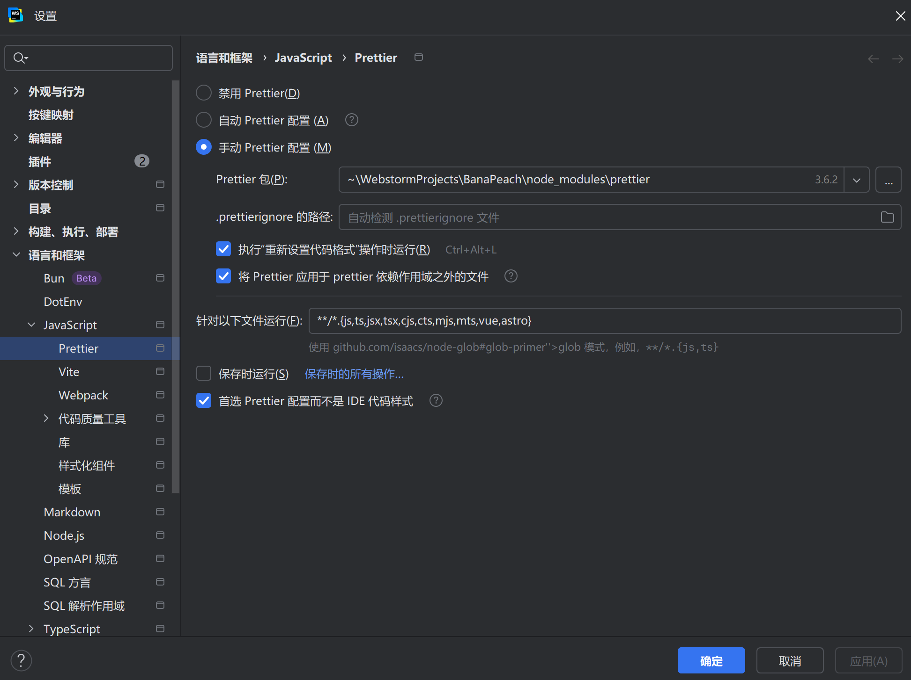

# Vue项目脚手架搭建

作者：YanShijie

---

## 一、Vite 构建项目

1. 命令行输入以下命令，并根据提示完成初始项目构建

```shell
npm create vite@latest
```

## 二、ESLint+Prettier 配置（实现代码规范化）

> https://juejin.cn/post/7402696141495779363**（参考网址）**

1. 安装`ESlint`到开发依赖中

```shell
pnpm add eslint@latest -D
```

```json
// 安装成功后在package.json会看到如下结果
"devDependencies": {
    ...
	"eslint": "^9.38.0",
    ...
},
```

2. 配置命令

> 我们在项目中安装`ESlint`，最终是会通过命令`pnpm lint` 或者`pnpm lint:fix` 去执行，这个命令会用项目中安装的`eslint`去检查指定目录/文件的代码，最终输出不符合规则的代码错误信息。所以接下来就是要配置命令让`ESlint`起作用。

```json
// 在package.json中配置如下命令
"scripts": {
    "lint": "eslint . --ext .js,.ts,.tsx,.vue",
    "lint:fix": "eslint . --ext .js,.ts,.tsx,.vue --fix"
    ...
  },
```

3. 创建`Eslint`配置文件

> 从`ESlint9.x`开始，建议直接用`eslint.config.js`（`ESNext`）或者`eslint.config.mjs`（`CommonJS`）命名的配置文件。

```js
// 因为我们的lint命令是没有指定目录或者指定文件类型的，默认eslit会去读取项目所有文件进行校验，所以我们需要在配置文件中使用
// ignores字段来告诉eslint排除哪些文件，这里也建议写在配置文件里面（更灵活），而不是写在命令那里（比较乱）。
export default [
    {
        ignores: [
            'node_modules',
            'dist',
            'public',
        ],
    },
]
```

4. 规则制定

> 到这里，规则那么多，我要一条一条全部写出来吗？我们可以用ESlint提供的现成的规则集。

```shell
pnpm add -D @eslint/js typescript typescript-eslint eslint-plugin-vue vue-eslint-parser eslint-config-prettier globals
```

> **@eslint/js：**ESLint 官方内置规则集的模块化版本（Flat Config 用的）。 提供 `js.configs.recommended` 等。ESLint v9 起官方推荐的入口。
>
> **typescript：**ESLint 的 TS 规则、类型检查都依赖它。
>
> **typescript-eslint：**让 ESLint 能“读懂” `.ts` / `.vue` 中的 TypeScript。
>
>  **eslint-plugin-vue：**Vue 官方维护的 ESLint 插件。提供大量 Vue 特有的规则
>
> **vue-eslint-parser：**负责“读懂” `.vue` 文件结构。
>
> **eslint-config-prettier ：**如果你用 Prettier 格式化代码，必须装它来避免冲突。
>
> **globals：**提供浏览器、Node.js、ES2023 等常见全局变量的集合。让 ESLint 知道哪些全局是合法的

```js
// eslint.config.js
import js from "@eslint/js";
import globals from "globals";
import tseslint from "typescript-eslint";
import vue from "eslint-plugin-vue";
import vueParser from "vue-eslint-parser";
import prettier from "eslint-config-prettier";

export default [
    // 忽略
    { ignores: ["dist", "node_modules", "coverage"] },

    // 官方 JS 推荐（对象 ✅）
    js.configs.recommended,

    // TypeScript 推荐（数组 -> 展开 ✅）
    ...tseslint.configs.recommended,

    // Vue Flat 推荐（数组 -> 展开 ✅）
    ...vue.configs["flat/recommended"],

    // .vue：外层用 vue-parser，script 内再交给 TS parser
    {
        files: ["**/*.vue"],
        languageOptions: {
            parser: vueParser,
            parserOptions: {
                parser: tseslint.parser,
                ecmaVersion: "latest",
                sourceType: "module",
                extraFileExtensions: [".vue"],
            },
            globals: { ...globals.browser, ...globals.node },
        },
    },

    // .ts / .tsx
    {
        files: ["**/*.{ts,tsx}"],
        languageOptions: {
            parser: tseslint.parser,
            ecmaVersion: "latest",
            sourceType: "module",
            globals: { ...globals.browser, ...globals.node },
        },
    },

    // 关掉和 Prettier 冲突的格式规则（对象 ✅）
    prettier,

    // 你的个性化规则
    {
        files: ["**/*.{ts,tsx,vue,js,jsx}"],
        rules: {
            "no-console": "off",
            "no-unused-vars": "off",
            "@typescript-eslint/no-unused-vars": [
                "warn",
                { argsIgnorePattern: "^_", varsIgnorePattern: "^_" },
            ],
            "vue/multi-word-component-names": "off",
        },
    },
];

```

5. 安装`Prettier`

```shell
pnpm add -D prettier eslint-config-prettier
```

6. 创建`Prettier`规则

> 创建`prettierrc.json`文件，输入以下规则参考自`art-design-pro`。

```js
{
  "printWidth": 100,
  "tabWidth": 2,
  "useTabs": false,
  "semi": false,
  "vueIndentScriptAndStyle": true,
  "singleQuote": true,
  "quoteProps": "as-needed",
  "bracketSpacing": true,
  "trailingComma": "none",
  "bracketSameLine": false,
  "jsxSingleQuote": false,
  "arrowParens": "always",
  "insertPragma": false,
  "requirePragma": false,
  "proseWrap": "never",
  "htmlWhitespaceSensitivity": "strict",
  "endOfLine": "auto",
  "rangeStart": 0
}
```

7. 确保`Eslink`引入`Prettier`

> eslink.config.js中存在以下配置

```js
import prettier from "eslint-config-prettier";

export default [
  // ...其他配置
  prettier, // 放在最后：关闭 ESLint 的格式化规则
];
```

8. 在`IDE`中启动`Prettier`格式化



## 三、路径别名 配置

| 阶段                        | 谁在起作用                                   | 文件             | 作用                                                         |
| --------------------------- | -------------------------------------------- | ---------------- | ------------------------------------------------------------ |
| 👨‍💻 **开发/运行时**          | **Vite**                                     | `vite.config.ts` | 当你写 `import xx from "@/api/user"` 时，Vite 知道 `@` 对应哪个物理目录（在开发服务器上解析） |
| 🧠 **类型检查 / 自动补全**   | **TypeScript + 编辑器（VSCode / WebStorm）** | `tsconfig.json`  | 让 TypeScript 和编辑器在静态分析时知道 `@` 是 `src/`，不然它会报找不到模块 |
| 📦 **构建时（Rollup 打包）** | **Vite + Rollup**                            | `vite.config.ts` | 打包时替换别名路径，确保输出文件路径正确                     |

1. 打开 `vite.config.ts`，加入以下内容：

```ts
...
import path from "node:path";

export default defineConfig({
  ...
  resolve: {
    alias: {
      "@": path.resolve(__dirname, "src"), // @ 指向 src 目录
    },
  },
})
```

2. 配置`tsconfig.json`

> 为了让编辑器（和编译器）也识别别名，你还需要在 tsconfig.json 里同步配置：

```json
{
  ...
  "compilerOptions": {
    "baseUrl": ".",
    "paths": {
      "@/*": [
        "src/*"
      ]
    }
  }
}	
```

## 四、环境变量 配置

1. 创建环境变量文件

| 文件名             | 适用环境 | 加载条件           |
| ------------------ | -------- | ------------------ |
| `.env`             | 所有环境 | 总是会加载         |
| `.env.development` | 开发环境 | `vite dev`         |
| `.env.production`  | 生产环境 | `vite build`       |
| `.env.test`        | 测试环境 | `vite --mode test` |

2. 注意事项

> ⚠️ 所有自定义环境变量**必须以 `VITE_` 开头**！ 否则不会被注入到你的应用中。

3. 使用方式`import.meta.env.xxx`

```ts
// 举例
const baseURL = import.meta.env.VITE_API_BASE_URL;
```

## 五、Vue-Bits 动画库使用指南（可选）

> https://juejin.cn/post/7534969549495599146**（参考网址）**
>
> https://blog.csdn.net/qq_36034945/article/details/149838374**（参考网址）**

...

## 六、集成 Unocss (可选)

> **官网：**https://unocss.dev/integrations/vite

1. 安装依赖

```shell
pnpm add -D unocss
```

2. 安装插件

```ts
import UnoCSS from 'unocss/vite'
import { defineConfig } from 'vite'

export default defineConfig({
  plugins: [
    UnoCSS(),
  ],
})
```

3. 创建`uno.config.ts`文件

```ts
import { defineConfig } from 'unocss'

export default defineConfig({
  // ...UnoCSS options
})
```

4. 添加`virtual:uno.css`到您的主条目

```ts
// main.ts 文件中添加
import 'virtual:uno.css'
```

## 七、集成Element Plus

> **官网：**https://element-plus.org/zh-CN

1. ​		安装依赖

```shell
pnpm install element-plus
```

2. 安装按需导入依赖

```shell
pnpm install -D unplugin-vue-components unplugin-auto-import
```

3. 配置按需导入插件

```ts
import { defineConfig } from 'vite'
import AutoImport from 'unplugin-auto-import/vite'
import Components from 'unplugin-vue-components/vite'
import { ElementPlusResolver } from 'unplugin-vue-components/resolvers'

export default defineConfig({
  // ...
  plugins: [
    // ...
    AutoImport({
      resolvers: [ElementPlusResolver()],
    }),
    Components({
      resolvers: [ElementPlusResolver()],
    }),
  ],
})
```

## 八、集成 Router 路由

1. 安装依赖

```shell
pnpm add vue-router@4
```

2. 创建路由`router/index.ts`

```ts
import { createRouter, createWebHistory } from 'vue-router';
import Home from '@/views/home/Home.vue'

const router = createRouter({
  history: createWebHistory(import.meta.env.BASE_URL),
  routes: [
    {
      path: '/',
      name: 'home',
      component: Home
    }
  ]
});

export default router;
```

3. 在`main.ts`中配置路由

```ts
import { createApp } from 'vue'
import App from './App.vue'
//...
// 导入路由
import router from './router';

const app = createApp(App)
app.use(router)
ap	p.mount('#app')
```

