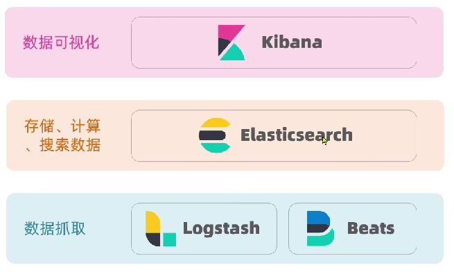
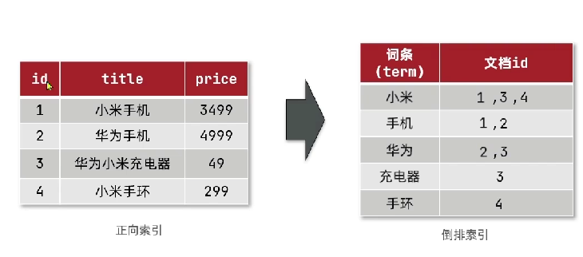
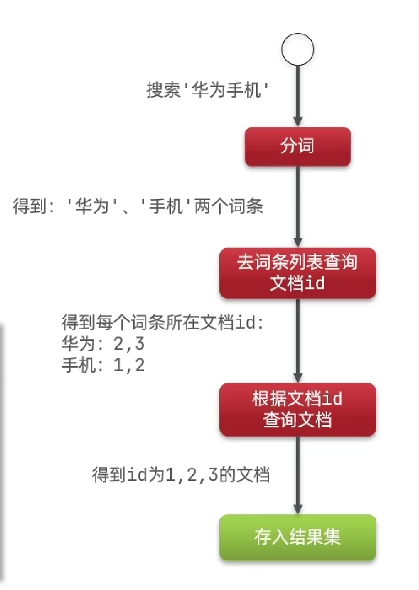

# Elasticsearch 学习笔记

作者：Shijie Yan

---

## 1. ES介绍

### 1.1 elasticsearch介绍

1. elasticsearch是一款非常强大的开源搜索引擎，可以帮助我们从海量数据中快速找到需要的内容。 

2. elasticsearch结合kibana、logstash、Beats，也就是elastic stack(ELK)。被广泛应用在日志数据分析、实时监控等领域。

### 1.2 倒排索引

1. **相关概念**
   - 文档（document）：每条数据就是一个文档。
   - 词条（term）：文档按照语义分成的词语。
2. **正向索引**
   - 基于文档id创建索引。查询词条时必须先找到文档，而后判断是否包含词条。（数据库索引）

3. **倒排索引**
   - 对文档进行分词，对词条创建索引，并记录词条所在文档的信息。查询时先根据词条查询到文档id，而后获取到文档。

	
	

### 1.3 MySQL对比

