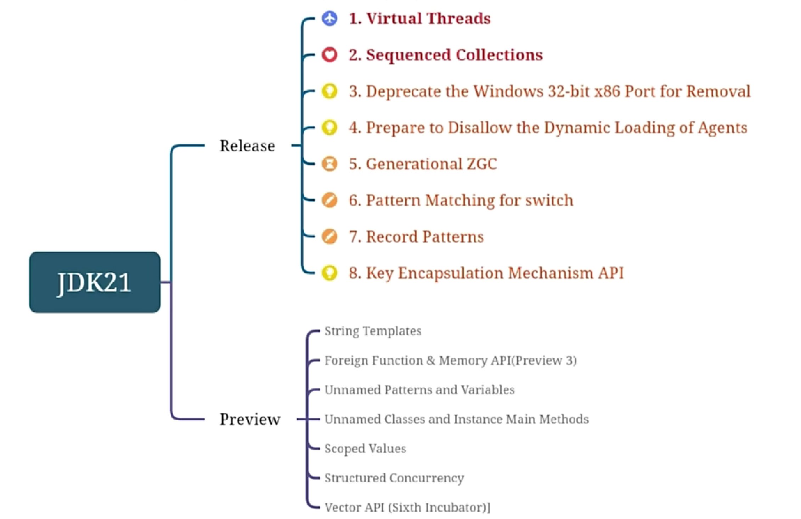
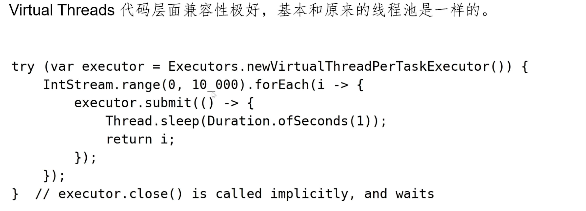
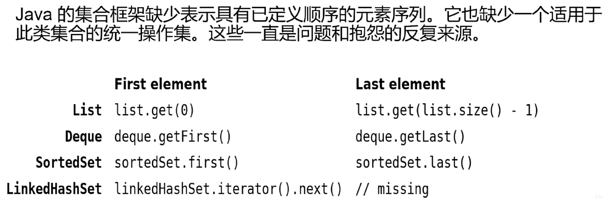

# JDK21新特性

---

## 一、新特性（列举）

## 二、Virtual Threads（虚拟线程）

> Virtual Threads 提供了一个更高效、更轻量级的线程模型。

1. 原理

2. 优点

3. 代码

## 二、Sequedced Collections（有序集合）

1. 原理

2. 代码

## 三、JVM废弃32位系统的支持

## 四、准备不允许动态加载代理

## 五、ZGC的分代收集

