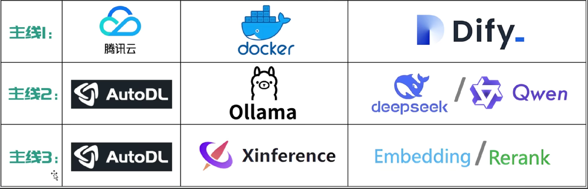
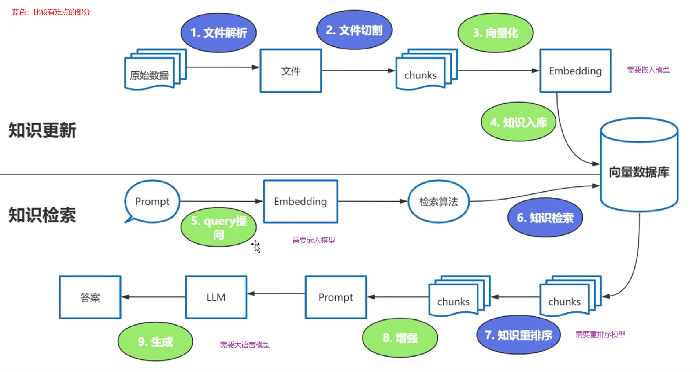

# 企业级大模型部署实战

> 笔记案例



## 一、为什么选哟企业级大模型的部署


## 二、企业级大模型的应用场景

> 背景
>
> - 大模型的知识冻结（知识截止日期）
> - 大模型幻觉（不懂装懂，胡说）

### 场景一：基于RAG架构的开发

> RAG：检索增强生成




### 场景二：基于Agent架构的开发

> 充分利用LLM的推理决策能力，通过增加规划、记忆和工具调用的能力，构造一个能够独立思考，逐步完成给定目标的智能体。
>
> 核心要素：
>
> - LLM（大语言模型）
> - 记忆（Memory）：短期记忆、长期记忆（向量数据库...）
> - 工具使用（Tool Ues）：调用外部工具（API，数据库...）
> - 规划决策：通过任务分解、反省与自省框架实现复杂任务处理（利用思维链Chain of Thought...）
> - 行动


## 三、主线一：Dify平台私有化部署

### 1、下载源码

> 在 /opt 下创建一个dify目录

```bash
cd /opt
sudo mkdir dify
// 从gitee克隆
git clone https://gitee.com/dify_ai/dify.git
```

### 2、使用docker启动dify

```bash
cd /opt/dify/docker
docker compose up -d
```

### 3、访问

```shell
http://公网IP:80
```

## 三、主线二：大语言模型部署

1. ollama 下载

```
https://ollama.com/
```

2. 下载模型在官网（举例）

```cmd
ollama run deepseek-r1:1.5b
```

## 四、主线三：嵌入和重排序模型部署

1. Xinference 的部署（下载）

```cmd
python -m pip install --upgrade pip

# 安装pytorch
pip3 install --pre torch torchvision torchaudio --index-url https://download.pytorch.org/whl/nightly/cu128

# 安装transformers引擎
pip install "xinference[transformers]"

#如果报错：subprocess-exited-with-error 
pip install nes-py --no-cache-dir
pip install --upgrade pip setuptools wheel

# 也可以安装所有引擎
pip install "xinference[all]"

#windows系统启动命令
xinference-local --host 127.0.0.1 --port 9997

# 浏览器打开 http://127.0.0.1:9997/ui
```

2. dify 连接

```
http://host.docker.internal:9997
```

