# RabbitMQ学习笔记

作者：BananaPeach

---

# 基础篇

## 一、为什么要使用消息队列


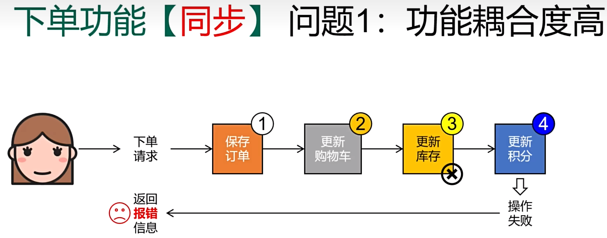

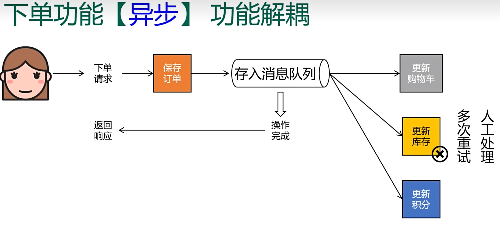

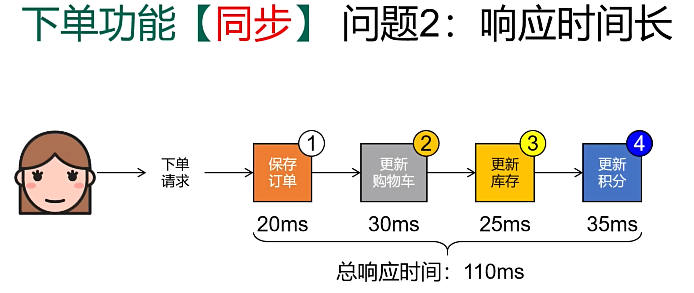

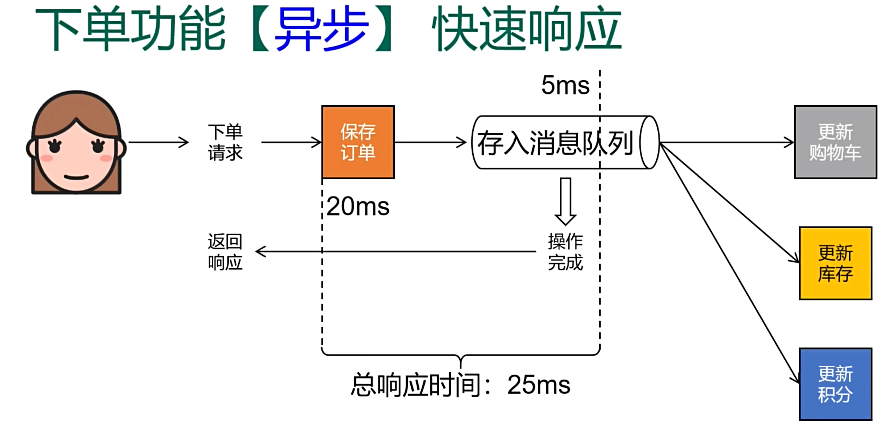

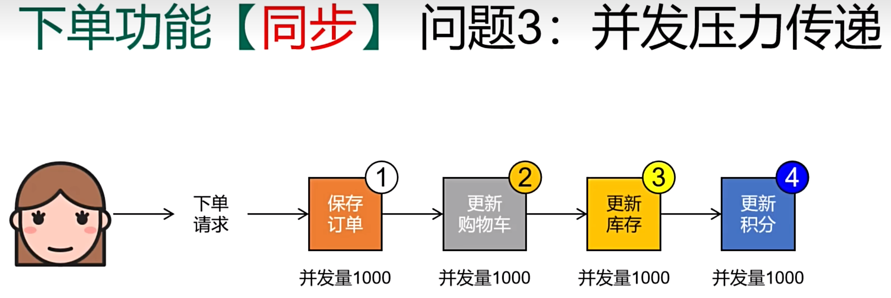

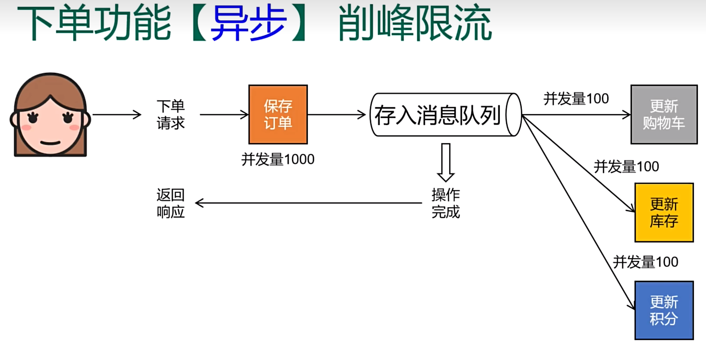

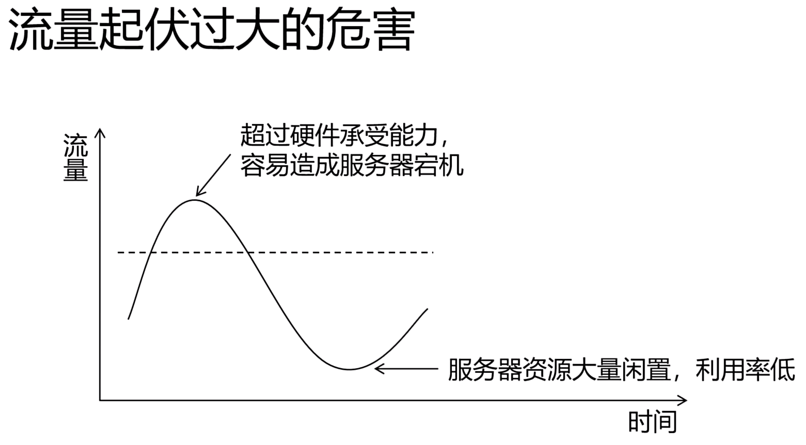


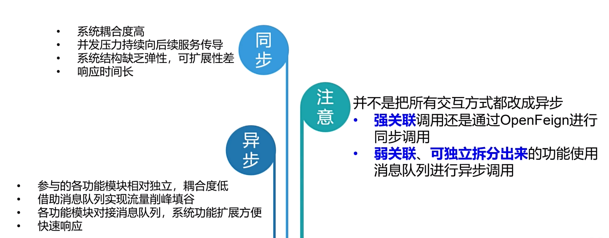

## 二、什么是消息队列

1.  定义

> 消息队列是实现应用程序和应用程序之间的通信的中间件产品


2. 底层实现的两大主流方式

> 由于消息队列执行的是跨应用的信息传递，所以制定底层通信标准非常必要。

- AMQP：通用协议，IBM公司开发。
- JMS：专门为Java语言服务，SUN公司开发，一组由Java接口组成的Java标准。


3. 主流MQ产品对比


## 三、什么是RabbitMQ

1. RabbitMQ体系结构

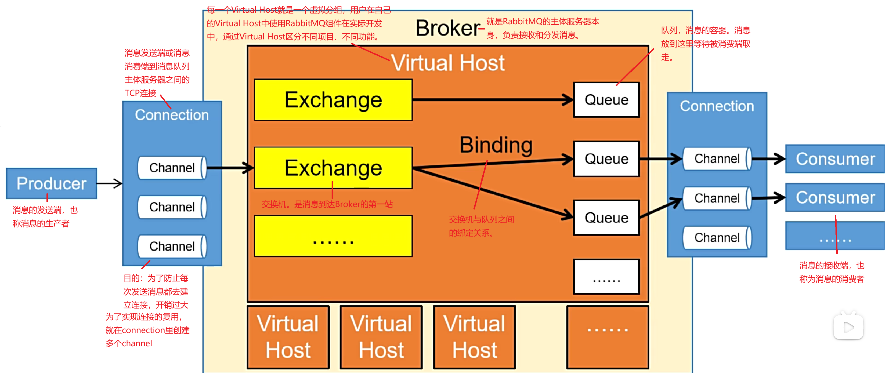

## 四、RabbitMQ 安装

1. 安装

```shell
# 拉去镜像
docker pull rabbitmq:management
# 运行docker容器
docker run -d \
--name rabbitmq \
-p 5672:5672 \
-p 15672:15672 \
-v rabbitmq-plugin:/plugins \
-e RABBITMQ_DEFAULT_USER=yanshijie \
-e RABBITMQ_DEFAULT_PASS=Ysj245913@. \
rabbitmq:management
```

2. 验证

```cmd
访问：http://127.0.0.1:15672
```

## 五、Hello，World

> **官网：**https://www.rabbitmq.com/tutorials/tutorial-one-java

1. 目标
   - 生产者发送消息，消费者接收消息用最简单的方式实现。


2. 具体操作

- 创建Java工程

（1）消息发送端

```java
package com.atguigu.rabbitmq.simple;

import com.rabbitmq.client.Channel;
import com.rabbitmq.client.Connection;
import com.rabbitmq.client.ConnectionFactory;

import java.io.IOException;
import java.util.concurrent.TimeoutException;

public class Producer {
    public static void main(String[] args) throws IOException, TimeoutException {

        // 创建连接工厂
        ConnectionFactory connectionFactory = new ConnectionFactory();

        // 设置主机地址
        connectionFactory.setHost("127.0.0.1");

        // 设置端口号
        connectionFactory.setPort(5672);

        // 设置虚拟主机名称 默认为 /
        connectionFactory.setVirtualHost("/");

        // 设置用户名
        connectionFactory.setUsername("yanshijie");

        // 设置密码
        connectionFactory.setPassword("Ysj245913@.");

        // 创建连接
        Connection connection = connectionFactory.newConnection();

        // 创建频道
        Channel channel = connection.createChannel();

        /*
         * 声明队列
         * queue 队列名称
         * durable 是否定义持久化队列 当MQ重启后还在
         * exclusive 是否独占队列 当声明时，队列只允许在该连接声明，当连接关闭后，队列将被删除
         * autoDelete 是否自动删除队列 当没有消费者时，队列将被删除
         * arguments 队列其他参数
         */
        channel.queueDeclare("simple_queue", true, false, false, null);

        // 要发送的消息
        String message = "hello world";

        /*
         * 交换机名称，如果没有指定则使用默认Default Exchange
         * 路由key 简单模式可以传递队列名称
         * 配置信息
         * 消息内容
         */
        channel.basicPublish("", "simple_queue", null, message.getBytes());

        System.out.println("已发送消息：" + message);

        // 关闭资源
        channel.close();
        connection.close();
    }
}
```

（2）消息接收端

```java
package com.atguigu.rabbitmq.simple;

import com.rabbitmq.client.*;

import java.io.IOException;
import java.util.concurrent.TimeoutException;

public class Consumer {
    public static void main(String[] args) throws IOException, TimeoutException {

        // 1. 创建连接工厂
        ConnectionFactory factory = new ConnectionFactory();

        // 2. 设置参数
        factory.setHost("127.0.0.1");
        factory.setPort(5672);
        factory.setVirtualHost("/");
        factory.setUsername("yanshijie");
        factory.setPassword("Ysj245913@.");

        // 3. 创建连接 Connection
        Connection connection = factory.newConnection();

        // 4. 创建Channel
        Channel channel = connection.createChannel();

        // 5. 创建队列Queue
        /*
         * queueDeclare(String queue, boolean durable, boolean exclusive, boolean autoDelete, Map<String, Object> arguments)
         * 参数：
         * 1. queue：队列名称
         * 2. durable：是否持久化， true持久化， false不持久化
         * 3. exclusive：是否独占， true独占， false不独占
         * 4. autoDelete：是否自动删除， true自动删除， false不自动删除
         * 5. arguments：参数
         */
        // channel.queueDeclare("simple_queue", true, false, false, null);

        DefaultConsumer consumer = new DefaultConsumer(channel) {
            /**
             *
             * @param consumerTag 消费者标签，在channel.basicConsume()去指定
             * @param envelope 消息获取到的消息，如消息ID，消息发布通道， 消息的routingKey， 消息的标识， 消息的过期时间等等
             * @param properties 消息的属性
             * @param body 消息内容
             * @throws IOException 异常
             */
            @Override
            public void handleDelivery(String consumerTag, Envelope envelope, AMQP.BasicProperties properties, byte[] body) throws IOException {

                System.out.println("consumerTag:" + consumerTag);
                System.out.println("exchange:" + envelope.getExchange());
                System.out.println("routingKey:" + envelope.getRoutingKey());
                System.out.println("properties:" + properties);
                System.out.println("body:" + new String(body));

            }
        };

        /*
         * basicConsume(String queue, boolean autoAck, Consumer callback)
         * 参数：
         * 1. queue：消费队列的名称
         * 2. autoAck：自动回复，当消费者接收到消息后要告诉mq消息已消费，true表示自动回复，false表示手动回复
         * 3. callback：消费方法，当消费者接收到消息要执行的方法
         */
        channel.basicConsume("simple_queue", true, consumer);

    }
}

```

## 六、RabbitMQ 工作模式

> RabbitMQ官网，通过教程，给我们列举了7种RabbitMQ的用法
>
> 网址：https://www.rabbitmq.com/getstarted.html

1. "Hello World!"

> 最简单的做点什么的例子
>
> 详情见上：五、Hello，World


2. Work Queues

> 在多个工作者之间分发任务（竞争消费者模式）

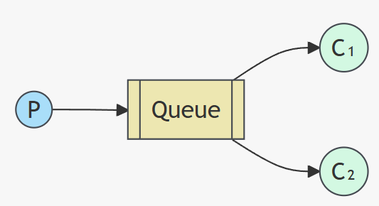

- Java 代码

（1）连接工具类

```java
public class ConnectionUtil {

    static public Connection getConnection() throws Exception {
        // 创建连接工厂
        ConnectionFactory factory = new ConnectionFactory();
        // 设置服务地址
        factory.setHost("127.0.0.1");
        // 端口
        factory.setPort(5672);
        // 设置虚拟机，一个MQ服务可以设置多个虚拟机，每个虚拟机就相当于一个独立的MQ
        factory.setVirtualHost("/");
        // 设置用户名
        factory.setUsername("yanshijie");
        // 设置密码
        factory.setPassword("Ysj245913@.");
        // 创建连接
        return factory.newConnection();
    }

}
```

（2）生产者

```java
public class Producer {
    
    public static final String QUEUE_NAME = "work_queue";
    
    public static void main(String[] args) throws Exception {
        Connection connection = ConnectionUtil.getConnection();
        Channel channel = connection.createChannel();
        channel.queueDeclare(QUEUE_NAME, false, false, false, null);
        for (int i = 0; i < 10; i++) {
            String body = "work queue message: " + i;
            // 发送消息
            channel.basicPublish("", QUEUE_NAME, null, body.getBytes());
        }
        channel.close();
    }
}

```

（3）消费者1

```java
public class Consumer1 {

    static final String QUEUE_NAME = "work_queue";

    public static void main(String[] args) throws Exception {

        Connection connection = ConnectionUtil.getConnection();

        Channel channel = connection.createChannel();

        channel.queueDeclare(QUEUE_NAME, false, false, false, null);

        DefaultConsumer consumer = new DefaultConsumer(channel) {
            @Override
            public void handleDelivery(String consumerTag, Envelope envelope, AMQP.BasicProperties properties, byte[] body) throws IOException {
                System.out.println("消费者1：" + new String(body));
            }
        };

        channel.basicConsume(QUEUE_NAME, true, consumer);

    }
}
```

（4）消费者2

```java
public class Consumer2 {

    static final String QUEUE_NAME = "work_queue";

    public static void main(String[] args) throws Exception {

        Connection connection = ConnectionUtil.getConnection();

        Channel channel = connection.createChannel();

        channel.queueDeclare(QUEUE_NAME, false, false, false, null);

        DefaultConsumer consumer = new DefaultConsumer(channel) {
            @Override
            public void handleDelivery(String consumerTag, Envelope envelope, AMQP.BasicProperties properties, byte[] body) throws IOException {
                System.out.println("消费者2：" + new String(body));
            }
        };
        channel.basicConsume(QUEUE_NAME, true, consumer);
    }
}
```

3. Public/Subscribe

> 一次性向多个消费者发送消息
>
> - 生产者不是把消息直接发送到队列，而是发送到交换机
> - 交换机接收消息，而如何处理消息取决与交换机的类型
> - 交换机有如下3种常见类型
>   - Fanout：广播，将消息发送给所有绑定到交换机的队列
>   - Direct：定向，把消息交给指定routing key的队列
>   - Topic：通配符，把消息交给符合routing pattern（路由模式）的队列
>
> **注意：Exchange（交换机）只负责转发消息，不具备存储消息的能力，因此如果没有任何队列与Exchange绑定，或者没有符合路由规则的队列，那么消息会丢失**

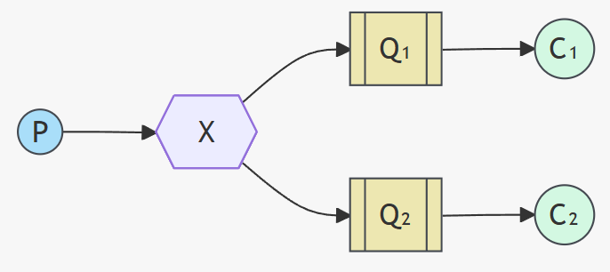

- 代码示例

（1）生产者

```java
public class Producer {

    public static void main(String[] args) throws Exception {

        // 1. 创建连接
        Connection connection = ConnectionUtil.getConnection();

        // 2. 创建频道
        Channel channel = connection.createChannel();

        String exchangeName = "test_fanout";

        /*
         * 3. 创建交换机
         * 参数1：交换机名称
         * 参数2：交换机类型
         *     DIRECT("direct")：定向
         *     FANOUT("fanout")：广播
         *     TOPIC("topic")：通配符
         *     HEADERS("headers")：参数匹配
         * 参数3：是否持久化
         * 参数4：是否自动删除
         * 参数5：内部使用
         * 参数6：其他参数
         */
        channel.exchangeDeclare(exchangeName, BuiltinExchangeType.FANOUT, true, false, false, null);

        // 4. 创建队列
        String queue1Name = "test_fanout_queue1";
        String queue2Name = "test_fanout_queue2";

        channel.queueDeclare(queue1Name, true, false, false, null);
        channel.queueDeclare(queue2Name, true, false, false, null);

        /*
         * 5. 绑定队列和交换机
         * 参数1：队列名称
         * 参数2：交换机名称
         * 参数3：路由key 如果使用FANOUT类型，routingKey设置为空字符串
         */
        channel.queueBind(queue1Name, exchangeName, "");
        channel.queueBind(queue2Name, exchangeName, "");

        String body = "日志信息：调用了Test方法...";

        // 6. 发送消息
        channel.basicPublish(exchangeName, "", null, body.getBytes());


        // 7. 释放资源
        channel.close();
        connection.close();

    }
}
```

（2）消费者1

```java
public class Consumer1 {
    public static void main(String[] args) throws Exception {

        Connection connection = ConnectionUtil.getConnection();

        Channel channel = connection.createChannel();

        String queue1Name = "test_fanout_queue1";

        channel.queueDeclare(queue1Name, true, false, false, null);

        DefaultConsumer consumer = new DefaultConsumer(channel) {
            @Override
            public void handleDelivery(String consumerTag, Envelope envelope, AMQP.BasicProperties properties, byte[] body) throws IOException {
                System.out.println("消费者1：" + new String(body));
            }
        };

        /*
         * 监听队列
         * 参数1：队列名称
         * 参数2：是否自动确认，设置为true表示自动确认
         * 参数3：消息接收到后回调
         */
        channel.basicConsume(queue1Name, true, consumer);

    }
} 
```

（3）消费者2

```java
public class Consumer2 {
    public static void main(String[] args) throws Exception {

        Connection connection = ConnectionUtil.getConnection();

        Channel channel = connection.createChannel();

        String queue1Name = "test_fanout_queue2";

        /*
         * 创建队列
         * 参数1：队列名称
         * 参数2：是否定义持久化队列
         * 参数3：是否独占队列
         * 参数4：队列不用时是否自动删除队列
         * 参数5：队列其他参数
         */
        channel.queueDeclare(queue1Name, true, false, false, null);

        DefaultConsumer consumer = new DefaultConsumer(channel) {
            @Override
            public void handleDelivery(String consumerTag, Envelope envelope, AMQP.BasicProperties properties, byte[] body) throws IOException {
                System.out.println("消费者2：" + new String(body));
            }
        };

        /*
         * 监听队列
         * 参数1：队列名称
         * 参数2：是否自动确认，设置为true表示自动确认
         * 参数3：消息接收到后回调
         */
        channel.basicConsume(queue1Name, true, consumer);

    }
}
```

4. Routing

> 根据路由键选择性接收消息


- Java 示例

（1）生产者

```java
public class Producer {
    public static void main(String[] args) throws Exception {

        // 1.创建连接
        Connection connection = ConnectionUtil.getConnection();

        // 2.创建频道
        Channel channel = connection.createChannel();

        String exchangeName = "test_direct";

        // 3. 创建交换机
        channel.exchangeDeclare(exchangeName, BuiltinExchangeType.DIRECT, true, false, false, null);

        // 4. 创建队列
        String queue1Name = "test_direct_queue1";
        String queue2Name = "test_direct_queue2";

        // 5. 声明（创建）队列
        channel.queueDeclare(queue1Name, true, false, false, null);
        channel.queueDeclare(queue2Name, true, false, false, null);

        // 6.队列绑定交换机
        // 队列1 绑定error 路由键
        channel.queueBind(queue1Name, exchangeName, "error");
        // 队列2 绑定error info warning 三个路由键
        channel.queueBind(queue2Name, exchangeName, "info");
        channel.queueBind(queue2Name, exchangeName, "error");
        channel.queueBind(queue2Name, exchangeName, "warning");

        String message = "日志信息：张三调用共了delete方法，错误了，日志级别error";

        // 发送消息
        channel.basicPublish(exchangeName, "error", null, message.getBytes());
        System.out.println(message);

        // 释放资源
        channel.close();
        connection.close();
    }
}
```

（2）消费者代码同上...

5. Topics

> 基于模式匹配来接收消息
>
> - 就是在绑定路由键的时候使用通配符
> - Routing Key 一般是由一个或多个单词组成 多个单词之间以`.`分割 例如item.insert
> - 通配符规则
>   - #：匹配零个或多个词
>   - *：匹配一个词

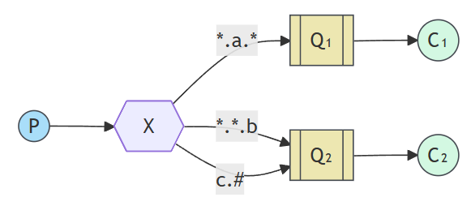

- Java示例

（1）生产者

```java
public class Producer {
    public static void main(String[] args) throws Exception {

        // 1.创建连接
        Connection connection = ConnectionUtil.getConnection();

        // 2.创建频道
        Channel channel = connection.createChannel();

        // 3. 创建交换机
        String exchangeName = "test_topic";

        channel.exchangeDeclare(exchangeName, BuiltinExchangeType.TOPIC, true, false, false, null);

        // 4. 创建队列
        String queue1Name = "test_topic_queue1";
        String queue2Name = "test_topic_queue2";

        channel.queueDeclare(queue1Name, true, false, false, null);
        channel.queueDeclare(queue2Name, true, false, false, null);

        /*
         * 5. 绑定队列和交换机
         */
        channel.queueBind(queue1Name, exchangeName, "#.error");
        channel.queueBind(queue1Name, exchangeName, "order.*");
        channel.queueBind(queue2Name, exchangeName, "*.*");

        // 6. 发送消息
        String message = "-----------------------------------message---------------------------------------";
        channel.basicPublish(exchangeName, "order.info", null, message.getBytes());

        // 7. 释放资源
        channel.close();
        connection.close();
    }
}
```

（2）消费者代码同上...

6. RPC

> 请求/应答模式的示例

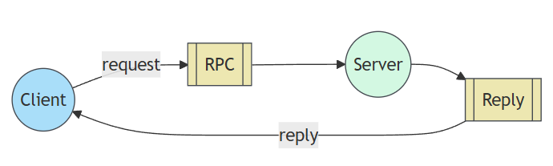

7. Publisher Confirms

# 进阶篇

## 一、RabbitMQ整合SpringBoot

> - 搭建环境
> - 基础设定：交换机名称、队列名称、绑定关系
> - 发送消息：使用RabbitTemplate
> - 接收消息：使用@RabbitListener注解

1. 创建消费端程序

- 引入依赖

```xml
...
<parent>
    <groupId>org.springframework.boot</groupId>
    <artifactId>spring-boot-starter-parent</artifactId>
    <version>3.5.6</version>
</parent>
...

<dependencies>
    ...
    <!-- 核心依赖包 -->
    <dependency>
        <groupId>org.springframework.boot</groupId>
        <artifactId>spring-boot-starter-amqp</artifactId>
    </dependency>
    ...
    <dependency>
        <groupId>org.springframework.boot</groupId>
        <artifactId>spring-boot-starter-web</artifactId>
    </dependency>
    ...
</dependencies>
```

- 配置文件

```yml
spring:
  rabbitmq:
    host: localhost
    port: 5672
    username: yanshijie
    password: Ysj245913@.
    virtual-host: /
logging:
  level:
    com.atguigu.mq.listener.MyMessageListener: info
```

- 消费端消息监听器

```java
package com.atguigu.mq.listener;

import com.rabbitmq.client.Channel;
import lombok.extern.slf4j.Slf4j;
import org.springframework.amqp.core.Message;
import org.springframework.amqp.rabbit.annotation.Exchange;
import org.springframework.amqp.rabbit.annotation.Queue;
import org.springframework.amqp.rabbit.annotation.QueueBinding;
import org.springframework.amqp.rabbit.annotation.RabbitListener;
import org.springframework.stereotype.Component;

@Component
@Slf4j
public class MyMessageListener {

    public static final String EXCHANGE_DIRECT = "exchange.direct.order";

    public static final String ROUTING_KEY = "order";

    public static final String QUEUE_NAME = "queue.order";

    // 写法一：监听 + 在RabbitMQ中创建交换机和队列
    // @RabbitListener(
    //         // 绑定关系
    //         bindings = @QueueBinding(
    //                 // 设置队列信息
    //                 value = @Queue(value = QUEUE_NAME, durable = "true"),
    //                 // 设置交换机信息
    //                 exchange = @Exchange(value = EXCHANGE_DIRECT),
    //                 // 绑定路由key
    //                 key = {ROUTING_KEY}
    //         )
    // )
    // 写法二：只监听 创建好的情况下
    @RabbitListener(queues = QUEUE_NAME)
    public void processMessage(String dataString, Message message, Channel channel) {
        System.out.println("已接收到消息：" + dataString);
    }
}
```

2. 发送消息

```java
@SpringBootTest
public class RabbitMQTest {

    public static final String EXCHANGE_DIRECT = "exchange.direct.order";

    public static final String ROUTING_KEY = "order";

    public static final String QUEUE_NAME = "queue.order";

    @Autowired
    private RabbitTemplate rabbitTemplate;

    @Test
    public void test01SendMessage() {
        /*
         * 发送消息
         * 参数1：交换机名称
         * 参数2：路由key
         * 参数3：消息内容
         */
        rabbitTemplate.convertAndSend(EXCHANGE_DIRECT, ROUTING_KEY, "Hello World");
    }
}
```

## 二、消息可靠性投递

1. 提出场景（下单）

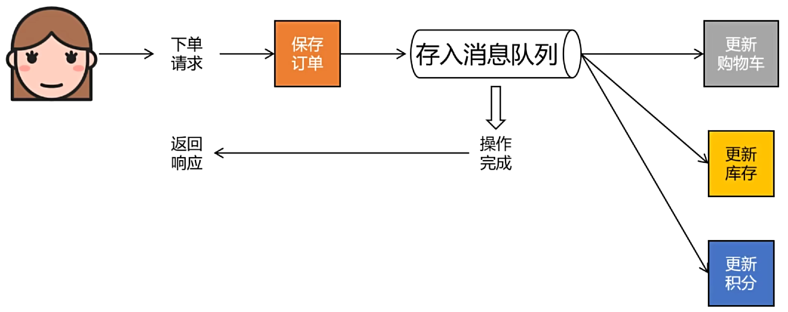

2. 提出问题一：消息没有发送到消息队列上

> 后果：消费者拿不到消息，业务功能缺失，数据错误


**解决方法：**

> **解决思路一：**在生产者端进行确认，具体操作中我们会分别针对交换机和队列来确认，如果没有成功发送到消息队列服务器上，那就可以尝试重新发送。
>
> **解决思路二：**为目标交换机指定备份交换机，当目标交换机投递失败时，把消息投递至备份交换机。

3. 提出问题二：消息成功存入消息队列，但是消息队列服务器宕机了

> 原本保存在内存中的消息也丢失了！！！
>
> 即使服务器重新启动，消息也找不回来了


**解决方法：**

> **解决思路：**把消息持久化到硬盘上。

4. 提出问题三：消息成功存入消息队列，但是消费端出现问题，例如：宕机、抛异常等等。

> 后果：业务功能缺失，数据错误


**解决方法：**

> **解决思路：**消费端消费消息成功，给服务器返回ACK信息，然后消息队列删除该消息。消费端消费消息失败，给服务器返回NACK信息，同时把消息恢复为待消费的状态，这样就可以再次取回消息，重试一次。

## 三、生产者端消息确认机制

1. Yaml配置

```yml
spring:
  rabbitmq:
    host: localhost
    port: 5672
    username: yanshijie
    password: Ysj245913@.
    virtual-host: /
    publisher-confirm-type: correlated # 交换机确认机制
    publisher-returns: true # 队列确认机制
logging:
  level:
    com.atguigu.mq.listener.MyMessageListener: info
```

2. 创建配置类

> 目的：我们需要声明回调函数来接收RabbitMQ服务器返回的确认信息

| 方法名            | 方法功能                 | 所属接口        | 接口所属类     |
| ----------------- | ------------------------ | --------------- | -------------- |
| confirm()         | 确认消息是否发送到交换机 | ConfirmCallback | RabbitTemplate |
| returnedMessage() | 确认消息是否发送到队列   | ReturnsCallback | RabbitTemplate |

```java
package com.atguigu.rabbitmq.config;

import lombok.extern.slf4j.Slf4j;
import org.springframework.amqp.core.ReturnedMessage;
import org.springframework.amqp.rabbit.connection.CorrelationData;
import org.springframework.amqp.rabbit.core.RabbitTemplate;
import org.springframework.context.annotation.Configuration;

@Slf4j
@Configuration
public class RabbitMQConfig implements RabbitTemplate.ConfirmCallback, RabbitTemplate.ReturnsCallback {

    /**
     * 消息发送到交换机成功或失败时被调用returnedMessage() 回调函数 
     * @param correlationData 回调相关数据
     * @param ack true for ack, false for nack
     * @param cause nack的可选原因，否则为null。
     */
    @Override
    public void confirm(CorrelationData correlationData, boolean ack, String cause) {
        log.info("confirm() 回调函数打印 CorrelationData：{}", correlationData);
        log.info("confirm() 回调函数打印 ack：{}", ack);
        log.info("confirm() 回调函数打印 cause：{}", cause);

    }

    /**
     * 消息发送到队列失败时被调用
     * @param returnedMessage the returned message and metadata.
     */
    @Override
    public void returnedMessage(ReturnedMessage returnedMessage) {
        log.info("returnedMessage() 回调函数 消息主体：{}", new String(returnedMessage.getMessage().getBody()));
        log.info("returnedMessage() 回调函数 应答码：{}", returnedMessage.getReplyCode());
        log.info("returnedMessage() 回调函数 描述：{}", returnedMessage.getReplyText());
        log.info("returnedMessage() 回调函数 消息使用的交换器'{}'", returnedMessage.getExchange());
        log.info("returnedMessage() 回调函数 消息使用的路由键'{}'", returnedMessage.getRoutingKey());
    }

}
```

3. RabbitMQ 增强

```java
@Slf4j
@Configuration
@RequiredArgsConstructor
public class RabbitMQConfig implements RabbitTemplate.ConfirmCallback, RabbitTemplate.ReturnsCallback {

    private final RabbitTemplate rabbitTemplate;

    /**
     * 初始化RabbitTemplate
     */
    @PostConstruct // 依赖注入完立即执行
    public void initRabbitTemplate() {
        // RabbitMQ 增强
        rabbitTemplate.setConfirmCallback(this);
        rabbitTemplate.setReturnsCallback(this);
    }

    /**
     * 消息发送到交换机成功或失败时被调用returnedMessage() 回调函数
     * @param correlationData 回调相关数据
     * @param ack true for ack, false for nack
     * @param cause nack的可选原因，否则为null。
     */
    @Override
    public void confirm(CorrelationData correlationData, boolean ack, String cause) {
        log.info("confirm() 回调函数打印 CorrelationData：{}", correlationData);
        log.info("confirm() 回调函数打印 ack：{}", ack);
        log.info("confirm() 回调函数打印 cause：{}", cause);

    }

    /**
     * 消息发送到队列失败时被调用
     * @param returnedMessage the returned message and metadata.
     */
    @Override
    public void returnedMessage(ReturnedMessage returnedMessage) {
        log.info("returnedMessage() 回调函数 消息主体：{}", new String(returnedMessage.getMessage().getBody()));
        log.info("returnedMessage() 回调函数 应答码：{}", returnedMessage.getReplyCode());
        log.info("returnedMessage() 回调函数 描述：{}", returnedMessage.getReplyText());
        log.info("returnedMessage() 回调函数 消息使用的交换器'{}'", returnedMessage.getExchange());
        log.info("returnedMessage() 回调函数 消息使用的路由键'{}'", returnedMessage.getRoutingKey());
    }

}

```

4. 发送测试

```java
package com.atguigu.rabbitmq;

import org.junit.jupiter.api.Test;
import org.springframework.amqp.rabbit.core.RabbitTemplate;
import org.springframework.beans.factory.annotation.Autowired;
import org.springframework.boot.test.context.SpringBootTest;

@SpringBootTest
public class RabbitMQTest {

    private static final String EXCHANGE_DIRECT = "exchange.direct.order";

    private static final String ROUTING_KEY = "order";

    @Autowired
    private RabbitTemplate rabbitTemplate;

    @Test
    public void testSendMessage() {
        rabbitTemplate.convertAndSend(EXCHANGE_DIRECT, ROUTING_KEY, "-----------Hello World-------------");
    }
}
```

## 四、备份交换机

1. 场景

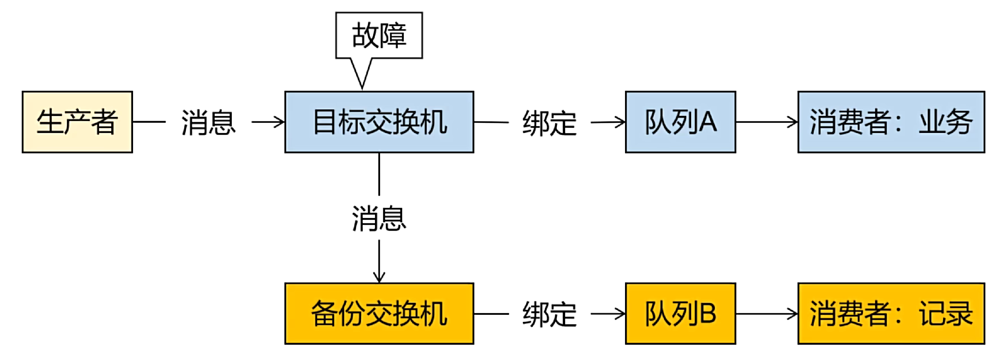

2. 创建备份交换机

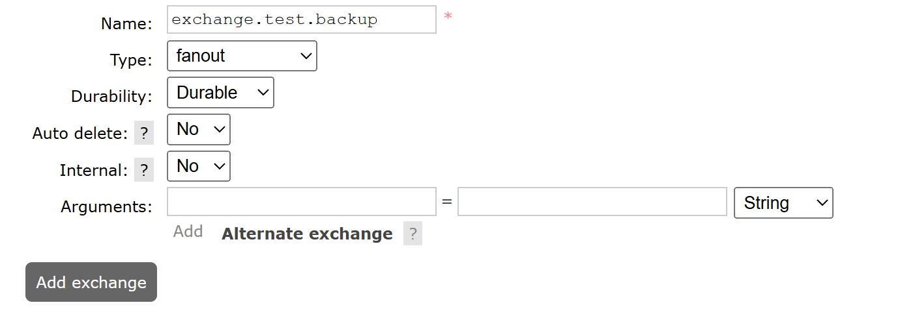

3. 创建与备份交换机绑定的队列


4. 设定绑定关系

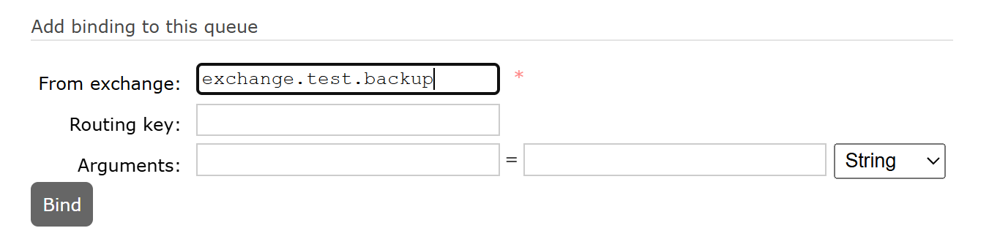

5. 指定备份交换机

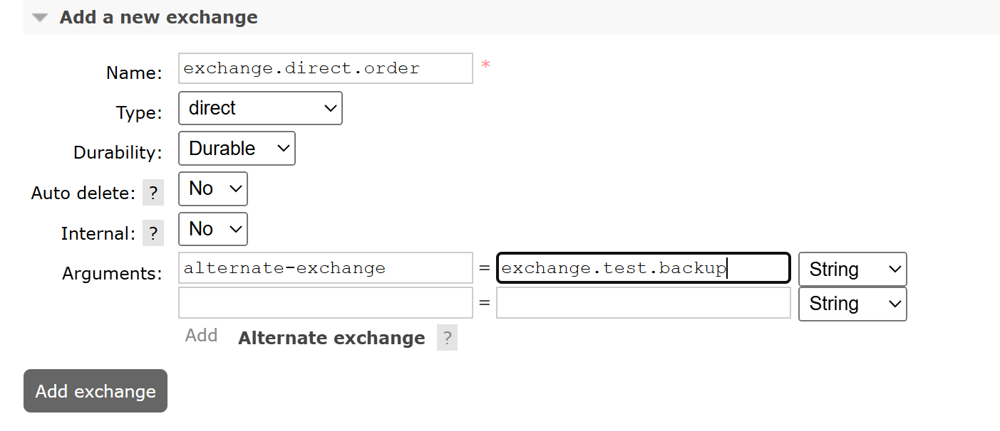

