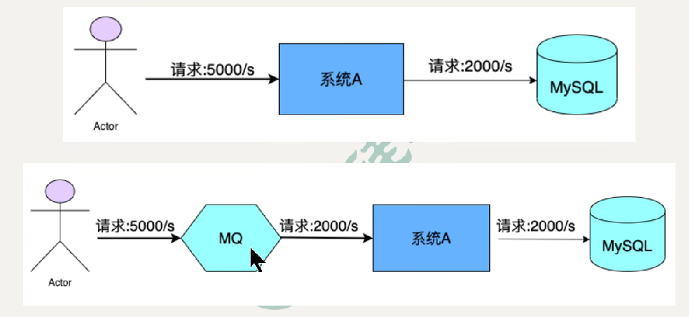

# RocketMQ 学习笔记

作者：Shijie Yan

---

## 1. MQ 概述

1. **简介：**MQ，Message Queue，是一种提供**消息队列服务**的中间件，是一套提供了消息生产、存储、消费全过程API的软件系统。（消息：数据）。

2. **用途：**

   - **限流削峰：**将**超量**的请求暂存起来，以便后期可以慢慢处理，从而避免**请求的丢失**（系统限流）或**系统被压垮**。

   

   - **异步解耦：**上游系统对下系统的调用若为同步调用，则会大大的降低系统的吞吐量和并发量，且系统耦合度太高。所以在两层之间加一个MQ层。实现了同步到异步的转换。

   

   - **数据收集**

## 2. RocketMQ 概述

​	历史、发展...

## 3. 基本概念

1. **消息（Message）：**传输数据的物理载体，生产和消费数据的最小单位，每条消息必须属于一个主题。

2. **主题（Topic）：**一类消息的集合，是RocketMQ消息订阅的基本单位。

3. **标签（Tag）：**为消息设置的标签，为了区分同一主题下不同类型的消息。

4. **队列（Queue）：**存储消息的物理实体，一个Topic中可以包含多个Queue。一个Topic的Queue也被称为一个Topic中消息的分区。

5. **消息标识（MeesageId / key）：**RocketMQ中每个消息都有一个唯一MessageId，且可以携带具有业务标识的Key。以方便对消息的查询。（MessageId有两个在生产者send()消息时会自动生成一个MessageId（msgId），当消息到达Broker后，Broker也会生成一个MessageId（offsetMsgId），msgId、offsetMsgId、key统称为消息标识）
   - **msgId：**由produce端生成，生成规则，**producerIp + 进程pid + MessageCLientIDSetter类的ClassLoader的hashCode + 当前时间 + AutomicInteger自增计数器。**
   - **offectMsgId：**由broker端生成，其生成规则为，**brokerIp + 物理分区的offset**
   - **key：**由用户指定业务相关的唯一标识。

## 4. 基本架构

RockerMQ 架构由四部分构成。

### 4.1 Producer（生产者）

> RocketMQ中的消息生产者都是以生产者组的形式出现的。
>
> 生产者组是同一类生产者的集合，这类Producer发送相同Topic类型的消息。
>
> 一个生产者组可以同时发送多个主题的消息。

### 4.2 Consumer（消费者）

> RockerMQ中的消息消费者都是以消费者组的形式出现的。
>
> 消费者组是同一类消费者的集合，者类Consumer消费的是同一个Topic类型的消息。
>
> 消费者组使得在消息消费方面，实现负载均衡和容错的目标变的非常容易。

### 4.3 NameServer

> NameServer是一个Broker与Topic路由的注册中心，支持Broker的动态注册与发现

1. **功能介绍**

   - **Broker管理：**接受Broker集群的注册信息并保存下来作为路由信息的基本数据，提供心跳检测机制，检查Broker是否还存活。

   - **路由信息管理：**每个NameServer中都保存着Broker集群的整个路由信息和用于客户端查询队列信息。Producer和Consumer通过NameServer可以获取整个Broker集群的路由信息，从而进行消息的投递和消费。

2. **路由注册**
   - NameServer

3. **路由剔除**

4. **路由发现**

### 4.4 Broker

