# Redis7  学习笔记

作者：Shijie Yan

---

## 1. Redis 介绍

### 1.1 概念

**Redis：** **RE**mote **Di**ctionary **S**erver（远程字典服务器）

基于**内存**的一种**K、V键值对**内存数据库。

### 1.2 功能与作用

1. 分布式缓存
2. 内存存储和持久化（RDB + AOF 混合持久化）
   - **RDB 持久化** 是 Redis 将内存中的数据 **定期快照（Snapshot）** 保存到磁盘上的一种方式。
   - **AOF 持久化** 是 Redis 以 **追加命令日志** 的方式记录每次写操作。
3. 高可用架构搭配
   - 单机
   - 主存
   - 哨兵
   - 集群
4. 缓存穿透、击穿、雪崩
5. 分布式锁
6. 队列
7. 排行榜 + 点赞
8. ......

### 1.3 优势

1. 性能极高
2. 支持数据持久化
3. 支持数据备份

## 2. Redis 安装配置

```cmd
 redis-server [自定义配置文件路径]
 redis-cli # 启动
 auth [密码]
```

......

## 3. 通用命令

1. 查看通用命令

```shell
help @generic # 查看所用通用命令
help [命令] # 查看指定命令用法
```

2. 通用命令

```shell
1. KEYS pattern # 查看匹配的key（不建议在生产环境使用）
2. DEL key [key ...] # 删除一个或多个key
3. EXISTS key [key ...] # 判断key是否存在
4. EXPIRE key seconds [NX|XX|GT|LT] # 给一个key #设置有效期
	NX（Not Exist,）仅在 key 没有设置过期时间时，才设置新的过期时间。
	XX（Exist）：仅在 key 已经设置过期时间时，才设置新的过期时间。
	GT（Greater Than）：仅在新的过期时间（seconds）大于当前过期时间时，才设置新的过期时间。
	LT（Less Than）：仅在新的过期时间（seconds）小于当前过期时间时，才设置新的过期时间。
5. TTL key #查看一个key的剩余有效期
```

## 4. Redis 数据类型

> **官网介绍：**https://redis.ac.cn/docs/latest/develop/data-types/
>
> **String、Hash、List、Set、Sorted Set、Vertor Set、Stream、Bitmap、Bitfield、Geospatial、JSON、Probabilistic、Time series**

### 4.1 String

1. **介绍**
   - String 字符串类型，其value是字符串，但是根据格式不同又可以分为`string`、`int`（可以做自增、自减）、`float`（可以做自增、自减）3类。
   - 不论是那种格式，底层都以字节数组进行存储，只不过编码方式不同。
   - 字符串类型最大不能超过512M。
2. **常用命令**

|    命令     |                           介绍                            |
| :---------: | :-------------------------------------------------------: |
|     SET     |        添加或修改一个已经存在的String类型的键值对         |
|     GET     |                根据key获取String类型value                 |
|    MSET     |               批量添加多个String类型键值对                |
|    MGET     |           根据多个key获取多个String类型的value            |
|    INCR     |                    让一个整型key自增1                     |
|   INCRBY    |                让一个整型key自增并指定步长                |
| INCRBYFLOAT |               让一个浮点数key自增并指定步长               |
|    SETNX    | 添加一个String类型键值对，前提是这个key不存在，否则不执行 |
|    SETEX    |          添加一个String类型键值对，并指定有效期           |

### 4.2 Hash

1. **介绍**
   - Hash 类型也叫散列，其value是一个无序字典类似Java中的HashMap

2. **常用命令**

|                  命令                   |                             介绍                             |
| :-------------------------------------: | :----------------------------------------------------------: |
| HSET key field value [field value ...]  |              添加或者修改hash类型key的field字段              |
|             HGET key field              |                 获取一个hash类型的field的值                  |
| HMSET key field value [field value ...] |               批量添加多个hash类型key的field值               |
|       HMGET key field [field ...]       |                 批量添加多个hash类型field值                  |
|               HGETALL key               |          获取一个hash类型的key中的所有field和value           |
|                HKEYS key                |              获取一个hash类型的key中的所有field              |
|                HVALS key                |               获取一个hash类型key中的所有value               |
|       HINCRBY key field increment       |            让一个hash类型key的字段自增并指定步长             |
|         HSETNX key field value          | 添加一个hash类型的key的field值，前提是这个field不存在，否则不执行 |

### 4.3 List

1. **介绍**
   - Redis中的List的类型与Java中的LinkedList类似，可以看做一个双向链表结构。既可以支持正向检索，也可以支持反向检索。
   - 特征也与LinkedList类似，有序、元素可以重复、插入和删除快、查询速度一般。
   - 常用来存储一个有序数据，例如：朋友圈点赞列表，评论列表等。
2. **常用命令**

|              命令               |                             介绍                             |
| :-----------------------------: | :----------------------------------------------------------: |
| LPUSH key element [element ...] |                 向列表左端插入一个或多个元素                 |
|        LPOP key [count]         |          移除并返回列表左端第一个元素，没有返回nil           |
| RPUSH key element [element ...] |                 向列表右端插入一个或多个元素                 |
|        RPOP key [count]         |          移除并返回列表右端第一个元素，没有返回nil           |
|      LRANGE key start stop      |                    返回角标范围内所有元素                    |
|          BLPOP与BRPOP           | 与LPOP与RPOP类似，只不过没有元素世等待指定时间，而不是直接返回nil |

3. **扩展**
   - 利用List模拟栈、队列、阻塞队列。

### 4.4 Set

1. **介绍**
   - Redis中的Set结构与Java中的HashSet类似，可以看做一个value为null的HashMap。因为也是一个Hash表，因此具备与HashSet类似的特征。
   - 无序、元素不可重复、查找快、支持交集、并集、差集等功能。
2. **常用命令**

|             命令             |            介绍             |
| :--------------------------: | :-------------------------: |
| SADD key member [member ...] |  向set中添加一个或多个元素  |
| SREM key member [member ...] |     移除set中的指定元素     |
|          SCARD key           |     返回set中元素的个数     |
|     SISMEMBER key member     | 判断一个元素是否存在于set中 |
|         SMEMBERS key         |     获取set中的所有元素     |
|     SINTER key [key ...]     |            交集             |
|     SDIFF key [key ...]      |            差集             |
|     SUNION key [key ...]     |            并集             |

### 4.5 SortedSet

1. **介绍**
   - Redis的SortedSet是一个可排序的set集合，与Java中的TreeSet有些类似，但底层数据结构差别很大。
   - SortedSet中的每一个元素都带一个score属性，可以基于score属性对元素进行排序，底层的实现是一个跳表（SkipList）加hash表。
   - 可排序、元素不重复、查询速度快。
   - 因为SortedSet的可排序特性，经常被用来实现排行榜这样的功能。

2. **常用命令**

|                             命令                             |                    介绍                    |
| :----------------------------------------------------------: | :----------------------------------------: |
| ZADD key [NX\|XX] [GT\|LT] [CH] [INCR] score member [score member ...] |   添加或编辑一个或多个元素到sortedset中    |
|                 ZREM key member [member ...]                 |                删除指定元素                |
|                      ZSCORE key member                       |           获取指定元素的score值            |
|                       ZRANK key member                       |             获取指定元素的排名             |
|                          ZCARD key                           |                获取元素个数                |
|                      ZCOUNT key min max                      |      统计score在指定范围内的元素个数       |
|                 ZINCRBY key increment member                 |      让指定元素自增，increment为步长       |
| ZRANGE key start stop [BYSCORE\|BYLEX] [REV] [LIMIT offset count] [WITHSCORES] |  按照score排序好，获取指定排名范围的元素   |
| ZRANGEBYSCORE key min max [WITHSCORES] [LIMIT offset count]  | 按照score排序好，获取指定score范围内的元素 |
|                    ZDIFF、ZINTER、ZUNION                     |              差集、交集、并集              |

（注意：所有的排名默认都是升序，如果要降序则在命令Z后面添加REV即可）

## 5. Redis Java客户端

### 5.1 三种 Redis 客户端

1. Jedis：以Redis命令作为方法名称，学习成本低，简单实用。但是Jedis实例是线程不安全的，多线程环境下需要基于连接池来使用。
2. Lettuce：Lettuce是基于Natty实现的，支持同步，异步和响应式编程方式，并且是线程安全的。支持Redis和哨兵模式、集群模式、管道模式。
3. Redisson：是一个基于Redis实现分布式、可伸缩的Java数据结构集合。包含诸如Map、Queue、Lock、Semaphore、AtomicLong等强大功能。

### 5.2 Jedis

#### 5.2.1 基本使用

1. 引入依赖

```xml
<!--jedis-->
<dependency>
    <groupId>redis.clients</groupId>
    <artifactId>jedis</artifactId>
    <version>7.0.0</version>
</dependency>
```

2. 建立连接

```java
@BeforeEach
void setUp() {
    // 1. 建立连接
    jedis = new Jedis("192.168.147.101", 6379);
    // 2. 设置密码
    jedis.auth("Ysj245913@.");
    // 3. 选择库
    jedis.select(0);
}
```

3. 测试string

```java
@Test
void testString() {
    // 存入数据
    String result = jedis.set("name", "YanShijie");
    System.out.println("result" + result);
    //  获取数据
    String name = jedis.get("name");
    System.out.println("name" + name);
}
```

4. 释放资源

```java
@AfterEach
void tearDown() {
    if (jedis != null) {
        jedis.close();
    }
}
```

#### 5.2.2 Jedis连接池

> Jedis本身是线程不安全的，并且频繁的创建和销毁连接会有性能损耗，因此我们推荐大家使用Jedis连接池替代Jedis的直连方式。

```java
public class JedisConnectionFactory {

    private static final JedisPool jedisPool;

    // 静态代码块类加载时执行一次
    static {
        // 配置连接池
        JedisPoolConfig poolConfig = new JedisPoolConfig();
        // 最大8个连接
        poolConfig.setMaxIdle(8);
        // 最大预备8个连接
        poolConfig.setMaxTotal(8);
        // 最小空闲连接
        poolConfig.setMinIdle(0);
        // 最大等待时间
        poolConfig.setMaxWait(Duration.ofMillis(1000));
        // 创建连接池对象
        jedisPool = new JedisPool(poolConfig, "192.168.147.101", 6379, 3000, "Ysj245913@.");
    }

    public static Jedis getJedis() {
        return jedisPool.getResource();
    }
}
```

### 5.3 SpringDataRedis

#### 5.3.1 基本介绍

1. 提供了对不同Redis客户端的整合（Lettuce 和 Jedis）。
2. 提供了RedisTemplate统一API来操作Redis。
3. 支持Redis的发布订阅模型、Redis哨兵、Redis集群、基于Lettuce的响应式编程、基于JDK、JSON、字符串、Spring对象的数据序列化与反序列化。
4. 支持Redis的JDKCollection实现。

#### 5.3.2 基本使用

> RedisTemplate工具类，封装了各种对Redis的操作。并且将不同数据类型的操作API封装到不同类型中。

1. 引入依赖

```xml
<!--redis-->
<dependency>
    <groupId>org.springframework.boot</groupId>
    <artifactId>spring-boot-starter-data-redis</artifactId>
    <version>3.5.7</version>
</dependency>
<!--连接池依赖-->
<dependency>
    <groupId>org.apache.commons</groupId>
    <artifactId>commons-pool2</artifactId>
    <version>2.12.1</version>
</dependency>
```

2. 测试String

```java
@SpringBootTest
public class RedisDemoApplicationTests {

    @Autowired
    private RedisTemplate redisTemplate;

    @Test
    void testString() {
        redisTemplate.opsForValue().set("name", "YanShijie");
        Object name = redisTemplate.opsForValue().get("name");
        System.out.println(name);
    }
}
```

#### 5.3.3 序列化方式

> RedisTemplate可以接收任意Object作为值写入Redis，只不过写入之前会把Object序列化为字节形式，默认采用JDK序列化。
>
> 缺点：可读性差、内存占用大、出现乱码

1. 问题一
   - 默认序列化方式会发生编码问题导致数据不一致。

2. 解决方式

> 设置序列化方式（JSON序列化器）

```java
package com.ysj.redis.config;

import org.springframework.context.annotation.Configuration;
import org.springframework.data.redis.connection.RedisConnectionFactory;
import org.springframework.data.redis.core.RedisTemplate;
import org.springframework.data.redis.serializer.GenericJackson2JsonRedisSerializer;
import org.springframework.data.redis.serializer.RedisSerializer;

/**
 * @Classname RedisConfig
 * @Description Redis配置类
 * @Date 2025/11/14 20:03
 * @Created by YanShijie
 */
@Configuration
public class RedisConfig {
    
    public RedisTemplate<String, Object> redisTemplate(RedisConnectionFactory redisConnectionFactory) {
        // 1. 创建RedisTemplate对象
        RedisTemplate<String, Object> redisTemplate = new RedisTemplate<>();
        // 设置连接工厂
        redisTemplate.setConnectionFactory(redisConnectionFactory);
        // c创建序列化工具
        GenericJackson2JsonRedisSerializer jackson2JsonRedisSerializer = new GenericJackson2JsonRedisSerializer();
        // 设置key序列化工具
        redisTemplate.setKeySerializer(RedisSerializer.string());
        redisTemplate.setHashKeySerializer(RedisSerializer.string());
        // 设置value的序列化
        redisTemplate.setValueSerializer(jackson2JsonRedisSerializer);
        redisTemplate.setHashValueSerializer(jackson2JsonRedisSerializer);
        // 返回
        return redisTemplate;
    }
}
```

3. 问题二
   - 为了在反序列化时知道对象的类型，Json序列化器会将类的class类型写入json结果中，存入Redis，会带来额外的内存开销。

4. 解决方式

> 为了节省内存空间，我们并不会使用JSON序列化器来处理value，而是统一使用String序列化器，要求只能存储String类型的key和value。当需要存储Java对象时，手动完成对象的序列化和反序列化。
>
> Spring默认提供了一个StringRedisTemplat类他的key和value序列化方式默认就是String方式。省区了自定义RedisTempalte的过程

```java
StringRedisTemplate... // 使用方式同RedisTemplate相同不过要进行手动序列化
```


## 6. 企业实战

### 6.1 短信登录

#### 6.1.1 基于Session实现登录流程

1. 业务流程

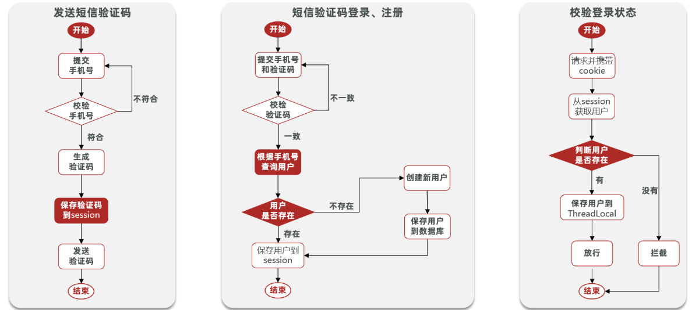

2. 发送验证码

```java
public Result sendCode(String phone, HttpSession session) {
    // 1. 验证手机号格式
    if (RegexUtils.isPhoneInvalid(phone)) {
        // 2. 不符合
        return Result.fail("手机号格式错误");
    }
    // 3.符合 生成验证码
    String code = RandomUtil.randomNumbers(6);
    // 4. session保存
    session.setAttribute("code", code);
    // 5. 第三方服务发送验证码
    log.debug(code);
    // 6.返回ok
    return Result.ok();
}
```

3. 登录、注册

```java
@Override
public Result login(LoginFormDTO loginForm, HttpSession session) {
    // 1. 校验手机号
    if (RegexUtils.isPhoneInvalid(loginForm.getPhone())) {
        return Result.fail("手机号格式错误");
    }
    // 2. 校验验证码
    Object cacheCode = session.getAttribute("code");
    String code = loginForm.getCode();
    if (cacheCode == null || !cacheCode.toString().equals(code)) {
        // 3. 不一致报错
        return Result.fail("验证码错误");
    }
    // 4. 查用户
    User user = userMapper.selectOne(new LambdaQueryWrapper<User>().eq(User::getPhone, loginForm.getPhone()));
    // 5.判断用户是否存在
    if (user == null) {
        // 6.不存在创建新用户
        user = new User();
        user.setPhone(loginForm.getPhone());
        user.setNickName("user_" + RandomUtil.randomNumbers(10));
        int row = userMapper.insert(user);
        if (row != 1) {
            return Result.fail("用户不存在，创建新用户失败");
        }
    }
    // 7.保存用户信息到session
    session.setAttribute("user", user);
    return Result.ok();
}
```

4. 登录校验拦截器

```java
/**
 * @Classname LoginInterceptor
 * @Description 自定义拦截器
 * @Date 2025/11/15 11:43
 * @Created by YanShijie
 */
public class LoginInterceptor implements HandlerInterceptor {
    @Override
    public boolean preHandle(HttpServletRequest request, HttpServletResponse response, Object handler) throws Exception {
        // 1. 获取session
        HttpSession session = request.getSession();
        // 2. 获取用户
        Object user = session.getAttribute("user");
        // 3. 判断用户是否存在
        if (user == null) {
            // 4. 不存在拦截
            response.setStatus(401);
            return false;
        }
        // 5. 存在保存到ThreadLocal
        UserHolder.saveUser((User) user);
        // 6. 放行
        return true;
    }

    @Override
    public void afterCompletion(HttpServletRequest request, HttpServletResponse response, Object handler, Exception ex) throws Exception {
        // 移除用户
        UserHolder.removeUser();
    }
}
```

```java
/**
 * @Classname MVCConfig
 * @Description MVC配置
 * @Date 2025/11/15 11:49
 * @Created by YanShijie
 */
@Configuration
public class MVCConfig implements WebMvcConfigurer {

    @Override
    public void addInterceptors(InterceptorRegistry registry) {
        registry.addInterceptor(new LoginInterceptor())
                .excludePathPatterns(
                        "/user/login", "user/code", "/shop/**", "/blog/hot", "/shop-type/**", "/upload/**", "/voucher/**"
                );
    }
}

```

```java
@GetMapping("/me")
public Result me(){
    return Result.ok(UserHolder.getUser());
}
```

5. 存在问题
   - 集群的session共享问题：多台Tomcat并不共享session存储空间，当请求切换到不同tomcat服务导致数据丢失问题。
   - 解决方式：需要满足，数据共享、内存存储、key-value结构（Redis）。

#### 6.1.2 基于Redis实现共享session登录

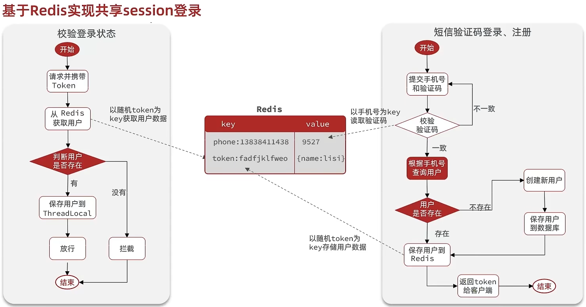

1. 发送验证码

```java
@Override
public Result sendCode(String phone, HttpSession session) {
    // 1. 验证手机号格式
    if (RegexUtils.isPhoneInvalid(phone)) {
        // 2. 不符合
        return Result.fail("手机号格式错误");
    }
    // 3.符合 生成验证码
    String code = RandomUtil.randomNumbers(6);
    // 4. 保存到redis
    stringRedisTemplate.opsForValue().set(LOGIN_CODE_KEY + phone, code, LOGIN_CODE_TTL, TimeUnit.MINUTES);
    // 5. 第三方服务发送验证码
    log.debug(code);
    // 6.返回ok
    return Result.ok();
}
```

2. 登录

```java
@Override
public Result login(LoginFormDTO loginForm, HttpSession session) {
    // 1. 校验手机号
    if (RegexUtils.isPhoneInvalid(loginForm.getPhone())) {
        return Result.fail("手机号格式错误");
    }
    // 2. 校验验证码
    String cacheCode = stringRedisTemplate.opsForValue().get(LOGIN_CODE_KEY + loginForm.getPhone());
    String code = loginForm.getCode();
    if (cacheCode == null || !cacheCode.equals(code)) {
        // 3. 不一致报错
        session.removeAttribute("code");
        return Result.fail("验证码错误");
    }
    session.removeAttribute("code");
    // 4. 查用户
    User user = userMapper.selectOne(new LambdaQueryWrapper<User>().eq(User::getPhone, loginForm.getPhone()));
    // 5.判断用户是否存在
    if (user == null) {
        // 6.不存在创建新用户
        user = new User();
        user.setPhone(loginForm.getPhone());
        user.setNickName("user_" + RandomUtil.randomNumbers(10));
        int row = userMapper.insert(user);
        if (row != 1) {
            return Result.fail("用户不存在，创建新用户失败");
        }
    }
    // 7.保存用户信息到redis
    // 7.1 随机生成token
    String token = UUID.randomUUID().toString(true);
    // 7.2 将User对象转HashMap
    UserDTO userDTO = BeanUtil.copyProperties(user, UserDTO.class);
    Map<String, Object> userMap = BeanUtil.beanToMap(userDTO, new HashMap<>(), CopyOptions.create().setIgnoreNullValue(true).setFieldValueEditor((filedName, fieldValue) -> fieldValue.toString()));
    // 7.3 存储
    stringRedisTemplate.opsForHash().putAll(LOGIN_USER_KEY + token, userMap);
    stringRedisTemplate.expire(LOGIN_USER_KEY + token, LOGIN_USER_TTL, TimeUnit.MINUTES);
    return Result.ok(token);
}
```

3. 登录拦截

```java
@RequiredArgsConstructor
public class LoginInterceptor implements HandlerInterceptor {

    private final StringRedisTemplate stringRedisTemplate;

    @Override
    public boolean preHandle(HttpServletRequest request, HttpServletResponse response, Object handler) throws Exception {
        // 1. 获取请求头中token
        String token = request.getHeader("authorization");
        if (StringUtils.isBlank(token)) {
            // 不存在拦截
            response.setStatus(401);
            return false;
        }
        // 2. 基于token获取用户
        Map<Object, Object> userMap = stringRedisTemplate.opsForHash().entries(LOGIN_USER_KEY + token);
        // 3. 判断用户是否存在
        if (userMap.isEmpty()) {
            // 4. 不存在拦截
            response.setStatus(401);
            return false;
        }
        // 5. hash -> userDto
        UserDTO userDTO = BeanUtil.fillBeanWithMap(userMap, new UserDTO(), false);
        // 6. 保存用户信息到threadLocal中
        UserHolder.saveUser(userDTO);
        // 7.刷新token有效期
        stringRedisTemplate.expire(LOGIN_USER_KEY + token, LOGIN_USER_TTL, TimeUnit.MINUTES);
        
        return true;
    }

    @Override
    public void afterCompletion(HttpServletRequest request, HttpServletResponse response, Object handler, Exception ex) throws Exception {
        // 移除用户
        UserHolder.removeUser();
    }
}
```

4. 存在问题
   - 用户一直访问不需要登录的页面，导致token有效期不刷新。
5. 解决方式

> 加一个全局拦截器，在全局拦截器中刷新token，保证一切请求都会触发刷新token有效期。

```java
/**
 * @Classname LoginInterceptor
 * @Description 自定义拦截器
 * @Date 2025/11/15 11:43
 * @Created by YanShijie
 */
@RequiredArgsConstructor
public class LoginInterceptor implements HandlerInterceptor {

    @Override
    public boolean preHandle(HttpServletRequest request, HttpServletResponse response, Object handler) throws Exception {
       // 1. 判断是否需要拦截
        if (UserHolder.getUser() == null) {
            response.setStatus(401);
            return false;
        }
        // 有用户放行
        return true;
    }

    @Override
    public void afterCompletion(HttpServletRequest request, HttpServletResponse response, Object handler, Exception ex) throws Exception {
        // 移除用户
        UserHolder.removeUser();
    }
}
```

```java
**
 * @Classname RefreshInterceptor
 * @Description 自定义拦截器
 * @Date 2025/11/15 11:43
 * @Created by YanShijie
 */
@RequiredArgsConstructor
public class RefreshInterceptor implements HandlerInterceptor {

    private final StringRedisTemplate stringRedisTemplate;

    @Override
    public boolean preHandle(HttpServletRequest request, HttpServletResponse response, Object handler) throws Exception {
        // 1. 获取请求头中token
        String token = request.getHeader("authorization");
        // 不做拦截
        if (StringUtils.isBlank(token)) {
            return true;
        }
        // 2. 基于token获取用户
        Map<Object, Object> userMap = stringRedisTemplate.opsForHash().entries(LOGIN_USER_KEY + token);
        // 3. 判断用户是否存在
        if (userMap.isEmpty()) {
            // 不做拦截
            return true;
        }
        // 5. hash -> userDto
        UserDTO userDTO = BeanUtil.fillBeanWithMap(userMap, new UserDTO(), false);
        // 6. 保存用户信息到threadLocal中
        UserHolder.saveUser(userDTO);
        // 7.刷新token有效期
        stringRedisTemplate.expire(LOGIN_USER_KEY + token, LOGIN_USER_TTL, TimeUnit.MINUTES);

        return true;
    }

    @Override
    public void afterCompletion(HttpServletRequest request, HttpServletResponse response, Object handler, Exception ex) throws Exception {
        // 移除用户
        UserHolder.removeUser();
    }
}
```

```java
/**
 * @Classname MVCConfig
 * @Description MVC配置
 * @Date 2025/11/15 11:49
 * @Created by YanShijie
 */
@Configuration
@RequiredArgsConstructor
public class MVCConfig implements WebMvcConfigurer {

    private final StringRedisTemplate stringRedisTemplate;

    @Override
    public void addInterceptors(InterceptorRegistry registry) {
        // 默认按照添加顺序执行,但是可以通过order设置优先级，小的先执行。
        registry.addInterceptor(new LoginInterceptor())
                .excludePathPatterns(
                        "/user/login", "/user/code", "/shop/**", "/blog/hot", "/shop-type/**", "/upload/**", "/voucher/**"
                )
                .order(1);
        registry.addInterceptor(new RefreshInterceptor(stringRedisTemplate))
                .addPathPatterns("/**")
                .order(0);
    }
}
```

### 6.2 查询缓存

#### 6.2.1 基本概念

1. 缓存：就是数据交互的缓存区，是数据临时存贮的地方，、一般读写性能较高。
2. 缓存的作用：
   - 降低后端负载
   - 提高读写效率，降低响应时间。
3. 缓存的成本
   - 数据一致性成本
   - 代码维护成本
   - 运维成本

#### 6.2.2 添加Redis缓存

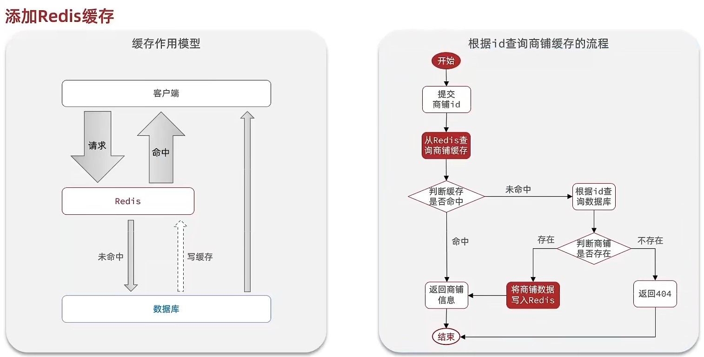

```java
@Service
@RequiredArgsConstructor
public class ShopServiceImpl extends ServiceImpl<ShopMapper, Shop> implements IShopService {

    private final StringRedisTemplate stringRedisTemplate;

    @Override
    public Result queryById(Long id) {
        // 1. 尝试从redis查询商铺缓存
        String shopJson = stringRedisTemplate.opsForValue().get(CACHE_SHOP_KEY + id);
        // 2. 判断是否存在
        if (StrUtil.isBlank(shopJson)) {
            // 3. 存在直接返回
            return Result.ok(JSONUtil.toBean(shopJson, Shop.class));
        }
        // 4. 不存在，从数据库查询
        Shop shop = this.getById(id);
        // 5. 不存在返回失败
        if (shop == null) {
            return Result.fail("商品不存在");
        }
        // 6. 存在，写入redis
        stringRedisTemplate.opsForValue().set("cache:shop:" + id, JSONUtil.toJsonStr(shop));
        // 7. 返回
        return Result.ok(shop);
    }
}
```

#### 6.2.3 缓存更新策略

|          |                           内存淘汰                           |                           超时剔除                           |                  主动更新                  |
| -------- | :----------------------------------------------------------: | :----------------------------------------------------------: | :----------------------------------------: |
| 说明     | 不用自己委会，利用Redis的内存淘汰机制，当内存不足时自动淘汰部分数据。下次查询时更新缓存 | 给缓存数据添加TTL时间，到期后自动删除缓存。下次查询时更新缓存。 | 编写业务逻辑，在修改数据库同时，更新缓存。 |
| 一致性   |                              差                              |                             一般                             |                     好                     |
| 维护成本 |                              无                              |                              低                              |                     高                     |

1. 业务场景
   - 低一致性需求：使用内存淘汰机制。例如店铺类型的查询缓存。
   - 高一致性需求：主动更新，并超时剔除作为兜底方案。例如店铺查询的缓存。
2. 主动更新策略方案
   - 由缓存的调用者，在更新数据库同时更新缓存。（资质编码，可控性更高）**（推荐）**
   - 缓存与数据库整合为一个服务，由服务来维护一致性。调用者调用改服务，无需关系缓存一致性问题。
   - 调用者只操作缓存，由其他线程异步将缓存数据持久化到数据库，保证最终一致。
3. 考虑问题
   - 删除缓存还是更新缓存？
     - 更新缓存：每次更新数据库都更新缓存，无效写操作较多。
     - 删除缓存：更新数据库时让缓存失效，查询时再更新缓存。**（推荐）**
   - 如何保证缓存与数据库操作的同时成功或失败？
     - 单体系统，将缓存与数据库操作放在一个事务中。
     - 分布式系统，利用**TCC等分布式事务**方案。
   - 先操作缓存还是先操作数据库？
     - 先删缓存再操作数据库。**（多线程数据不一致可能性高）**
     - 先操作数据库再删缓存。**（多线程数据不一致可能性低）**，**（推荐）**
4. 添加超时剔除和主动更新策略

```java
@Service
@RequiredArgsConstructor
public class ShopServiceImpl extends ServiceImpl<ShopMapper, Shop> implements IShopService {
    private final StringRedisTemplate stringRedisTemplate;
    @Override
    public Result queryById(Long id) {
        String shopJson = stringRedisTemplate.opsForValue().get(CACHE_SHOP_KEY + id);
        if (!StrUtil.isBlank(shopJson)) {
            return Result.ok(JSONUtil.toBean(shopJson, Shop.class));
        }
        Shop shop = this.getById(id);
        if (shop == null) {
            return Result.fail("商品不存在");
        }
        // 6. 存在，写入redis并设置超时剔除
        stringRedisTemplate.opsForValue().set(CACHE_SHOP_KEY + id, JSONUtil.toJsonStr(shop), CACHE_SHOP_TTL, TimeUnit.MINUTES);
        return Result.ok(shop);
    }
```

```java
// 单体项目
@Transactional(rollbackFor = Exception.class)
@Override
public Result updateShop(Shop shop) {
    Long id = shop.getId();
    if (id == null) {
        return Result.fail("店铺DI不能为空");
    }
    // 更新数据库
    this.updateById(shop);
    // 删除缓存
    stringRedisTemplate.delete(CACHE_SHOP_KEY + shop.getId());
    return Result.ok();
}
```

#### 6.2.4 缓存穿透

> **缓存穿透**是指客户端请求的数据在缓存中和数据库中都不存在，这样缓存永远都不会生效，这些请求都会打到数据库。

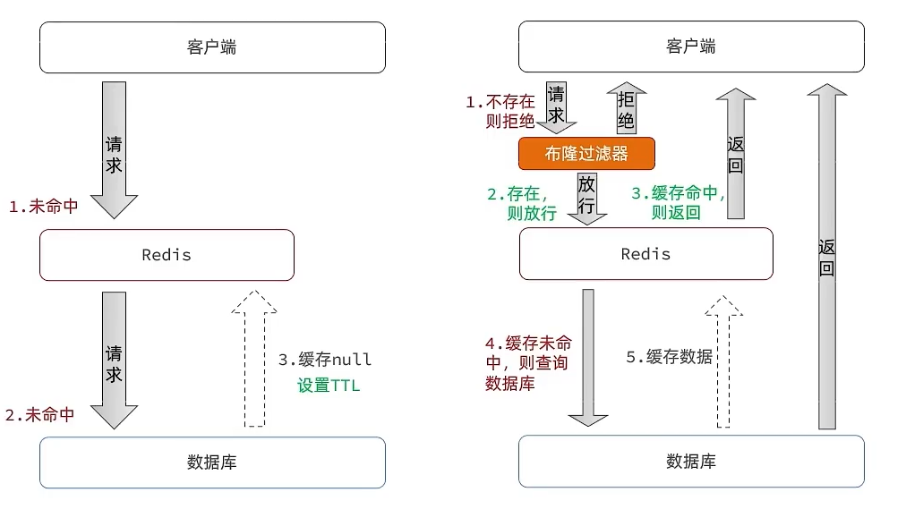

1. 常见解决方案

   - 缓存空对象
     - 优点：实现简单，维护方便。
     - 缺点：额外内存消耗、可能造成短期的不一致。

   - 布隆过滤
     - 优点：内存占用少，没有多余key。
     - 缺点：实现复杂、存在误判可能。

2. 缓存空对象方式

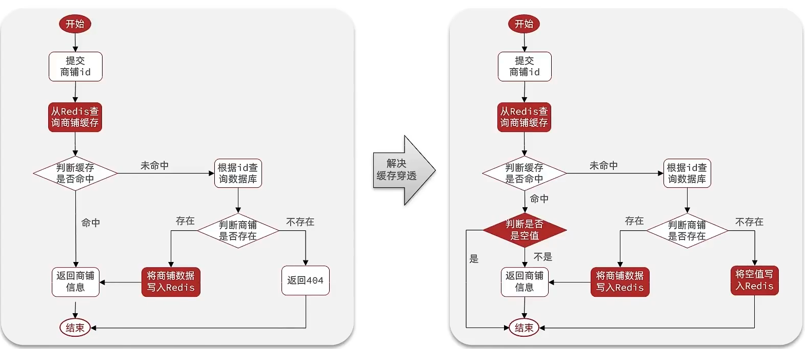

```java
@Override
public Result queryById(Long id) {
    String key = CACHE_SHOP_KEY + id;
    // 1. 尝试从redis查询商铺缓存
    String shopJson = stringRedisTemplate.opsForValue().get(key);
    // 2. 判断是否存在
    if (StrUtil.isNotBlank(shopJson)) {
        // 3. 存在直接返回
        return Result.ok(JSONUtil.toBean(shopJson, Shop.class));
    }
    // 判断命中的是否是空值
    if (shopJson != null) {
        return Result.fail("店铺不存在");
    }
    // 4. 不存在，从数据库查询
    Shop shop = this.getById(id);
    // 5. 不存在返回失败
    if (shop == null) {
        // 将空值写入redis
        stringRedisTemplate.opsForValue().set(key, "", CACHE_NULL_TTL, TimeUnit.SECONDS);
        // 返回错误信息
        return Result.fail("店铺不存在");
    }
    // 6. 存在，写入redis并设置超时剔除
    stringRedisTemplate.opsForValue().set(key, JSONUtil.toJsonStr(shop), CACHE_SHOP_TTL, TimeUnit.MINUTES);
    // 7. 返回
    return Result.ok(shop);
}
```

#### 6.3.5 缓存雪崩

> **缓存雪崩**是指同一时段大量的缓存key同时失效或者Redis服务宕机导致大量请求到达数据库，带来压力。

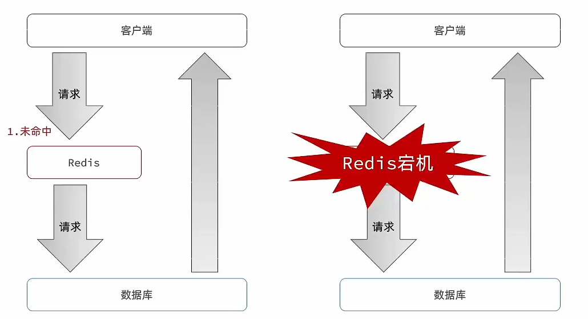

1. 解决方案
   - 给不同key的TTL添加随机值（防止TTL一起到期）。
   - 利用Redis集群提高服务的可用性。
   - 给缓存业务添加**降级限流策略**。
   - 给业务添加**多级缓存**。

#### 6.3.6 缓存击穿

> **缓存击穿问题**也叫热点问题，就是一个被**高并发访问**并且**缓存重建业务交复杂**的key突然失效，无数的请求访问会在瞬间给数据库带来巨大冲击。

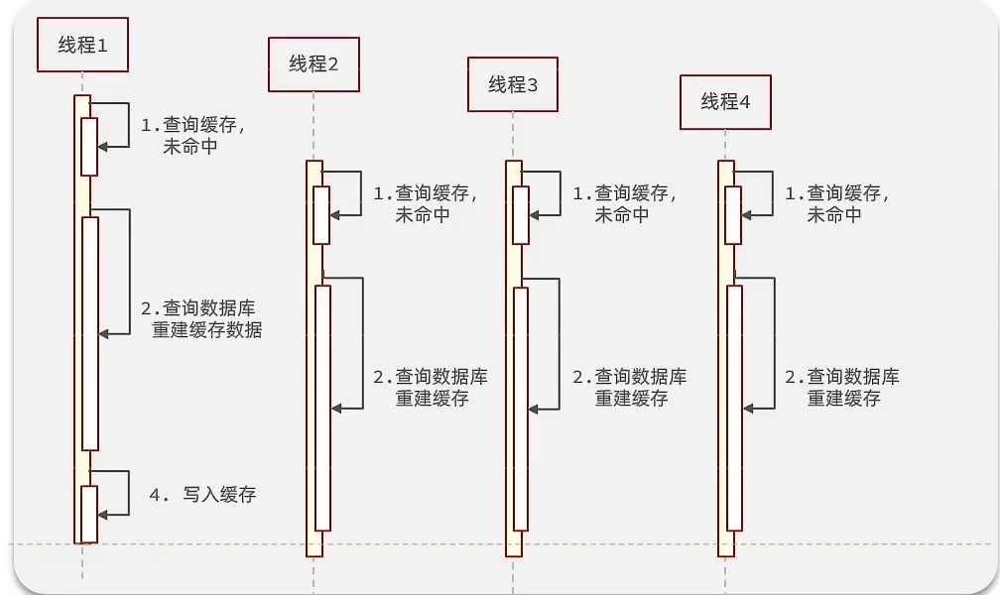

1. 常见解决方案

   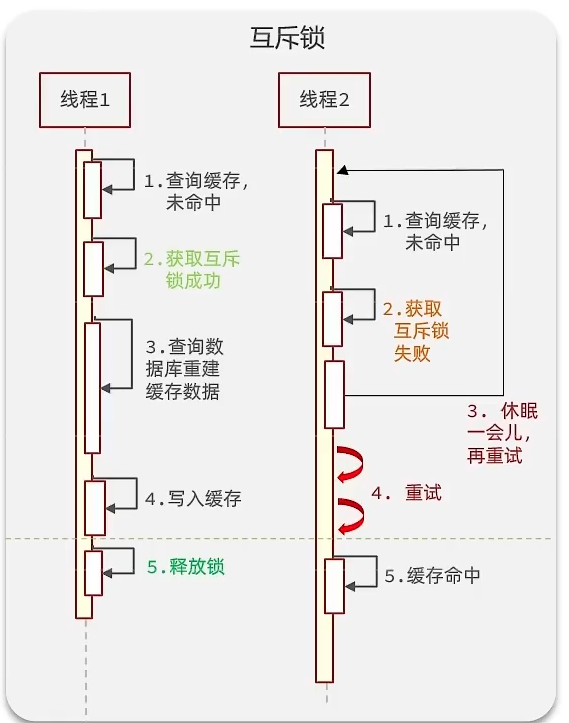

   - 互斥锁
     - 其他线程会等待，所以导致性能较差。

   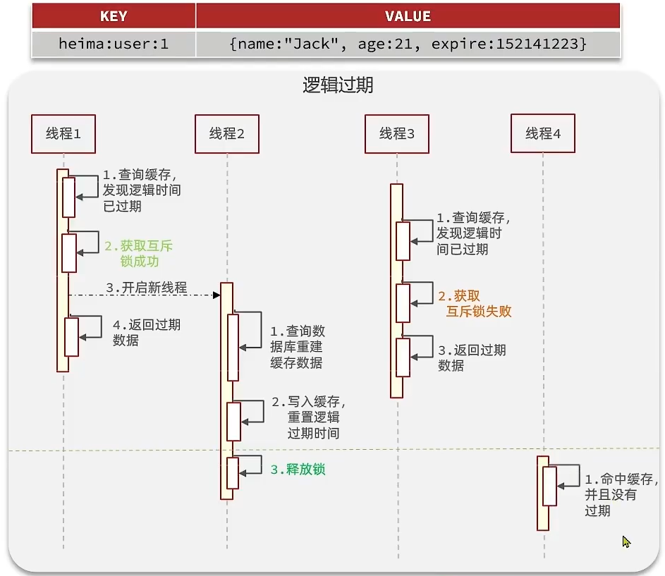

   - 逻辑过期

2. 优缺点

| 解决方案 | 优点                                              | 缺点                                              |
| -------- | ------------------------------------------------- | ------------------------------------------------- |
| 互斥锁   | 1. 没有额外内存消耗。2. 保证一致性。3. 实现简单。 | 1. 线程需要等待，性能受影响。2. 可能有死锁风险。  |
| 逻辑过期 | 1. 线程无需等待，性能较好。                       | 1. 不保证一致性。2. 有额外内存消耗。3. 实现复杂。 |

3. 互斥锁方案解决缓存击穿问题

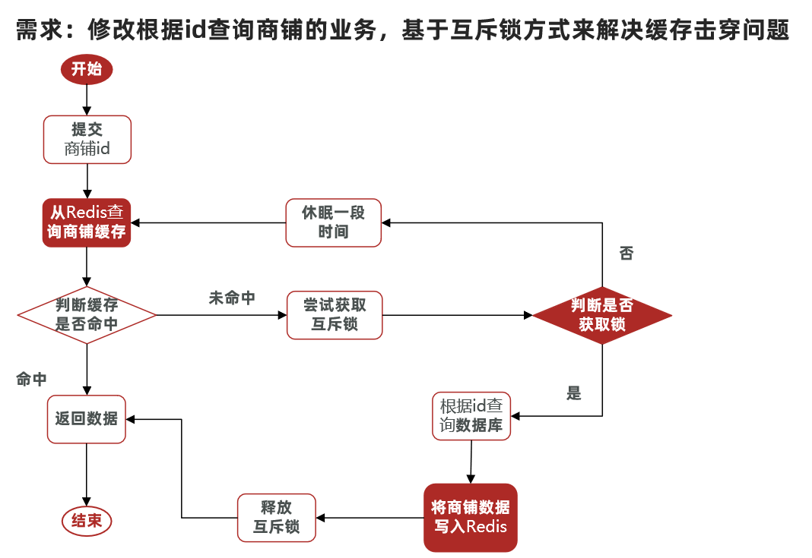

```java
/**
 * 缓存击穿
 */
private Shop queryWithMutex(Long id) {
    // 缓存key
    String key = CACHE_SHOP_KEY + id;
    // 互斥锁key
    String lockKey = LOCK_SHOP_KEY + id;

    // 1. 尝试从redis查询商铺缓存
    String shopJson = stringRedisTemplate.opsForValue().get(key);
    // 2. 判断是否存在
    if (StrUtil.isNotBlank(shopJson)) {
        // 3. 存在直接返回
        return JSONUtil.toBean(shopJson, Shop.class);
    }
    // 判断命中的是否是空值 缓存穿透
    if (shopJson != null) {
        return null;
    }
    // 4. 实现缓存重建
    // 4.1 获取互斥锁
    Shop shop;
    try {
        boolean isLock = tryLock(lockKey);
        // 4.2 判断是否获取成功
        if (!isLock) {
            // 4.3 失败，则休眠并重试
            Thread.sleep(50);
            return queryWithMutex(id);
        }
        // 4.4 成功
        shop = this.getById(id);
        // 模拟重建时间长情况
        Thread.sleep(200);
        // 5. 不存在返回失败
        if (shop == null) {
            // 将空值写入redis
            stringRedisTemplate.opsForValue().set(key, "", CACHE_NULL_TTL, TimeUnit.SECONDS);
            // 返回错误信息
            return null;
        }
        // 6. 存在，写入redis并设置超时剔除
        stringRedisTemplate.opsForValue().set(key, JSONUtil.toJsonStr(shop), CACHE_SHOP_TTL, TimeUnit.MINUTES);
    } catch (InterruptedException e) {
        throw new RuntimeException(e);
    } finally {
        // 释放互斥锁
        unlock(lockKey);
    }
    // 7. 返回
    return shop;
}
```

4. 逻辑过期方案解决缓存击穿问题

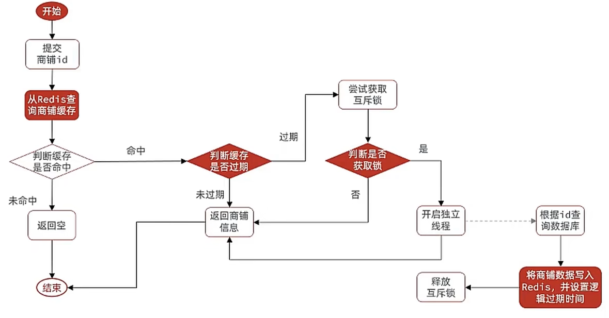

```java
 // 创建线程池
private static final ExecutorService CACHE_REBUILDER_EXECUTOR = Executors.newFixedThreadPool(10);

/**
 * 逻辑过期处理缓存击穿
 */
private Shop queryWithLogicExpire(Long id) {
    // 缓存key
    String key = CACHE_SHOP_KEY + id;
    // 互斥锁key
    String lockKey = LOCK_SHOP_KEY + id;
    // 1. 尝试从redis查询商铺缓存
    String shopJson = stringRedisTemplate.opsForValue().get(key);
    // 2. 判断是否命中
    if (StrUtil.isBlank(shopJson)) {
        // 3. 未命中
        return null;
    }
    // 4. 命中需要先把json反序列化对象
    RedisData<Shop> redisData = JSONUtil.toBean(shopJson, new TypeReference<RedisData<Shop>>() {}, false);
    LocalDateTime expireTime = redisData.getExpireTime();
    Shop shop = redisData.getData();
    // 5. 判断是否过期
    if (expireTime.isAfter(LocalDateTime.now())) {
        // 5.1 未过期直接返回店铺信息
        return shop;
    }
    // 5.2 过期进行缓存重建
    // 6. 缓存重建
    // 6.1 获取互斥锁
    boolean isLock = tryLock(lockKey);
    // 6.2 判断是否获取锁成功
    if (isLock) {
        // 6.3 成功，开启独立线程 实现缓存重建
        CACHE_REBUILDER_EXECUTOR.submit(() -> {
            // 重建缓存
            try {
                this.saveShop2Redis(id, 30L);
            } catch (Exception e) {
                throw new RuntimeException(e);
            } finally {
                // 释放锁
                unlock(lockKey);
            }
        });
        return shop;
    }
    // 6.4 返回过期商铺信息
    return shop;
}

private void saveShop2Redis(Long id, Long expireSeconds) {
    // 1. 查询店铺数据
    Shop shop = getById(id);
    // 2. 封装逻辑过期时间
    RedisData<Shop> redisData = new RedisData<>();
    redisData.setData(shop);
    redisData.setExpireTime(LocalDateTime.now().plusSeconds(expireSeconds));
    stringRedisTemplate.opsForValue().set(CACHE_SHOP_KEY + id, JSONUtil.toJsonStr(redisData));
}

/**
 * 上锁 setnx
 * @param key key
 * @return 是否成功
 */
private boolean tryLock(String key) {
    Boolean flag = stringRedisTemplate.opsForValue().setIfAbsent(key, "1", 10, TimeUnit.SECONDS);
    return BooleanUtil.isTrue(flag);
}

/**
 * 释放锁
 * @param key key
 */
private void unlock(String key) {
    stringRedisTemplate.delete(key);
}
```

#### 6.3.7 缓存工具封装

> 基于StringRedisTemplate封装缓存工具类。

1. 需求
   - 将java对象序列化为json并存储在string类型的key中，并且可以设置TTL过期时间。
   - 将任意java对象序列化为json并存储在string类型的key中，并且可以设置逻辑过期时间，用于处理缓存击穿问题。
   - 根据指定key查询缓存，并反序列化为指定类型，利用缓存空值的方式解决缓存穿透的问题。
   - 根据指定key查询缓存，并反序列化为指定类型，需要利用逻辑过期解决缓存击穿问题。
2. 代码

```java
/**
 * @Classname CacheClient
 * @Description 缓存工具类
 * @Date 2025/11/16 15:20
 * @Created by YanShijie
 */
@Component
@RequiredArgsConstructor
public class CacheClient<T> {

    private final StringRedisTemplate stringRedisTemplate;

    // 线程池
    public static final ExecutorService CACHE_REBUILDER_EXECUTOR = Executors.newFixedThreadPool(10);

    // 设置普通缓存
    public void set(String key, T value, Long time, TimeUnit timeUnit) {
        stringRedisTemplate.opsForValue().set(key, JSONUtil.toJsonStr(value), time, timeUnit);
    }

    // 设置逻辑过时缓存
    public void setWithLogicExpire(String key, T value, Long time, TimeUnit timeUnit) {
        // 设置逻辑过期
        RedisData<T> redisData = new RedisData<>();
        redisData.setData(value);
        redisData.setExpireTime(LocalDateTime.now().plusSeconds(timeUnit.toSeconds(time)));
        // 写入redis
        stringRedisTemplate.opsForValue().set(key, JSONUtil.toJsonStr(redisData));
    }

    /**
     * 缓存穿透
     * @param keyPrefix key前缀
     * @param id 查询id
     * @param type 反序列化类型
     * @param dbFallBack 缓存重建逻辑
     * @param time 时间
     * @param timeUnit 时间单位
     * @return 返回结果
     * @param <R> id类型
     */
    public <R> T queryWithPassThrough (String keyPrefix, R id, Class<T> type, Function<R, T> dbFallBack, Long time, TimeUnit timeUnit) {
        String key = keyPrefix + id;
        // 从redis查询缓存
        String json = stringRedisTemplate.opsForValue().get(key);
        // 判断是否存在
        if (StrUtil.isNotBlank(json)) {
            // 存在直接返回
            return JSONUtil.toBean(json, type);
        }
        // 缓存击穿
        if(json != null) {
            return null;
        }
        // 不存在 更具id查询数据库
        T r = dbFallBack.apply(id);
        // 不存在 处理缓存穿透
        if(r == null) {
            // 将空值写入redis
            stringRedisTemplate.opsForValue().set(key,"", CACHE_NULL_TTL, TimeUnit.MINUTES);
            // 返回null
            return null;
        }
        // 存在写入Redis
        this.set(key, r, time, timeUnit);

        return r;
    }


    /**
     * 逻辑过时解决缓存击穿
     * @param keyPrefix key前缀
     * @param id 查询id
     * @param type 反序列化类型
     * @param dbFallBack 查询逻辑
     * @param time 时间
     * @param timeUnit 时间单位
     * @return 数据
     * @param <R> ID类型
     */
    public <R> T queryWithLogicalExpire(String keyPrefix, R id, Class<T> type, Function<R, T> dbFallBack, Long time, TimeUnit timeUnit) {
        // 缓存key
        String key = keyPrefix + id;
        // 互斥锁key
        String lockKey = LOCK_SHOP_KEY + id;
        // 1. 尝试从redis查询缓存
        String shopJson = stringRedisTemplate.opsForValue().get(key);
        // 2. 判断是否命中
        if (StrUtil.isBlank(shopJson)) {
            // 3. 未命中
            return null;
        }
        // 4. 命中需要先把json反序列化对象
        RedisData<T> redisData = JSONUtil.toBean(shopJson, new TypeReference<RedisData<T>>() {}, false);
        LocalDateTime expireTime = redisData.getExpireTime();
        T data = redisData.getData();
        // 5. 判断是否过期
        if (expireTime.isAfter(LocalDateTime.now())) {
            // 5.1 未过期直接返回数据
            return data;
        }
        // 5.2 过期进行缓存重建
        // 6. 缓存重建
        // 6.1 获取互斥锁
        boolean isLock = tryLock(lockKey);
        // 6.2 判断是否获取锁成功
        if (isLock) {
            // 6.3 成功，开启独立线程 实现缓存重建
            CACHE_REBUILDER_EXECUTOR.submit(() -> {
                // 重建缓存
                try {
                    // 查询数据库
                    T res = dbFallBack.apply(id);
                    // 写入redis
                    this.setWithLogicExpire(key, res, time, timeUnit);
                } catch (Exception e) {
                    throw new RuntimeException(e);
                } finally {
                    // 释放锁
                    unlock(lockKey);
                }
            });
        }
        // 6.4 返回数据
        return data;
    }

    /**
     * 上锁 setnx
     * @param key key
     * @return 是否成功
     */
    private boolean tryLock(String key) {
        Boolean flag = stringRedisTemplate.opsForValue().setIfAbsent(key, "1", 10, TimeUnit.SECONDS);
        return BooleanUtil.isTrue(flag);
    }

    /**
     * 释放锁
     * @param key key
     */
    private void unlock(String key) {
        stringRedisTemplate.delete(key);
    }
}
```

```java
@Service
@RequiredArgsConstructor
public class ShopServiceImpl extends ServiceImpl<ShopMapper, Shop> implements IShopService {

    private final StringRedisTemplate stringRedisTemplate;

    private final CacheClient<Shop> cacheClient;

    @Override
    public Result queryById(Long id) {
        // 缓存穿透
        // Shop shop = cacheClient.queryWithPassThrough(CACHE_SHOP_KEY, id, Shop.class, this::getById, CACHE_SHOP_TTL, TimeUnit.MINUTES);
        // 逻辑过期解决缓存击穿
        Shop shop = cacheClient.queryWithLogicalExpire(CACHE_SHOP_KEY, id, Shop.class, this::getById, CACHE_SHOP_TTL, TimeUnit.MINUTES);
        return Result.ok(shop);
    }

    @Transactional(rollbackFor = Exception.class)
    @Override
    public Result updateShop(Shop shop) {
        Long id = shop.getId();
        if (id == null) {
            return Result.fail("店铺DI不能为空");
        }
        // 更新数据库
        this.updateById(shop);
        // 删除缓存
        stringRedisTemplate.delete(CACHE_SHOP_KEY + shop.getId());
        return Result.ok();
    }
}
```

### 6.3 优惠卷秒杀

#### 6.3.1 全局唯一ID

1. 问题背景
   - 当用户抢购时，生成订单并保存到表中，而订单表如果使用数据库自增ID就存在一些问题
     - id的规律性太明显，容易让用户就会猜测到一些信息。
     - 受表单数量的限制，多表id会重复，未来售后会出问题。
2. 基本概念
   - 是一种在分布式系统下用来生成全局唯一ID的工具，一般要满足下列特性：
     - 唯一性、高可用、高性能、递增性、安全性。
3. 组成原理

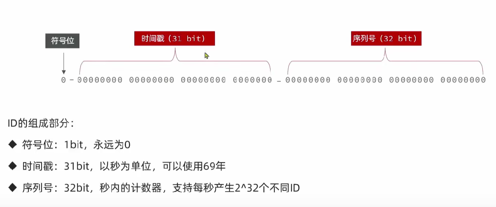

4. 全局唯一ID生成策略
   - UUID：不够友好，不满足特性
   - Redis自增：上方方案
   - snowflake算法（雪花算法）：不依赖redis性能比较好，但是对时钟要求强。
   - 数据库自增：单独做一张表，可以立即为Redis自增的数据库版本。但是性能没有Redis好。
5. Redis自增策略优势
   - 每天一个key，方便统计订单量
   - ID构造是时间戳 + 计数器

#### 6.3.2 实现优惠卷秒杀下单

1. 实现流程

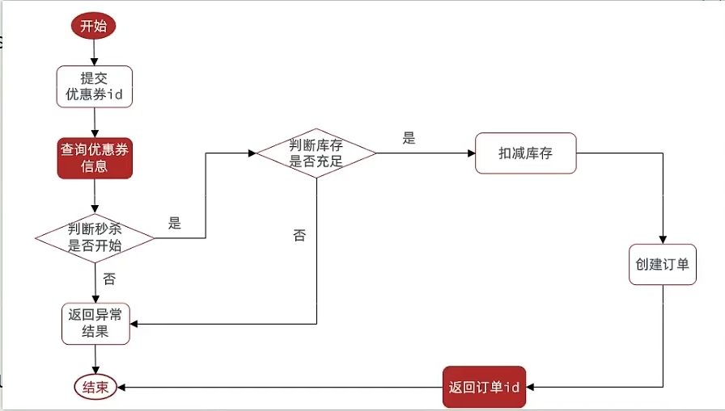

2. 代码实现

```java
@Service
@RequiredArgsConstructor
public class VoucherOrderServiceImpl extends ServiceImpl<VoucherOrderMapper, VoucherOrder> implements IVoucherOrderService {

    private final ISeckillVoucherService iSeckillVoucherService;

    private final RedisIdWorker redisIdWorker;

    @Transactional(rollbackFor = Exception.class)
    @Override
    public Result seckillVoucher(Long voucherId) {
        // 1. 查询优惠卷
        SeckillVoucher seckillVoucher = iSeckillVoucherService.getById(voucherId);
        // 2. 判断是否开始
        if (seckillVoucher.getBeginTime().isAfter(LocalDateTime.now())) {
            return Result.fail("秒杀尚未开始");
        }
        // 3. 判断是否已经结束
        if (seckillVoucher.getEndTime().isBefore(LocalDateTime.now())) {
            return Result.fail("秒杀已结束");
        }
        // 4. 判断库存是否充足
        if (seckillVoucher.getStock() < 1) {
            return Result.fail("库存不足");
        }
        // 5. 扣减库存
        boolean success = iSeckillVoucherService.update().setSql("stock = stock - 1").eq("voucher_id", voucherId).update();
        if (!success) {
            return Result.fail("库存不足");
        }
        // 6. 创建订单
        VoucherOrder voucherOrder = new VoucherOrder();
        long orderId = redisIdWorker.nextId("order");
        voucherOrder.setId(orderId);
        voucherOrder.setUserId(UserHolder.getUser().getId());
        voucherOrder.setVoucherId(voucherId);
        save(voucherOrder);
        // 7. 返回orderId
        return Result.ok(orderId);
    }
}
```

#### 6.3.3 超卖问题

> 经过Jmeter压测出现了超卖情况。**（多线程并发安全问题）**

1. 问题原理

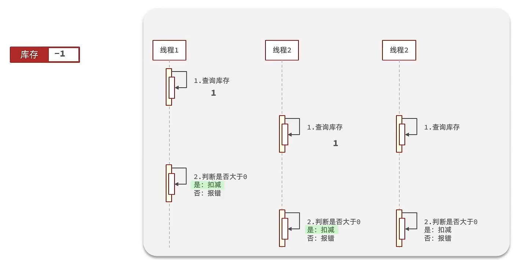

2. 解决方案（加锁）
   - **悲观锁：**认为线程安全问题一定会发生，因此在操作数据之前先获取锁，确保线程串行。
     - 例如Synchronized、Lock等
     - 性能太差
   - **乐观锁：**认为线程安全问题不一定会发生，因此不加锁，只是在更新数据时去判断有没有其他线程对数据做了修改。
     - 如果没有修改则认为是安全的，自己才更新数据。
     - 如果已经被其他线程修改说明发送了安全问题，此时可以重试或异常。
     - 所以性能要好很多。

3. 乐观锁方案

   - 版本号法：判断数据库版本号字段有没有变化。

   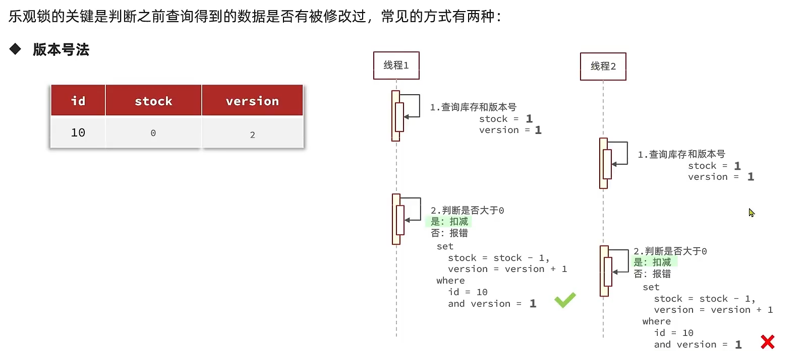

   - CAS方案：用数据本身有没有变化去判断。**(Compare And Set)**

   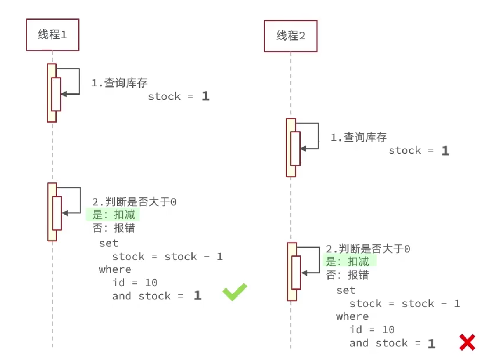

```java
// 5. 扣减库存
boolean success = iSeckillVoucherService.update()
        .setSql("stock = stock - 1")
        .eq("voucher_id", voucherId)
        .eq("stock", seckillVoucher.getStock())
        .update();
```

4. 优化问题**（完美解决）**
   - 成功率太低，虽然业务层面不影响。

```java
// 5. 扣减库存
boolean success = iSeckillVoucherService.update()
        .setSql("stock = stock - 1")
        .eq("voucher_id", voucherId)
        .gt("stock", 0) // 直接 > 0 就行
        .update();
```

#### 6.3.4 一人一单

1. 解决了一人一旦并发安全问题

```java
@Service
@RequiredArgsConstructor
public class VoucherOrderServiceImpl extends ServiceImpl<VoucherOrderMapper, VoucherOrder> implements IVoucherOrderService {

    private final ISeckillVoucherService iSeckillVoucherService;

    private final RedisIdWorker redisIdWorker;

    @Override
    public Result seckillVoucher(Long voucherId) {
        // 1. 查询优惠卷
        SeckillVoucher seckillVoucher = iSeckillVoucherService.getById(voucherId);
        // 2. 判断是否开始
        if (seckillVoucher.getBeginTime().isAfter(LocalDateTime.now())) {
            return Result.fail("秒杀尚未开始");
        }
        // 3. 判断是否已经结束
        if (seckillVoucher.getEndTime().isBefore(LocalDateTime.now())) {
            return Result.fail("秒杀已结束");
        }
        // 4. 判断库存是否充足
        if (seckillVoucher.getStock() < 1) {
            return Result.fail("库存不足");
        }

        Long userId = UserHolder.getUser().getId();
        // 注意String对象地址不一样所以要用intern从字符串常量池找相同值的对象地址来加锁
        synchronized (userId.toString().intern()) {
            // 自我调用事务失效
            // 获取代理对象（事务） 避免自我调用事务失效
            IVoucherOrderService proxy = (IVoucherOrderService) AopContext.currentProxy();
            return proxy.createVoucherOrder(voucherId);
        }
    }
    
    @Transactional(rollbackFor = Exception.class)
    public Result createVoucherOrder(Long voucherId) {
        // 5. 一人一单
        Long userId = UserHolder.getUser().getId();
        // 5.1 查询订单
        int count = query().eq("user_id", userId).eq("voucher_id", voucherId).count();
        // 5.2 判断是否存在
        if (count > 0) {
            return Result.fail("用户已经购买过一次！");
        }
        // 6. 扣减库存
        boolean success = iSeckillVoucherService.update()
                .setSql("stock = stock - 1")
                .eq("voucher_id", voucherId)
                .gt("stock", 0)
                .update();
        if (!success) {
            return Result.fail("库存不足");
        }
        // 7. 创建订单

        VoucherOrder voucherOrder = new VoucherOrder();
        long orderId = redisIdWorker.nextId("order");
        voucherOrder.setId(orderId);
        voucherOrder.setUserId(UserHolder.getUser().getId());
        voucherOrder.setVoucherId(voucherId);
        save(voucherOrder);
        // 7. 返回orderId
        return Result.ok(orderId);

    }
}

```

2. 改进

> 集群模式下存在问题，负载均衡情况下，用户ID一样没锁住。

3. 原理
   - 由于现在我们部署了多个tomcat，每个tomcat都有一个属于自己的jvm，那么假设在服务器A的tomcat内部，有两个线程，这两个线程由于使用的是同一份代码，那么他们的锁对象是同一个，是可以实现互斥的，但是如果现在是服务器B的tomcat内部，又有两个线程，但是他们的锁对象写的虽然和服务器A一样，但是锁对象却不是同一个，所以线程3和线程4可以实现互斥，但是却无法和线程1和线程2实现互斥，这就是 集群环境下，syn锁失效的原因，在这种情况下，我们就需要使用分布式锁来解决这个问题。

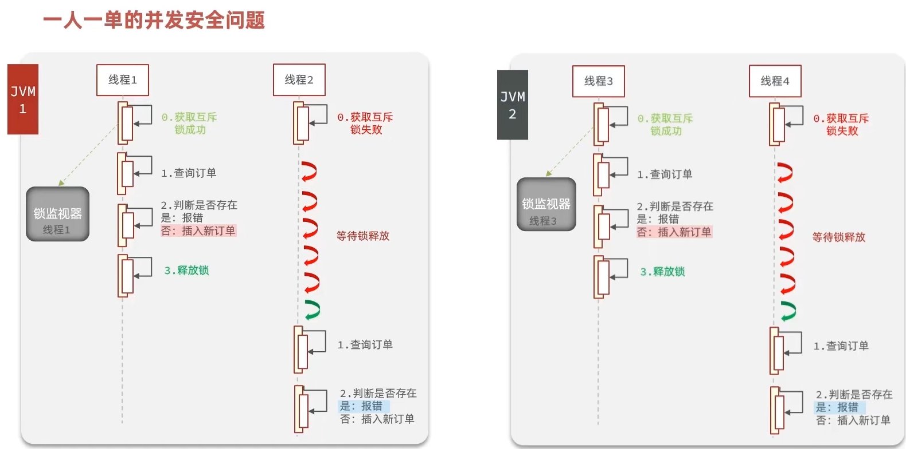

4. 解决方式：使用分布式锁详情见下。

#### 6.3.5 分布式锁

> 满足在分布式系统或集群模式下多进程可见并且互斥的锁。

1. 必须特性
   - 多进程可见、互斥、高可用、高性能、安全性...
2. 分布式锁的方案
   - 分布式锁的核心是实现多进程之间的互斥，常见实现方法有三种：

|        |           Mysql            |                      Redis                       |            Zookeeper             |
| :----: | :------------------------: | :----------------------------------------------: | :------------------------------: |
|  互斥  | 利用数据库本身的互斥锁机制 | 利用setnx互斥命令（只用数据不存在才可以set成功） | 利用节点的唯一性和有序性实现互斥 |
| 高可用 |     好（支持主从模式）     |                好（集群 + 主从）                 |            好（集群）            |
| 高性能 |            一般            |                        好                        |    一般（强一致性，数据同步）    |
| 安全性 |    断开连接，自动释放锁    | 服务宕机，无法释放锁，利用key过期机制，到期释放  |      临时节点，断开自动释放      |


#### 6.3.6 Redis优化秒杀


#### 6.3.7 Redis消息队列实现异步秒杀


### 6.4 分布式锁


### 6.5 秒杀优化


### 6.6 Redis消息队列


