## 四、 Sentinel

> **官方文档：**https://github.com/alibaba/Sentinel/wiki
>
> 服务保护（限流、熔断降级）

### 1.  基础

#### 	1、 功能介绍

> 随着微服务的流行，服务和**服务之间的稳定性**变锝越来越重要。**Spring Cloud Alibaba Sentinel** 以流量为切入点，从**流量控制**、**流量路由**、**熔断降级**、**系统自适应过载保护**、**热点流量防护**等多个维度保护服务的稳定性。

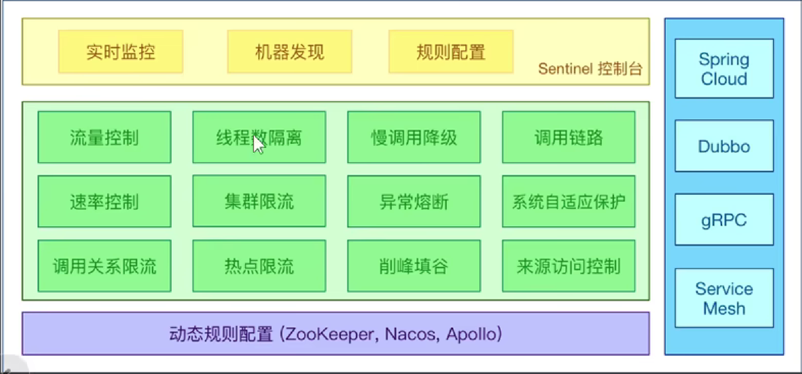

#### 	2、架构原理

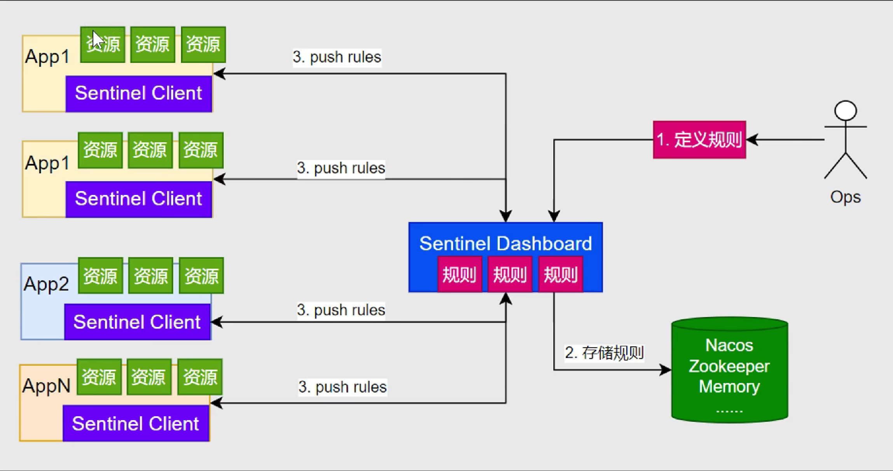

#### 	3、资源&规则

> （1）定义资源：
>
> ​	主流框架**自动适配：**（Web Servlet、Dubbo、Spring Cloud、gRPC、Spring WebFlux、Reactor）所有web接口均为资源。
>
> ​	编程式：SphU API
>
> ​	声明式：@SentinelREsource
>
> （2）定义规则：
>
> ​	**流量控制**
>
> ​	**熔断降级**
>
> ​	**系统保护**
>
> ​	**来源访问控制**
>
> ​	**热点参数**

#### 	4、工作原理

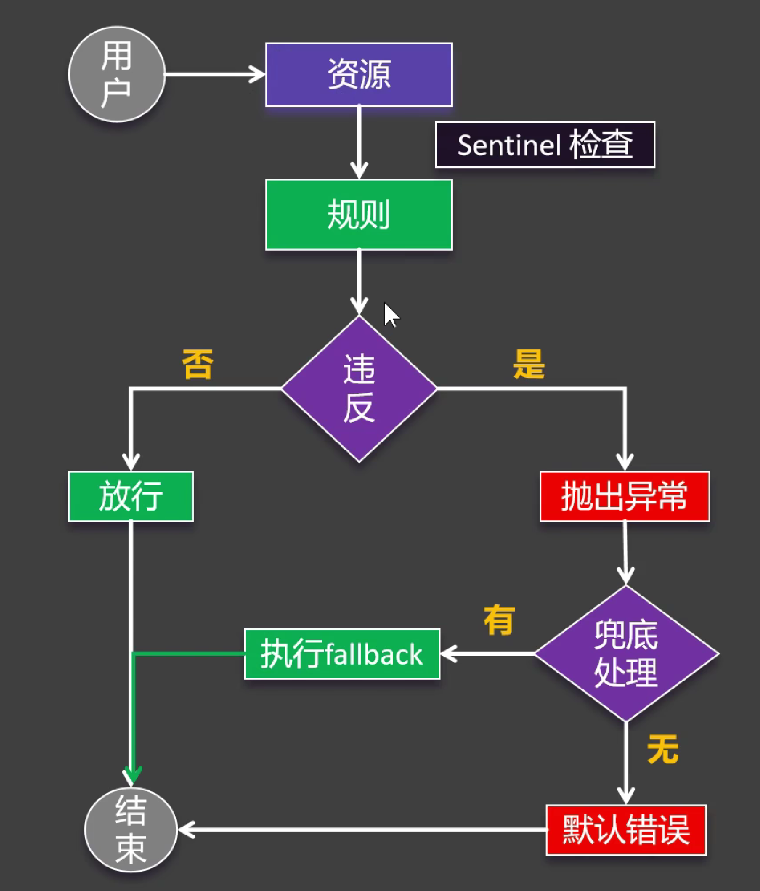

### 2. 整合


#### 	1、依赖导入

```xml
<!-- Sentinel 服务保护 -->
<dependency>
    <groupId>com.alibaba.cloud</groupId>
    <artifactId>spring-cloud-starter-alibaba-sentinel</artifactId>
</dependency>
```

#### 	2、Yaml配置

```yaml
spring:
  cloud:
    sentinel:
      transport:
        dashboard: localhost:8858
      # 提前加载
      eager: true
```

#### 	3、基础场景

```java
@SentinelResource(value = "createOrder") // 配置sentinel
@Override
public Order createOrder(Long userId, Long productId) {
    ...
}
```

### 3. 异常处理

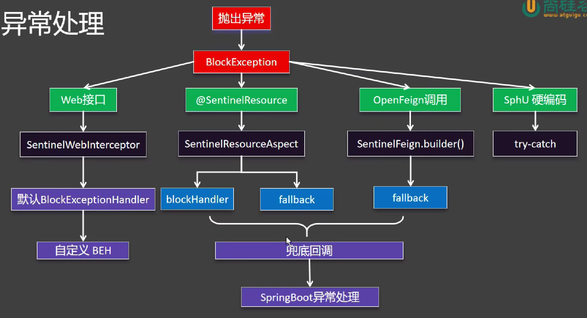

#### 	1、Web接口处理方式

```java
@Component
@RequiredArgsConstructor
public class MyBlockExceptionHandler implements BlockExceptionHandler {
private final ObjectMapper objectMapper;
@Override
public void handle(HttpServletRequest request, HttpServletResponse response, String resourceName, BlockException e) throws Exception {
        response.setContentType("application/json;charset=utf8");
        PrintWriter writer = response.getWriter();
        R error = R.error(500, resourceName + "被Sentinel限制了，原因：" + e.getMessage());
        writer.write(objectMapper.writeValueAsString(error));
        writer.flush();
        writer.close();
    }
}
```

#### 	2、@SentinelResource处理方式

```java
@SentinelResource(value = "createOrder", blockHandler = "createOrderFallback") // 配置sentinel
@Override
public Order createOrder(Long userId, Long productId) {
    ...
    return order;
}
/**
 * 执行兜底回调
 */
public Order createOrderFallback(Long userId, Long productId, BlockException e) {
    Order order = new Order();
    order.setId(0L);
    order.setTotalAmount(new BigDecimal(0));
    order.setUserId(userId);
    order.setNickname("未知用户");
    order.setAddress("未知地址");
    return order;
}
```

#### 	3、OpenFeign调用处理方式

```java
@FeignClient(value = "service-product", fallback = ProductFeignClientFallback.class) // fallback兜底回调
public interface ProductFeignClient {
    @GetMapping("/product/{id}")
    Product getProductById(@PathVariable("id") Long id);

}
```

```java
/**
 * 兜底回调
 */
@Component
public class ProductFeignClientFallback implements ProductFeignClient {
    @Override
    public Product getProductById(Long id) {
        System.out.println("兜底回调");
        Product product = new Product();
        product.setId(id);
        product.setProductName("未知商品");
        product.setPrice(new BigDecimal("0"));
        product.setNum(0);
        return product;
    }
}
```

#### 	4、SphU硬编码

```java
@Override
public Order createOrder(Long userId, Long productId) {
    ...
    // 如果这段代码违反sentinel规则，会抛出BlockException
    try {
        SphU.entry("test");
        /// 总金额
        order.setTotalAmount(product.getPrice().multiply(new BigDecimal(product.getNum())));
        order.setUserId(userId);
        order.setNickname("张三");
        order.setAddress("北京");
        /// 远程查询商品列表
        order.setProductList(List.of(product));
    } catch (BlockException e) {
        throw new RuntimeException(e);
    }
    return order;
}
```

### 4. 流控规则

> 限制多余的请求、从而保证系统资源不被耗尽


#### 	1、阈值类型

> 阈值类型
>
> ​	**QPS：**每秒钟系统能处理的请求数量。
>
> ​	**并发线程数 ：**同一时间，有多少个线程（或用户）在同时发起请求。
>
> 集群阈值模式
>
> ​	**单机均摊：**设置单个机器的请求阈值
>
> ​	**总体阈值：**设置整合集群的请求阈值

#### 	2、流控模式

> 直接、关联、链路

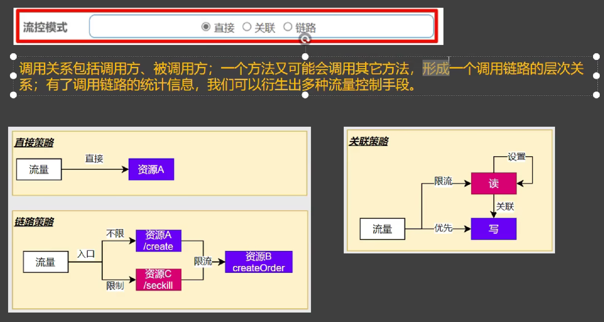

（1）直接模式：正常情况

（2）链路模式

```yaml
spring:
    sentinel:
      # 关闭上下文统一
      web-context-unify: false
```

```java
// 秒杀创建订单（测测试流控模式-链路）
@GetMapping("/seckill")
public Order seckill(@RequestParam("userId") Long userId, @RequestParam("productId") Long productId) {
    Order order = orderService.createOrder(userId, productId);
    order.setId(Long.MAX_VALUE);
    return order;
}
```

（3）关联模式

```java
// 关联模式演示
@GetMapping("/write")
public String writeDb() {
    return "writeDb success...";
}
@GetMapping("/read")
public String readDb() {
    return "readDb success...";
}
```

#### 	3、流控效果

> 快速失败、WarmUp、排队等待


（1）快速失败

（2）WarmUp：**设置预热时长、预热时长内逐步达到阈值**

（3）排队等待：**设置超时时间、每个超时时间内允许阈值通过。**


### 4. 熔断规则

#### 	1、熔断策略

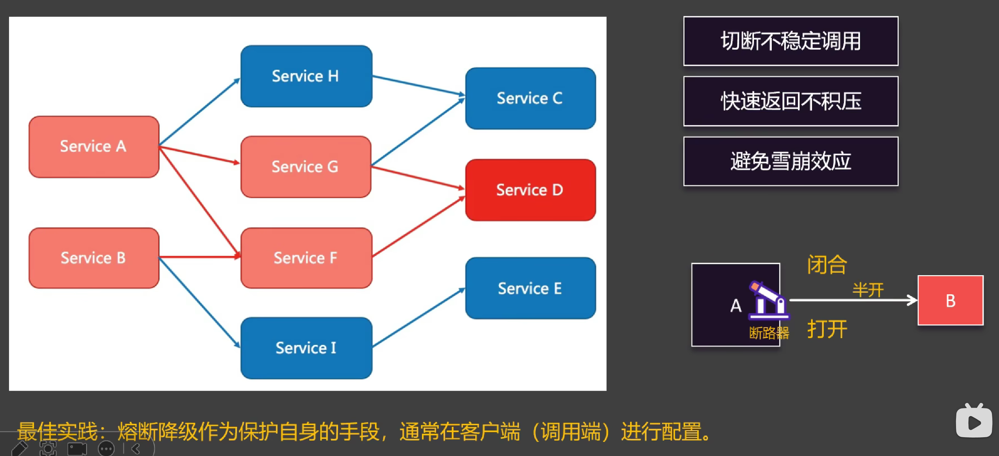

> **断路器工作原理**
>
> ​	**慢调用比例：**例如统计时长内放入100请求，其中70%都超过1秒（你认为的慢时间）就转为Open状态
>
> ​	**异常比例：**同上
>
> ​	**异常数：**同上

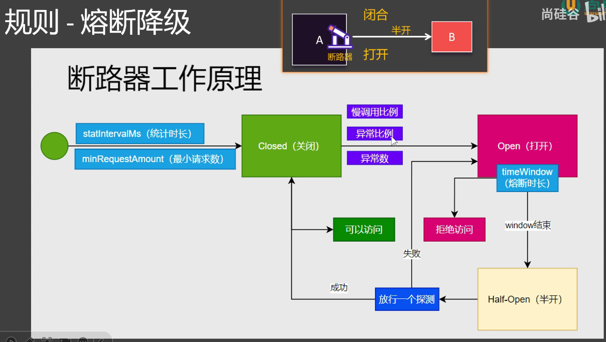

> **有无熔断规则情况的兜底回调**
>
> **有熔断发送请求前就可以兜底回调速度快**：避免雪崩。降低资源浪费。提高系统鲁棒性。
>
> **无熔断请求发送后才兜底回调**

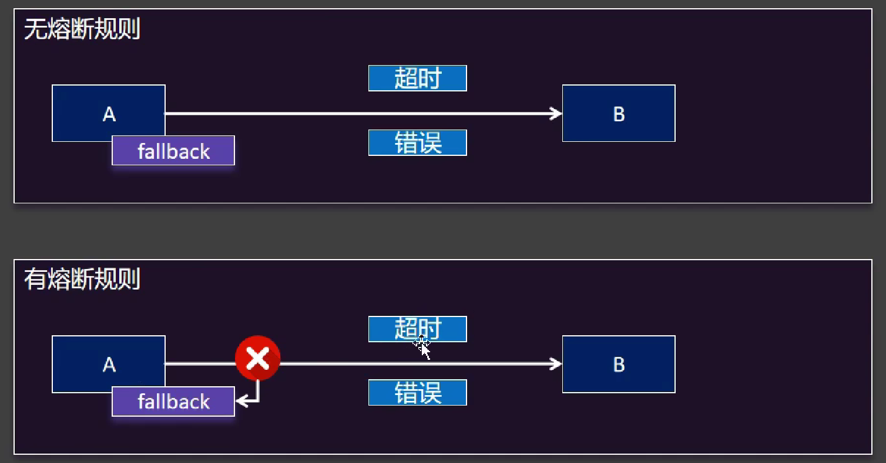

##### 	（1）慢调用比例

> 设置参数说明：
>
> **最大 RT：**你认为的慢请求时间
>
> **比例阈值：**认为失败的比例
>
> **熔断时长：**熔断时长
>
> **统计时长:****统计时长
>
> **最小请求数：**最少请求数量

##### 	（2）异常比例

> 参数同上：没有最大RT（不需要）

##### 	（3）异常数

> 参数同上：没有最大RT，以及比例阈值（不需要）
>
> **异常数：**异常数量（新增）

### 5. 热点规则

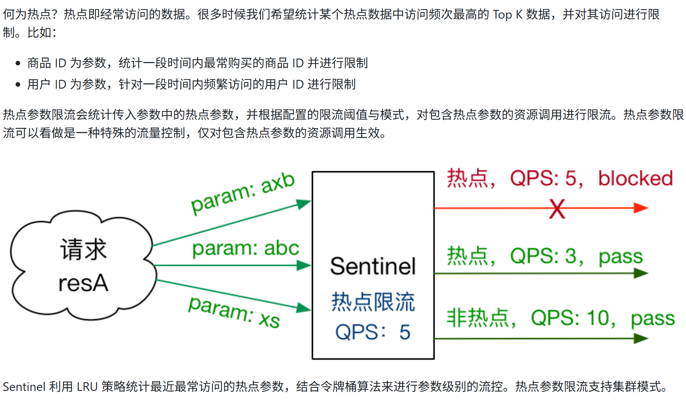

#### 	1、环境搭建

（1）导入热点规则依赖

```xml
<!-- Sentinel 热点规则 -->
<dependency>
    <groupId>com.alibaba.csp</groupId>
    <artifactId>sentinel-parameter-flow-control</artifactId>
</dependency>
```

```java
// 秒杀创建订单（测试热点规则）
@GetMapping("/seckill")
@SentinelResource(value = "seckill-order", fallback = "seckillFallback")
public Order seckill(@RequestParam(value = "userId", defaultValue = "888") Long userId, @RequestParam(value = "productId", defaultValue = "1000") Long productId) {
    Order order = orderService.createOrder(userId, productId);
    order.setId(Long.MAX_VALUE);
    return order;
}
public Order seckillFallback(Long userId, Long productId, BlockException e) {
    System.out.println("seckillFallback...");
    Order order = new Order();
    order.setId(productId);
    order.setUserId(userId);
    order.setAddress("异常信息：" + e.getClass());
    return order;
}
```

#### 	2、热点参数限流

> 需求一：每个用户秒杀QPS不得超过1（秒杀下单userId级别）

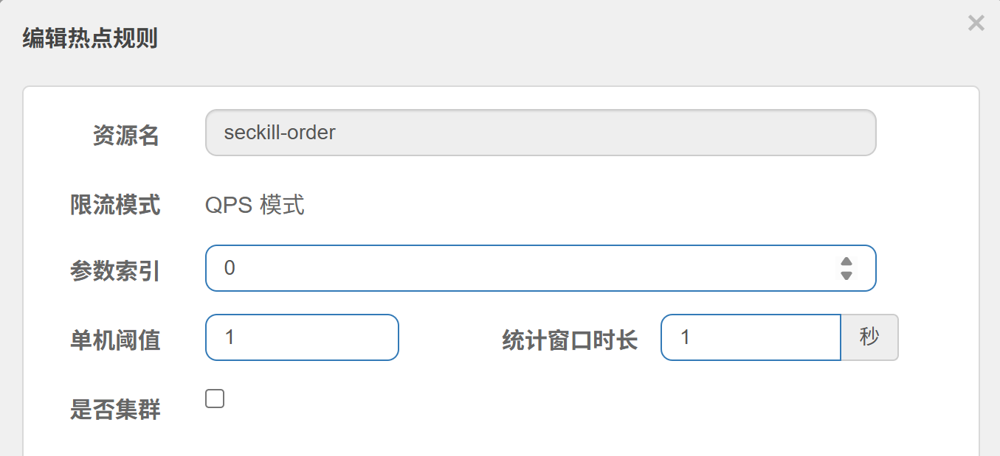

> 需求二：6号用户是vvip，不限制QPS（例外情况）

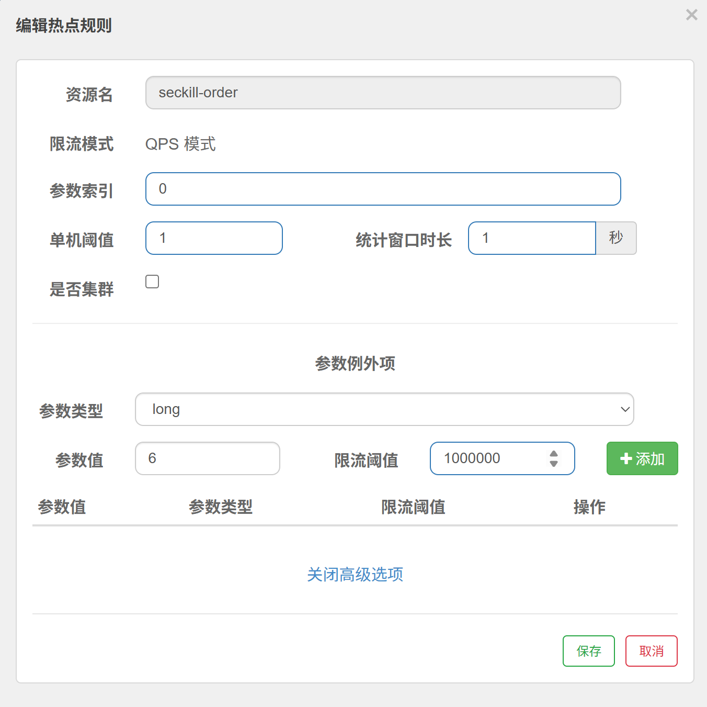

> 需求三：666号是下架商品，不允许访问

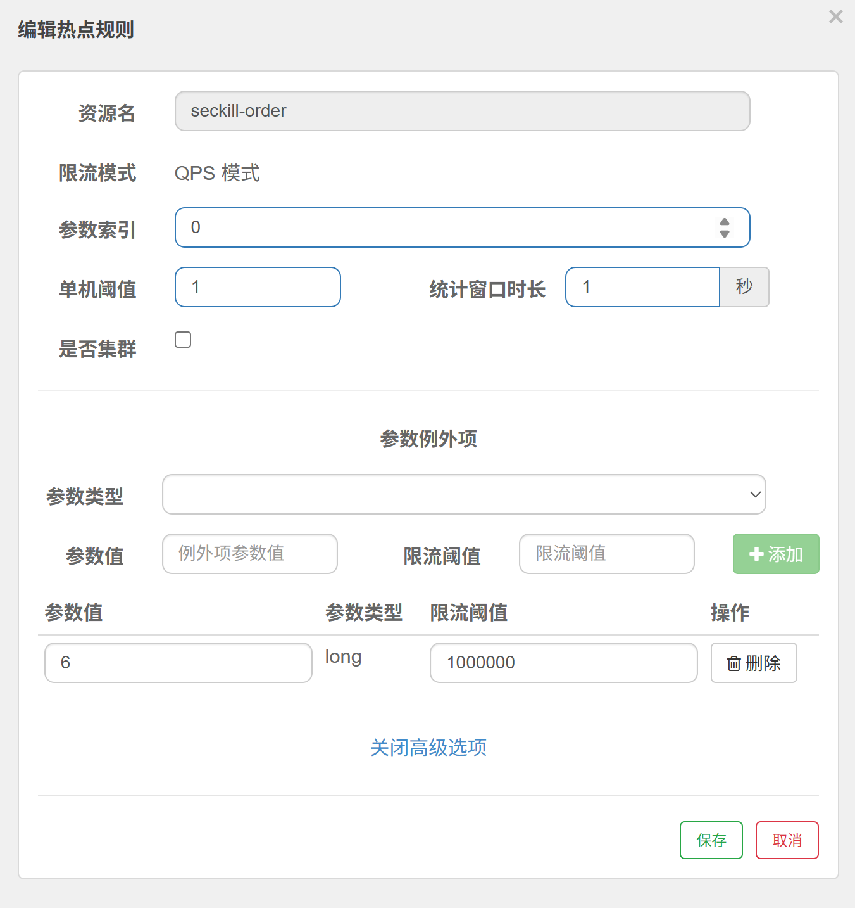

### 6. Sentinel补充

> **fallback与blockHandler兜底回调细节:**
>
> ​	**@SentinelResource注解方式处理异常的规则就是：有block优先使用block，没有才走fallback**
>
> ​	**fallback的好处是可以处理业务异常、兜底函数异常参数写Throwable不要写BlockException** 

```java
// 秒杀创建订单（测测试流控模式-链路）
@GetMapping("/seckill")
@SentinelResource(value = "seckill-order", fallback = "seckillFallback")
public Order seckill(@RequestParam(value = "userId", defaultValue = "888") Long userId, @RequestParam(value = "productId", defaultValue = "1000") Long productId) {
	...
}
public Order seckillFallback(Long userId, Long productId, Throwable e) {
    ...
}
```

```java
// 秒杀创建订单（测测试流控模式-链路）
@GetMapping("/seckill")
@SentinelResource(value = "seckill-order", blockhandler = "seckillFallback")
public Order seckill(@RequestParam(value = "userId", defaultValue = "888") Long userId, @RequestParam(value = "productId", defaultValue = "1000") Long productId) {
    ...
}
public Order seckillFallback(Long userId, Long productId, BlockException e) {
    ..
}
```

### 7. 系统规则（不重要）

> 黑白名单授权


### 8. 授权规则（不重要）

> **全系统角度出发**
>
> **系统自适应限流**


## 五、 Gateway

> **官方文档：**https://docs.spring.io/spring-cloud-gateway/reference/
>
> 网关

### 1.  基础

#### 	1、功能介绍


### 2. 整合

#### 	1、创建gateway项目

#### 	2、依赖导入

```xml
<dependencies>
    <!--使用响应式的网关 不带mvc-->
    <dependency>
        <groupId>org.springframework.cloud</groupId>
        <artifactId>spring-cloud-starter-gateway</artifactId>
    </dependency>
    <!--注册发现中心-->
    <dependency>
        <groupId>com.alibaba.cloud</groupId>
        <artifactId>spring-cloud-starter-alibaba-nacos-discovery</artifactId>
    </dependency>
    <!--负载均衡场景-->
    <dependency>
        <groupId>org.springframework.cloud</groupId>
        <artifactId>spring-cloud-starter-loadbalancer</artifactId>
    </dependency>
</dependencies>
```

#### 	3、Yaml配置

```yaml
spring:
  application:
    name: gateway
  cloud:
    nacos:
      server-addr: 127.0.0.1:8848
# localhost/api/order 80可以不加端口访问
server:
  port: 80 
```

### 3. 路由

> 方式一：配置文件配置
>
> 方式二：使用编码方式编写 

#### 	1、规则配置

（1）配置文件配置

```yaml
spring:
  cloud:
    gateway:
      routes:
        - id: order-router
          # 微服务名称
          uri: lb://order-service
          # 断言：要遵守的规则
          predicates:
            - Path=/api/order/**
          # 过滤器
          # filters:
          # 扩展
          # metadata:
          # 顺序
          # order:
        - id: product-router
          uri: lb://product-service
          predicates:
            - Path=/api/product/**
```

#### 	2、路由工作原理


### 4. 断言


#### 	1、长短写法

```yaml
spring:
  cloud:
    gateway:
      routes:
      # 断言长写法
        - id: order-router
          uri: lb://service-order
          predicates:
            - name: Path
            - args:
                patterns: /api/order/**
                matchTrailingSlash: true # 默认值 运行多一个/
          order: 1
       # 断言短写法
        - id: product-router
          uri: lb://service-product
          predicates:
            - Path=/api/product/**
          order: 2
        - id: bing-route
          uri: https://www.bing.com
          predicates:
            - Path=/**
          order: 10
```

#### 	2、Query（举例）


```yaml
spring:
  cloud:
    gateway:
      routes:
        - id: bing-route
          uri: https://www.bing.com
          predicates:
            - name: Path
            - args:
                patterns: /search/**
                matchTrailingSlash: true
            - name: Query
              args:
                param: q
                regexp: SpringCloud
          order: 10
```

#### 	3、自定义断言工厂

> 仿照自带的断言工厂写即可

```java
/**
 * @Classname VipRoutePredicateFactory
 * @Description 自定义断言工厂
 * @Date 2025/08/07 15:40
 * @Created by YanShijie
 */
@Component
public class VipRoutePredicateFactory extends AbstractRoutePredicateFactory<VipRoutePredicateFactory.Config> {

    /**
     * Param key.
     */
    public static final String PARAM_KEY = "param";

    /**
     * VALUE key.
     */
    public static final String VALUE_KEY = "value";

    public VipRoutePredicateFactory() {
        super(Config.class);
    }

    @Override
    public List<String> shortcutFieldOrder() {
        return Arrays.asList(PARAM_KEY, VALUE_KEY);
    }

    @Override
    public Predicate<ServerWebExchange> apply(Config config) {
        return new GatewayPredicate() {
            // 满足条件才是VIP
            // localhost/search?q=haha&user=yanshijie
            @Override
            public boolean test(ServerWebExchange serverWebExchange) {
                ServerHttpRequest request = serverWebExchange.getRequest();
                String first = request.getQueryParams().getFirst(config.param);
                return StringUtils.hasText(first) && first.equals(config.value);
            }
        };
    }

    /**
     * 可以配置的参数
     */
    @Validated
    public static class Config {

        @NotEmpty
        private String param;

        @NotEmpty
        private String value;

        public String getParam() {
            return param;
        }

        public void setParam(@NotEmpty String param) {
            this.param = param;
        }

        public String getValue() {
            return value;
        }

        public void setValue(@NotEmpty String value) {
            this.value = value;
        }
    }
}
```

```yaml
spring:
  cloud:
    gateway:
      routes:
        - id: bing-route
          uri: https://www.bing.com
          predicates:
            - name: Path
              args:
                patterns: /search/**
                matchTrailingSlash: true
            - name: Query
              args:
                param: q
                regexp: SpringCloud
            # - Vip=user,yanshijie 短写法
            - name: Vip
              args:
                param: user
                value: yanshijie
          order: 10
```

### 5. 过滤器

#### 1、基本使用

> https://docs.spring.io/spring-cloud-gateway/reference/spring-cloud-gateway-server-webflux/gatewayfilter-factories.html

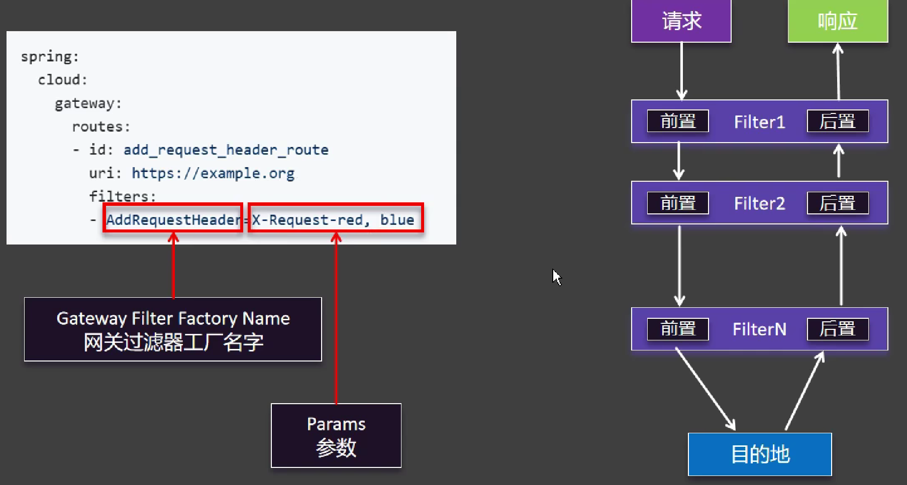

（1）RewritePathGatewayFilterFactory（举例）


```yaml
  spring:
    cloud:
      gateway:
        routes:
          - id: order-router
            # 微服务名称
            uri: lb://service-order
            # 断言：要遵守的规则
            predicates:
              - name: Path
                args:
                  patterns: /api/order/**
                  matchTrailingSlash: true # 默认值 运行多一个/
            order: 1
            # 过滤器
            filters:
              - RewritePath=/api/order/(?<segment>.*), /${segment}
          - id: product-router
            uri: lb://service-product
            predicates:
              - Path=/api/product/**
            order: 2
            filters:
              - RewritePath=/api/product/(?<segment>.*), /${segment}
```

#### 2、默认过滤器

```yaml
spring:
  cloud:
    gateway:
      default-filters: # 默认过滤器
        - AddResponseHeader=X-Request-Abs, 123
```

#### 3、GlobalFilter

```java
/**
 * @Classname RtGlobalFilter
 * @Description 全局过滤器
 * @Date 2025/08/07 16:37
 * @Created by YanShijie
 */
@Slf4j
public class RtGlobalFilter implements GlobalFilter, Ordered {

    @Override
    public Mono<Void> filter(ServerWebExchange exchange, GatewayFilterChain chain) {
        ServerHttpRequest request = exchange.getRequest();
        ServerHttpResponse response = exchange.getResponse();
        String uri = request.getURI().toString();
        long start = System.currentTimeMillis();
        log.info("请求{}开始：时间：{}", uri, start);
        // 以上是前置逻辑
        Mono<Void> filter = chain.filter(exchange)
                // 以下是后置逻辑
                .doFinally(result -> {
                    long end = System.currentTimeMillis();
                    log.info("请求{}结束：时间：{}，耗时：{}", uri, end, end - start);
                });
        return filter;
    }

    @Override
    public int getOrder() {
        return 0;
    }
}
```

#### 4、自定义过滤器工厂

**Spring Cloud Gateway 内置过滤器清单**

| 过滤器名称                  | 参数名（数量）                                               | 作用说明                            |
| --------------------------- | ------------------------------------------------------------ | ----------------------------------- |
| `AddRequestHeader`          | `name`, `value`                                              | 添加请求头                          |
| `AddRequestParameter`       | `name`, `value`                                              | 添加请求参数                        |
| `AddResponseHeader`         | `name`, `value`                                              | 添加响应头                          |
| `DedupeResponseHeader`      | `name`, `strategy= RETAIN_FIRST/LAST/RETAIN_UNIQUE`          | 去除重复的响应头值                  |
| `PrefixPath`                | `prefix`                                                     | 给请求路径添加前缀                  |
| `StripPrefix`               | `parts`（int）                                               | 移除请求路径的前缀片段              |
| `RewritePath`               | `regexp`, `replacement`                                      | 重写请求路径（支持正则）            |
| `RedirectTo`                | `status`（HTTP状态码）, `url`                                | 重定向到指定 URL                    |
| `RemoveRequestHeader`       | `name`                                                       | 移除请求头                          |
| `RemoveResponseHeader`      | `name`                                                       | 移除响应头                          |
| `RequestRateLimiter`        | 通过配置Bean注入（例如 RedisRateLimiter）                    | 限流（令牌桶或漏桶算法）            |
| `Retry`                     | `retries`, `statuses`, `methods`, `series`, `exceptions`, `backoff` | 请求失败时重试                      |
| `RequestSize`               | `maxSize`（单位：字节）                                      | 限制请求体最大大小                  |
| `SetPath`                   | `path`                                                       | 直接设置新的请求路径                |
| `SetRequestHeader`          | `name`, `value`                                              | 设置请求头（会覆盖）                |
| `SetResponseHeader`         | `name`, `value`                                              | 设置响应头（会覆盖）                |
| `SaveSession`               | 无                                                           | 强制在当前请求中保存Session         |
| `RemoveRequestParameter`    | `name`                                                       | 移除请求参数                        |
| `SecureHeaders`             | 可选参数：无                                                 | 添加常见的安全响应头（HSTS, XSS等） |
| `RequestHeaderToRequestUri` | 无                                                           | 将某个请求头值作为请求 URI          |

>  参考已有的过滤器自定义过滤器工厂
>
> 下方以AddResponseHeaderGatewayFilterFactory举例

```java
/**
 * @Classname OnceTokenGatewayFilterFactory
 * @Description 自定义过滤器
 * @Date 2025/08/07 16:54
 * @Created by YanShijie
 */
@Component
public class OnceTokenGatewayFilterFactory extends AbstractNameValueGatewayFilterFactory {
    @Override
    public GatewayFilter apply(NameValueConfig config) {
        return new GatewayFilter() {
            @Override
            public Mono<Void> filter(ServerWebExchange exchange, GatewayFilterChain chain) {
                // 每次响应前，添加一个一次性令牌 支持uuid jwt等格式的令牌
                // 请求完
                return chain.filter(exchange)
                        .then(Mono.fromRunnable(() -> {

                            HttpHeaders headers = exchange.getResponse().getHeaders();
                            String value = config.getValue();
                            if (value.equalsIgnoreCase("uuid")) {
                                value = UUID.randomUUID().toString();
                            } else if (value.equalsIgnoreCase("jwt")){
                                value = "jwt";
                            }
                            headers.add(config.getName(), UUID.randomUUID().toString());
                        }));
            }
        };
    }
}
```

### 6. Gateway 扩展CORS

> 跨域问题
>
> **SpringBoot提供 @CrossOrign注解**
>
> 痛点：每一个controller都要标注太麻烦
>
> **项目级别编写一个CorsFilter**
>
> 痛点：只能解决自己微服务的问题，每个微服务太麻烦
>
> **解决：直接Global CORS Configuration配置**

```yaml
  spring:
    cloud:
      gateway:
        globalcors:
          cors-configurations:
            '[/**]':
              allowed-origin-patterns:
                - '*'
              allowed-headers:
                - '*'
              allowed-methods:
                - '*'
```

### 7. 面试题

> 微服务之间调用过网关吗？
>
> 答：不走网关，详情见下。想走网关可以在FilgnClient(value = "**gateway**")，然后微服务调用方法Mapping映射中加入**基准路径**


## 五、 Seata

> https://seata.apache.org/zh-cn/docs/user/quickstart/
>
> **分布式事务**
>
> **产生原因：**微服务架构中，一个业务操作常常需要跨多个服务、多个数据库，传统本地事务无法保证数据一致性，Seata 正是为解决这一分布式事务一致性问题而诞生。

### 1. 打通远程链路

> 详情查看代码


### 2. 架构原理


### 3. Seata整合

#### 1、安装seata中间件

#### 2、file.conf配置

```yaml
service {
  # transaction service group mapping
  vgroupMapping.default_tx_group = "default"
  
  # only support when registry.type=file, please don't set multiple addresses
  default.grouplist = "127.0.0.1:8091"
  
  # degrade, current not support
  enableDegrade = false
  
  # disable seata
  disableGlobalTransaction = false
}

```

```java
@GlobalTransactional /// Seata全局事务
@Override
public void purchase(String userId, String commodityCode, int orderCount) {
    // 1. 扣减库存
    storageFeignClient.deduct(commodityCode, orderCount);
    // 2. 创建订单
    orderFeignClient.create(userId, commodityCode, orderCount);
}
```

### 4. 底层原理

#### 1、二阶提交协议流程


### 5. Seata 四种事务模式

> Seata 提供了四种分布式事务解决方案，分别适用于不同的业务场景和技术栈，下面分别说明：
>
> 官方网站：https://seata.apache.org/zh-cn/docs/user/mode/at

#### 1、Seata AT 模式（默认）

> **概述**
>
> AT 模式是 Seata 创新的一种非侵入式的分布式事务解决方案，Seata 在内部做了对数据库操作的代理层，我们使用 Seata AT 模式时，实际上用的是 Seata 自带的数据源代理 DataSourceProxy，Seata 在这层代理中加入了很多逻辑，比如插入回滚 undo_log 日志，检查全局锁等。
>
> **整体机制**
>
> 两阶段提交协议的演变：
>
> - 一阶段：业务数据和回滚日志记录在同一个本地事务中提交，释放本地锁和连接资源。
> - 二阶段：
>   - 提交异步化，非常快速地完成。
>   - 回滚通过一阶段的回滚日志进行反向补偿。

#### 2、Seata TCC 模式

> **概述**
>
> TCC 模式是 Seata 支持的一种由业务方细粒度控制的侵入式分布式事务解决方案，是继 AT 模式后第二种支持的事务模式，最早由蚂蚁金服贡献。其分布式事务模型直接作用于服务层，不依赖底层数据库，可以灵活选择业务资源的锁定粒度，减少资源锁持有时间，可扩展性好，可以说是为独立部署的 SOA 服务而设计的。


#### 3、Seata Saga 模式

> **概述**
>
> Saga 模式是 SEATA 提供的长事务解决方案，在 Saga 模式中，业务流程中每个参与者都提交本地事务，当出现某一个参与者失败则补偿前面已经成功的参与者，一阶段正向服务和二阶段补偿服务都由业务开发实现。

![Saga模式示意图](data:image/png;base64,iVBORw0KGgoAAAANSUhEUgAAAb0AAAG8CAMAAAB9rIvTAAAIwnRFWHRteGZpbGUAJTNDbXhmaWxlJTIwbW9kaWZpZWQlM0QlMjIyMDIwLTAxLTA3VDEyJTNBMjMlM0E0NS41MjlaJTIyJTIwaG9zdCUzRCUyMkVsZWN0cm9uJTIyJTIwYWdlbnQlM0QlMjJNb3ppbGxhJTJGNS4wJTIwKE1hY2ludG9zaCUzQiUyMEludGVsJTIwTWFjJTIwT1MlMjBYJTIwMTBfMTFfNiklMjBBcHBsZVdlYktpdCUyRjUzNy4zNiUyMChLSFRNTCUyQyUyMGxpa2UlMjBHZWNrbyklMjBkcmF3LmlvJTJGMTIuMy4yJTIwQ2hyb21lJTJGNzguMC4zOTA0LjExMyUyMEVsZWN0cm9uJTJGNy4xLjIlMjBTYWZhcmklMkY1MzcuMzYlMjIlMjBldGFnJTNEJTIyT0hZZnpnOGdHY3N4V2tkek1EMEolMjIlMjB2ZXJzaW9uJTNEJTIyMTIuMy4yJTIyJTIwdHlwZSUzRCUyMmRldmljZSUyMiUyMHBhZ2VzJTNEJTIyMSUyMiUzRSUzQ2RpYWdyYW0lMjBpZCUzRCUyMjhWczRpZ09wTWhPZDBTQzJNc2dCJTIyJTIwbmFtZSUzRCUyMlBhZ2UtMSUyMiUzRTVWcGRjNXM0RlAwMWZzd09RbnclMkJPbzZUN1d6YTZVNDYyJTJCMmpBckt0TGtZZUljZDJmdjBLSXd4STJCQnFqSk8lMkJlTkNWRU9qYzQzdnVGUnJCeVhMN3dOQnE4Wm1HT0JxWlJyZ2R3YnVSYWZxV0kzNVR3eTR6T0o2UkdlYU1oSmtKRklZbjhvcWxNUiUyQjJKaUZPS2dNNXBSRW5xNm94b0hHTUExNnhJY2JvcGpwc1JxUHFVMWRvampYRFU0QWkzZnFkaEh5UldUM1RMZXglMkZZakpmNUU4R2pwJTJGMUxGRSUyQldLNGtXYUNRYmtvbU9CM0JDYU9VWjFmTDdRUkhLWFk1THRsOTkwZDZEeSUyRkdjTXpiM1BBUSUyRnZWUHRQbk9qT25OZW1xdnZkMXVQTDR4WVRiTkM0cldjc1h5YmZrdWg0RFJkUnppZEJaakJHODNDOEx4MHdvRmFlOUclMkJGellGbndaaVJZUWx5RktGdnV4YVdOR1l5NWRDanpSMWw5WnJ1SUZNNDYzSlpOY3dnT21TOHpaVGd5UnZkQ1FieXo1QktDRWQxTjRCempTdGloNUJocVdaSVZreFB3d2R3R2F1SkM0dlFGRDRMd3pESDJnUUFqYVFXZ1pmbDhRYWdoJTJCQXljd0JNMFlxckROU0JSTmFFVFpmaTRZMnRnTExXRlBPS1AlMkY0VktQWno1RHh6a1AwQ0NQWWpuU2RnMVp6UnFrYyUyRlRQRDdUWHpGVWNpZ2dvbTVUeEJaM1RHRVhUd25wYlpYTXg1cEhTbGNUJTJGSiUyQlo4SngyQTFweWU5czVSckJPNlpnRSUyQkZjQ2tKaUEyeDd5WlllbmFUbnFPNFFoeDhsS04lMkZtZDNnNm56JTJGVlRNZUs5OFAlMkZCNE1MN3I4dllOZmtDZ1laNTFEQWEwcFFNZGYwQ2dMWGRvUnR2TkFWeGttcXYwY2hiaDdUak5nUVVXT0E3bDVWMFFvU1Fod1dtMDhaYndmOU1BJTJGNGN0V3olMkZreVBUNmJpdGolMkY3NnhrdzNWUXdoN3M2RE9RMDdnNGVmWkw4WDl2QlpvaXZ0bXk3aGY4cWRkNDg3YzFsb2U1Qk8lMkJVaUpXVm1TdnB2SyUyRmhRcE5zblhMdThySnZEcVJxMFJhVDVrb0EwYWJhRSUyQjV3N0s3czdCRnlqc1VDd1dWMks1MFU5cjhVZTRyYnR1M2htQnYyNndGWGhWN2dhZVF6dXpJWHVDcThuVlo5cm9YWW05SEpsNTc3SVV0Mld0ZEZYdE5xRWk1ZFNiMldxNXpVZmJxSmR5azMySjU1Z1U0cUNYVHMyZGJ0bkdtblIzejZvcGxRMGU2M3pKdEdLU0hMOU9BdmdFMDZiZE9Hd2JwNGVzMDBHTER0NlJ6TVkyeHVpUFpJbDhESmQwcVZLd3BYNnRvWkNHWlIxU3l1MzYxclIyOHE5WXZzNnQlMkJtVW9hQiUyRnpMWmw5QTN5czRKd1U3MHFrTGRidFRzRzBCa0V2UXRYRFFha2pjVzNQUVZ5WUNGJTJCWmdpMjJVajg3QnRtbDhMczdYd2tFMSUyRlZiRFYlMkJzOUZMT2hJT2liZzNvWmVqJTJGJTJCOVBpa0VUR3ZSUU1VUlhUTm0zT2ZGV1pFdkIxbXhVMWZDNU5HMXhWTkNDYzBOaVdsR09Vb2JZdW1YMU5iM3Q4N3puNSUyRjlYanF0S0NNdklxbm9FaE9tV1NQcyUyQjNTNCUyRmJraHNMd2pKSzAwJTJGVFBrM1JwaFo1Wms5NGFOUVFGME80cjYlMkZLYncwMSUyRiUyQjJYR3lRRHk5c1Q0Mkw0RzZDOWpNOTVseW1ZNVNzcldkY05NbThpOWJLaks2ZG8zZjMlMkJKaTRabFZlWFdTeDF6V25EVFZpazBucVpwODhlRzY5cXYxYkkxOVNOQmE2VTBsSW5VenhaOTAwJTJCdkdMNVF0a1Rwalp5aE9FRkJLaWlKeGttaEdMekt1Q3FUWkY1WHBwMDBvWWpNVTRVS0JBbjJvcG5xRHhGaU9wWWRTeEtHJTJCOE1RZFZwY1BTRFJ3eEVlejZrNHhIZDFoWE5yaUtYR24lMkZNZGFORHo2UWxkcnJCd0RTZnglMkZMZjFrMXJuMURqcThDODl0Nk51bHk3M1h1eFA4ZVBUbDFkbiUyRnZuRyUyQnR1cU9YbHlmWUc4UTFLaFJOd2FydzMyeWRmMXE3RXozd0o4JTJCeWRmWlNLZ1ROUTVDSXRtY1F3MUcxNmM1WVhUJTJGd0UlM0QlM0MlMkZkaWFncmFtJTNFJTNDJTJGbXhmaWxlJTNFL3urqwAAAD9QTFRF////g7Rnfn592qimAwMD2uj8uVVR1ejU+M7M/2Zm211cMCsrq7ilxNHAV1BP8vHx0YaDcpPCrcHflZeU5rq4RH8w0QAAFQJJREFUeNrsnYu6myoQhbORar6CYra8/7Mebiq5eRoDMuqatmkSRRmXjL9gmMsFBoPBYDDYMaxp2+YMfjIuvL+8+6CUECq8U+t3bYoq0WXwqeXWusT6/X91tz8WjPPhY/WU4KGmkrdrK2yLKiHSizdwLgbj1/qqratugWNhvWyKqXdRKkfLk15EoRKrt1zdAsfCqtdN6jVdiDjD0HRCmVfWdY1inXANtGVCsDZSb+h4J8PK09KLK+ZKqEEIIeOibh+CNVPRh70+FfzYBJfjm+Zx27Mvg2w70bkKKSY61vxPvefqzmtd7BZbOVyKHQvGW2Fjp1NPmpLCnrpGHtsm3Wswdr9YhTZovvIrq4fCroStCr/bsns3brtzsX6x4OfAMjU5ey4/bTvswNece8+dLddbTdWN1pJhc+WOBeNNY2OnVU+JsEll3onWvnbKts7WhKPObqa9uHf3kdOvfLfUFJPmnTsl3MrzQldtZg6bL/qw16eCK9Tr7kL83bYnX+xHv+ASVhFqsd5xdcNazhXV8YLHwrQ988+vI63S7ivloo4vIh3W2LdSXt6oZ5v641LzatqB3UwbFfX7UGKu8d1enwp+p97jtidflKdmsyCs/2b3U73jAxzWGl0peCyY36X06klfC+md8xTkPA7OM9fGn2rsY9W8VPgtKx9NZLzQH7+56MNenwt+oZ562vbkS8Bz89nGKmPcHrCFekfqjWsFSmEFjwXzzVj4c6ENm/LyeBcjj81W2PCq7fnTZFraTV7Jzl0H5qIzmM01nvf6VHDFndN03TMR6nHb79WzQLNU70i9blG9TY+FUy+QZzgX2Bv1GhuJzdF5rV68dNyxbe7KUNQwL/T7UOZcmms87/Wp4CrmHIKMvHnc9qN6A29bH6yadrneL9WTryLnlsfCq+fOB9sE3a7d+fFKPeYcfqfevHT2b/AbmBf6fQzRlTre61PB9fd7jksetx3HEbOSgb3Gt1V7vVqs9wv1/MYZL3gsurGteqjkUlqMfqMeZ9IGYRmr18mxxvPS6bQx37UDd1gbFrp9MEu5vuj9Xp8Kruv8830t9kA8bPvuKjAMDsjZ+G653mN1o5Bm7zg6zgseCxa+ZY5LbQT1WCYi9WT4wt3ftOYGU039nC2fPkVL/Y7HEgGC/cKwj3YsGu/1VcF1PRfuTkldnrY9+WJb5rjOEO6rluvdhOpGa7mSbOrgKn8smqZZIAXVNJfHHh21vHTcYLRQjbtQC3tVyzX5dzdeb8fpMNVjYfdxvZ/2oux3UecyyWNxQEsxuNGE6x7D4dyheq4LS6y8OMO+UY8NCTYyCC4YYhoMBoPBYDAYDAaDwWAwGAwGS21sHHMl+wpPF3w6z3l6QJ/4aY75ET3lpzm7jugpO4165/EUVyt4CoPi8BTMCeYEc4I5wZxgTngKg+LwFNEWzAnmBHOCOREFcbWCpzAo/j+etvJH/mxhZj9tWp/eRFvd9329hZn96KLM2ZhD2jbbWGtOlCY7c17rvtLXbUxXfX0tx5xSNtva2+aXijmr/rqt9VUp5txcPCOfzOrp5uItyZf3utxsL56Rr8noqd5ePCPftQjJ/DQl7CdjPKmvJawuwZytLKJeOvLkJJqeaXy6AHPKtoh6rczGnH1VRL2qL8CcP4XU+8nGnL0uop7Ort6Lc7tM4DShM5unZQKnCZ0FmPOnkHo/2TytC6mXH1uIq5cknhxWPXZA9Thx9bIy5+4jJ3X1+GnU4weMnPw0kZMfkFrAnGBOMCeYE8wJ5gRzgjnBnGBOMCeYE8wJ5gRzrlNPV1V1BuZs52y8bmxQsv0zp+58IqpxmJwdljnlg3qCt3tnTu3SU9pENf6z4PrIzNmOkrU2IV27d+YUvLNyVYIP5tW6pA/NnKN6Lkt4u3PmlFz4N4NtfM4lfWjmnNpeK1OqV4Y5O9vkfAi1/3RFVD2WWr31170u2wStK9SrHiOpPipzJlKPEHPmVY+fRj1eKHKO6ml9BuakpN731MLG614V8EWchDkJRM7v1Ru40EFGll69y2nUK9TPGe73Bh5CqDgNc7al1UvQU2ZuEXjHzI3eMHa9gDn3189ZnYQ5Dze2rquvZynA2DrG1jG2jrF1jK1jbB3Pc+J5zl2rB+bcc+QEc4I5wZxgTjAnmBPMCeYEc4I5d82cmCsplfUlmJPSPGVJPP1La56yrEZqjsAk8YTYHIFZmRPzc6YKnCXm5yQ1N26aOeFpzY2bd054SvNSp5kT/kpqXurMc8IXiJ3v4ibmhP/cNpfvp83sKaV8DNmNTC6UZPGEUC6UzJ765vdpHqJhNOQhKpyHaIXdfke7bXF2beKTkbzWyVsMxdyXtz+j3Qp7mpAKDDimT2lCMfclHfUSWp1jlI5ifsA86pX1tHY/fK4vx7c86hVVPPSP5u+vPGrkLBltp3vExPduJJmTTORM5FPUvZaWXMCc+c9tFXdt1wrMuSvmrLM9HgbmzG4PecPokguY8wWxPA7HVxXBYw7mfGkvRuN7Te+Ygzlf4ubfFyMHf6/kjjmY8/+JJTW5gDmz2psnCPVfMCd9T98+QHhg8DwMcy48RNETA08w5xOx9GueEwNzkmBOZR9s8KajZ9pHS9FlBubMd25Xk83kWc9fgjmpM+fTfUPa8Vkw557VA3NuoTh99cCce46cYM7t1QNz7jlygjnBnGBOMCeYc7+e/s6/PZnVm78Ec1JmThUpNakXKapKeArm/Ff7Mze5Z7v9AXPSZs6ozT1aisAJ5sxrb+VLctUDc24Gmw9xE8y5B09vtMQDc35PLgmIBcy5yZZeXPp+m3L1A3N+KV+y+3Qw5xbk8pvpogfm3B48y/Z0gjk/NRXLd1NFfQJzfgOeiXATzLnhliZySTqyAObciAqCfGmHhcCc25LL7TCenmlsPch3K18NMOdacklJLGDOba8rv7dfAmdXMvXmXw7tjTk/nxt3pS3PjZuQOcnMjZudOcnMS53MU0LzUucmMSmpJELBnPD0xTPyyazXSlL5GPJSAaVcKGmu5ZpULhTkIfrMpxPlISKVAywJcxLLAZY39yWl/Htpcl/Syr+H3JefqXem3JeU8s4miSfE8s5mZU7kW0e+deRbR7515FvfdeRM4ulhI+flgJGTunqX06h3OWDkBHOCOcGcYE4wJ5gTzAnmBHOCOcGcYE4wJ5gTzLlOPV1V1RmYs+WTyaaRjLFh98ypO+cP84Pk1qWjMqeM1WPuf7Fz5tSC844ZBTvzwbvU6eMyZyt4G5QcWik42zdzCi9WJfhwtS5p844dmDmDeswGT6Nht2vmlFz4N4NpfIzbqFm5ZnhU5gzqde6/Npl6ZZiz4+NlTtsPVVr1OFn1vLE16pmrjNGK3b/yp29WvK5Q7wk3GUX1WAb1zGWPt7tmzif1zGWP62My5716rWlDot03c87qaR1uH4S+Hpc5J/Wkv+vbdz8nG697lcWXyrp07H7OoJ65c2cp+1rKMOcwNjVm7hMqvuJmYa/MOTQp1SvUzxnu9wZuQugMoIdnThE6XbqC1JLgbt0Gy44ZZwarZHDp+MxJQb2E/ZzVNYN6GFvPP7auq69nKcDYOsbWMbaOsXWMrWNsHc9z4nnODagFz3PieU4wJ5gTzAnmBHOCOcGcYE4wJ5jzcMyJuZJSWV+COSnNU5bkWv6X1jxlWZmT1ByBSZiT2ByBmJ/zo3hypvk5Sc2Nm8ZTWnPj5p0TntK81Gk8vZKalzqzFYidSxk1EsSTE80JX0C+n4TivYy2lPIxZM9DRCYXSrI8RIRyoZDMQzSMhjxEhfMQrbDb72i3zFFwOzPkkYE9KOa+vGXJ113W0/p6kryXmdQrqnjtfv5FWD52QPVSRdvQwVb1ZI85J65ewdyX001G6js3fhr1yuVbj/pnEpMLSeYko14SU3HfaK3AnLvytC4+Sg7mXE8s+p8GWsGcFJnzaTw3JbmAOfP69GI4d7nzC8xJhzmbv1mH68CcGxJLcnIBc+a0N4+g6b9gTvok9vYJtORdZmDO5NF2YRQ+EXiCObP5tPgAUxpyAXPmOreVHRn3pqN79dGSdJmBObNZNdlMnvX8JZhzJ57W5+nlPODY+g7UA3Nurx6Yc8/qgTn3HDnBnHumFjAnmBPMCeYEc+6XOX/nXy/M6s1fgjkpM6eKlJrUixRVJeoH5vxX+zM3uWe7/QFz0mbOqM09WoLACeYsJV8K8cCcuT19FzuLoSeY83v5bsU8BXN+TS4JiAXMuYmnzW+2ix6YswC5JCMWMOcGdruX77doZxmY8ztyKdvTCeb81FQs300V9RTM+Q14JsJNMOeGrXgil6R9LGDObcEzbQfZv3p63ZF6RMGzHLFUtQZzJpCvDG5WffT7HjDnWnJJSSwfeFr10a/rwJwrL3231KNC/J/Vu+rxBz6pIuf8y6HdMefns6uutCSzq/qfTNaL7EJmdtXszLm3mY3DD14XftxKaGbj3Lb5rOLfTgk//ly5798oTmlW8cxUIAvM6C+TqHetzMWPExBvSb68zLnDbBqROvX12Sda2TTyMifNTDbK/nV/Xljctnq2AP8UMtlkZc7yWaSun3NeDCR9/0SbpLJIZWXO8hncvr1KPU6LQyyDW1Yrnz3xa8bQ98De08qemJU5y2cuTUCId1GLWObSg+dbT8H3MbAj3/re1IsPHfKt7029+MqHfOv7Uk/fTSh2pnzrB1DvgdUPq96eI6e2f8c/14Xb9cNGTpLUsqKvJb4fr/WFtHoHZ87PPY36wnTNLmdRjx1Nvaq+XIird3Dm/NzTSb2+v5BX73Ia9T4dW69eKQ7mpK1eaHv+Fp2fJnLyA0XO8Radn4ZaDsSc0y06mHNn6pnrXv9+NG2VerqqqjMwZ8snk00zMMbk9pHz78IDsCvU053zh4UnZRirjsqcMlYveL01tcRDCgkipxacd8z40pkPsZDHZM5WcPdABeNCtoNrhFuqtxxtP1dP8M52nVaCD1fj0n/tndmWoyAURauVpiuoZND//9YWcJ4SEeRizn1Ip2rVyuq4w2EDBtKqfkvphZ2zoSf1P6UzekkQejnLzJOybnySVfpZemHnbNueLDTD/Fxr2Sa+m56sm1y3jpHoZigp0ksc01PdYClZZnFfWt291P+bZPzIZr+xeLSgN0aVqrdUXdM5J/TqDp9l/wIm54+DtpdOukHWZuk15zl7eoWyliSgtSQO6VWVGfuVNtIZzzxnQ8986y9nMmrnTNp+L62bnPnaX6oHD9d2zsJkZuGMXhjnLNteLmFJZTKzckePrnNm2jYTZ/TCOGc73tOjvEzHaEKRnuvkVJJXC1rQEYODmbKUqbmWWlZKxc28pfQLnDNp5ztjds5unjM18dk9vfzaepFbfoWMkHM2awzV/CnW1iOY58TaesTOibX1qJ0Ta+sxOyfu54zaOXE/Z9zOifs54ZxwTjgnnBPOCeeEc8I54ZxwTqJ7Jbnuy79qr6Tg+5S5dk5i+5R5dc7wewS6dk5iewRefH9O1+/0m/bnJLU3rpt3yr9GOWntS+0mT2jtS+3VOYNk59Et/d+k7RftCU/pPAZXZ19SOo/B+zlEZM5CcXb2JaGzUEieQ1S2FeAcos/M81vOIbKo56utp+9+GeWeHpHzur+JeHJBeuxrrjkjTi+5ID32NfQsnfP4t6U9PmZfk5zU2xGsBQYSHz3LWcDUccE5rejxx90GHhdOi0eNL5y13Dl/7P90peLmtATo2fV7d/7BJ5+BHlHn/BU3wSvQi9Q5qxqF2D6ZHMlJd8Sg8N3EnkVo0CM0Wjcwdugn6FGaKTM0xKp+Ijkp0/t5GBxr+glrIZycPb4V/QQ9utYywreon0hO4vR+eiDv9RP0XCbnq7+bpafX//KzF+H91Xynn6Dn0FruA1IdvQHR+258E/1Ecvp0zr99k5vX8++nL8OHF3Son7AWr845aHPT+jQ4VRvmo0va6yfo+a1VfDvgTfH1+onkPE02J7m561V++eSyLusn6LkerT8dwNPrReNa1E/Qcz1TtmgunxtLW9UUjNJPJKf3ec6Fru9l8WXKGb6aXwZ63uc5Z/h2GcsWmunsJ+j5MJfXsU5vg8149hP0/Iun9f24jyU4Q/0EPffJqabMhvDuP07xDfQT9Jxby0Q89+vmW3zd7CfoeaHXm4udsXS1gqeZ/QQ9H8nZ4zsIbzxjPdNP0PNrLse/QcRXLzX/BT2v+Fx8/YuvX2wOen6SU5vLIWPpBJbfzipYy6Dre76cvM55+C5Kb/9uO5a1uNvOLwc9++QMvtPVrwA928rD7zJXCdCLBF6NLw+D73rJSWR31VSAnoW1UNnZ+Ax8l6NHZ1fxhwC9vclJaEd///guZy2UTtPwju9y9EidZAN6O5OT1ilSHPR2WQuxE9xc4RNCgN75pye+wZexptQPkmXmt5KJm2h/UHfG6D/hSM6z6b1ZcGBDeh0hWf87oCcZk7zmnF3fOamdfbmNL2Ni1MLkAj3B9B+JeesDPe9nX26uF5lG15LkzY9TerKhy5Gcp59curVelPX0FK7MAJq1PQ7nDHZq8MaCQ92ZSVXCNC1ukE36PaU2GeegF+bE7nV8rXPyJkRNPzihd+PmzyScM8h566sLDrWQ6NLOIrk0ITmlp8Z7iiCsJcx562v4+n5vOPIb0+PNjYR8NmQAvZPOW1+Zse6cUw8L6kaovWVMr1GZSWtEcp5IbwVf1/Z4NyyQs7ZnxnuXa3ssmuRU+DbbXjts123Q0GtKqFDVXSIToBfCWlYXHNq2N85JM8/Z0VNTZWrQIOCcs3XVbqqR5X7pHVlwuOIagwtryT3SSzwv94Gebn8ZK3xby+awD2vrR/q9hl4u81JmsgC9qKyloVc2EVp4Sk7Q80yv/FdImw7wE2sBPa/JWbKkewS9aGbKOnq5ttAEyRktvcIZPVjLucnptu2B3rnW4rbtITnPp5fDWiJOzqIeNoAeVmeRnDHTg7Wckpygh9VZJOel6MFaYk5O0INzgh6sBckJenBO0INzIjlBD9aC5HRWpPZKgrXsTU5C+5SB3l5rIbRHIJJzNz06+3PCWvYnJ5m9cUHPpojsS43ktKsA2bmcm7CW/ckZAN+fD+GB3jtr0eEZ+iwUJOcBeqHPIYK1HEhOup8u0Iv50wV6MRfoxZScoGdlLUhO0IO1wDmH9LhwW7CWMz9dqePCJUaF+mwzltB+RC3Vf0JS/0ulA6hDAAAAAElFTkSuQmCC)

#### 4、Seata XA 模式

> **概述**
>
> XA 模式是从 1.2 版本支持的事务模式。XA 规范 是 X/Open 组织定义的分布式事务处理（DTP，Distributed Transaction Processing）标准。Seata XA 模式是利用事务资源（数据库、消息服务等）对 XA 协议的支持，以 XA 协议的机制来管理分支事务的一种事务模式。


#### 5、事务模式详情


> #### 1、Seata AT 模式（Automatic Transaction）
>
> **特点：** 高自动化、无侵入，适用于 **关系型数据库 + 本地 JDBC** 场景。
>
> - **执行流程：**
>   1. **业务前置 SQL 执行**（如 insert/update/delete），并由 Seata 自动记录“**undo log**”；
>   2. **提交阶段**：全局提交时，数据自动提交，本地事务提交；
>   3. **回滚阶段**：Seata 自动根据 undo log 还原数据。
> - **优点：**
>   - 无需业务侵入，开发成本低；
>   - 支持自动补偿机制；
>   - 高性能（异步提交 undo_log）。
> - **限制：**
>   - 仅支持关系型数据库；
>   - 不适用于复杂逻辑、跨 RPC 的本地事务控制。
>
> ------
>
> #### 2、Seata TCC 模式（Try Confirm Cancel）
>
> **特点：** 半自动、强业务侵入，适用于对一致性要求高的场景。
>
> - **执行流程：**
>   1. **Try 阶段**：尝试执行，预留资源；
>   2. **Confirm 阶段**：确认提交，正式执行业务；
>   3. **Cancel 阶段**：取消操作，释放资源。
> - **优点：**
>   - 控制力强，逻辑清晰；
>   - 不依赖数据库事务，可跨资源类型（如 Redis、MQ）。
> - **限制：**
>   - 开发成本高，需手动实现三个方法；
>   - 需要幂等处理、防悬挂处理等细节控制。
>
> ------
>
> #### 3、Seata Saga 模式（长事务补偿）
>
> **特点：** 适用于 **长流程业务**，支持通过补偿逻辑实现最终一致性。
>
> - **执行流程：**
>   - 将全局事务拆解为多个本地事务；
>   - 每个本地事务都提供一个“**补偿操作**”；
>   - 当事务失败时，自动按顺序调用补偿操作回滚。
> - **优点：**
>   - 支持长事务；
>   - 容错性高，支持异步处理；
>   - 使用 JSON/YAML 编排事务流程（适配微服务编排平台）。
> - **限制：**
>   - 业务侵入性高；
>   - 一致性较弱（最终一致性）；
>   - 补偿操作需自行实现。
>
> ------
>
> #### 4、Seata XA 模式（标准 XA 规范）
>
> **特点：** 实现了 **两阶段提交（2PC）协议**，符合标准的 XA 协议。
>
> - **执行流程：**
>   1. **第一阶段（prepare）**：各分支事务预提交并锁定资源；
>   2. **第二阶段（commit/rollback）**：统一提交或回滚；
> - **优点：**
>   - 标准化、协议成熟；
>   - 支持多种数据库（只要支持 XA）。
> - **限制：**
>   - 性能较差（强一致性代价）；
>   - 资源锁定时间长，易出现死锁；
>   - 通常用于小型系统或关键业务。
>
> ------
>
> ### 总结对比表：
>
> | 模式 | 是否侵入业务 | 一致性保障 | 性能 | 适用场景                     |
> | ---- | ------------ | ---------- | ---- | ---------------------------- |
> | AT   | 否           | 强一致性   | 高   | 单体服务、关系型数据库       |
> | TCC  | 是           | 强一致性   | 中   | 高并发金融、资源控制精细场景 |
> | Saga | 是           | 最终一致性 | 高   | 长事务、订单处理             |
> | XA   | 否           | 强一致性   | 低   | 传统系统、对规范兼容性有要求 |
