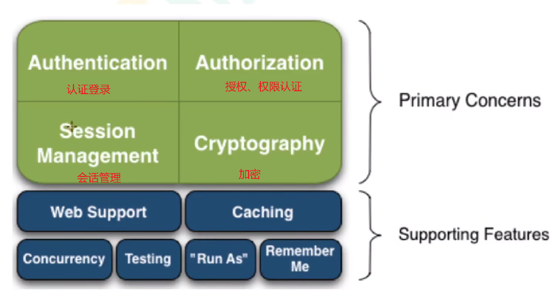

# Shiro 学习笔记

作者：Shijie Yan

---

## 1. 入门概述

### 1.1 介绍

​	安全认证框架

### 1.2 特点

​	易于使用、全面、灵活、兼容性强

### 1.3 与SpringSecurity对比

1. 项目使用Spring开发，配合SpringSecurity更方便，Shiro需要进行整合开发。。
2. SpringSeucrity 功能更丰富。
3. SpringSecurity 社区资源更丰富。
4. Shiro 配置使用比较简单。
5. Shiro 依赖性低，不需要任何框架和容器，SpringSecurity需要Spring容器。
6. Shiro 不仅仅可以使用在web中，它可以工作在任何环境中。在集群会话时Shiro最重要的一个好处就是它的会话是独立于容器的。

### 1.4 基本功能

### 1.5 原理

......

## 2. 基本使用

 

