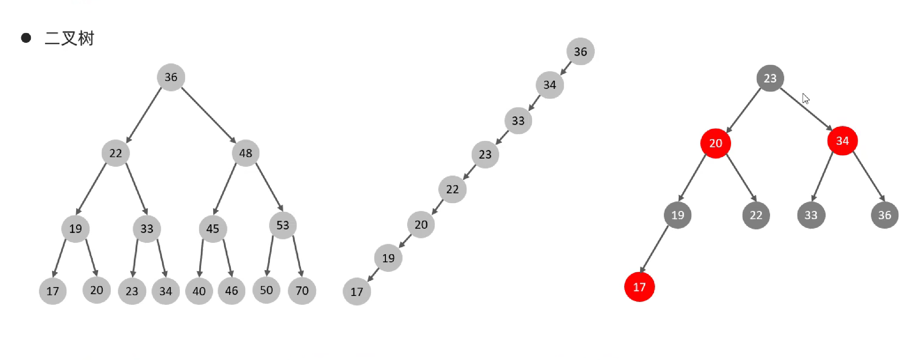
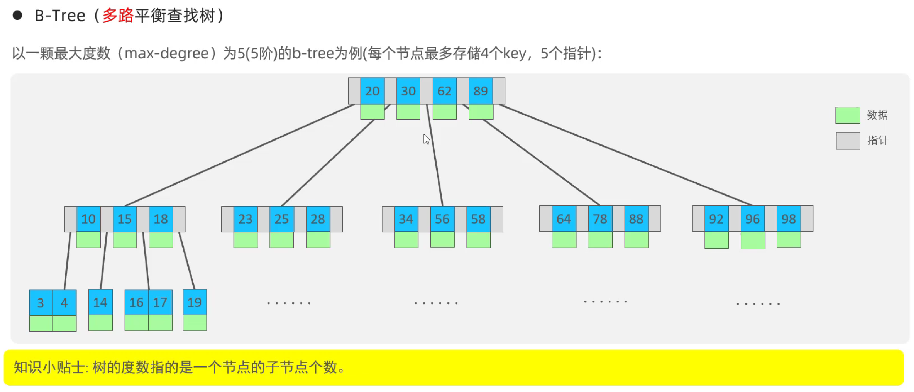
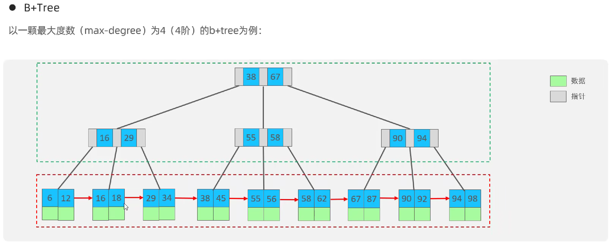
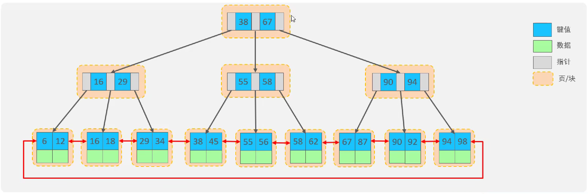
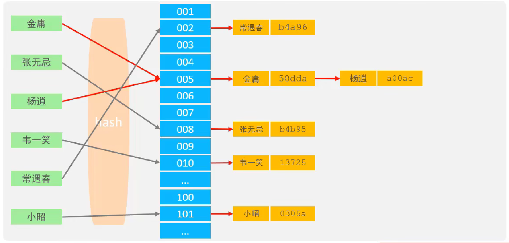
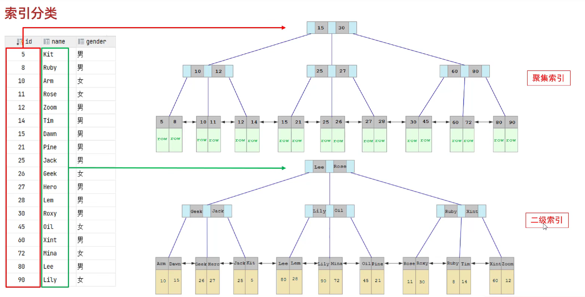
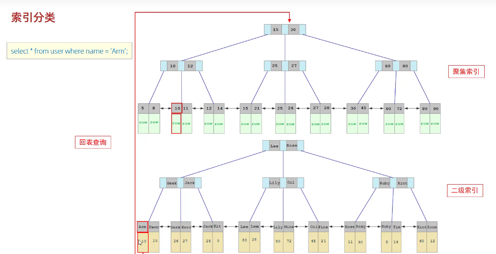
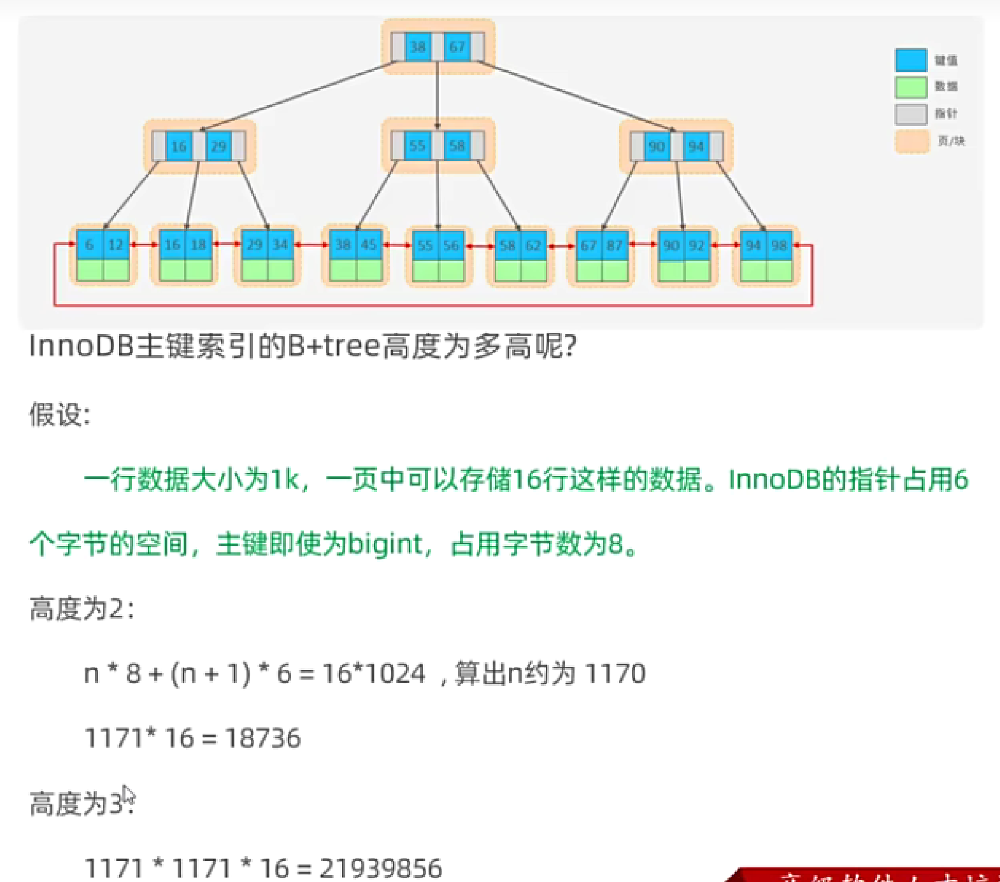

# MySQL Index

Author：Shijie Yan

---

## 1. Overview

### 1.1 Introduction

​	帮助MySQL高效获取数据的数据结构。

### 1.2 Advantages and Disadvantages

|                          Advantage                          |                         DIsadvantage                         |
| :---------------------------------------------------------: | :----------------------------------------------------------: |
|               提高数据检索的效率，降低IO成本                |                       索引列也要占空间                       |
| 通过索引列对数据进行排序，降低数据排序的成本，降低CPU的消耗 | 提高查询效率的同时，降低了更新表的速度，对表进行INSERT、UPDATE、DELETE时效率降低。 |

## 2. Index Structure

> MySQL 的索引是在存储引擎实现的，不同的存储引擎有不同的结构，主要包含以下几种。

### 2.1 Category

|    Index Structure    |                         Description                          |
| :-------------------: | :----------------------------------------------------------: |
|   **B+Tree Index**    |        **最常见的索引类型，大部分引擎都支持B+树索引**        |
|      Hash Index       | 底层数据结构是用哈希表实现的，只有精确匹配索引列的查询才有效，不支持范围查询 |
|  R-Tree（空间索引）   | 空间索引是MyISAM引擎的一个特殊索引类型，主要用于地理空间数据类型，通常使用较少 |
| Full-text（全文索引） |      是一种通过建立倒排序，快速匹配文档的方式。类似于ES      |

### 2.2 Support Status

> 如果没有特别指明，默认都是B+树结构组织的索引。

|    Index     |      InnoDB       | MyISAM | Memory |
| :----------: | :---------------: | :----: | :----: |
| B+Tree Index |         ✔️         |   ✔️    |   ✔️    |
|  Hash Index  |         ❌         |   ❌    |   ✔️    |
| R-Tree Index |         ❌         |   ✔️    |   ❌    |
| Full-text I  | **5.6版本后支持** |   ✔️    |   ❌    |

### 2.3 Data Structure

#### 2.3.1 B+Tree Index

1. Binary Tree Or Red-Black Tree

- Disadvantages of Binary trees：顺序插入时会形成一个链表，查询性能大大降低。大量数据的情况，层级较深，检索速度慢。
- Disavantages of Red-Black trees：大量数据的情况，层级较深，检索速度慢。

2. B-Tree

3. B+Tree

**Difference compared to B-trees:**

- 所有数据都会出现在叶子节点
- 叶子节点形成一个单向链表

4. MySQL B+Tree

> 对B+Tree进行了优化，增加了一个指向相邻节点的链表指针，形成了带有顺序的指针B+Tree，提高了区间访问的性能。

#### 2.3.2 Hash Index

1. Characteristics
   - Hash Index 只能用于对等比较 ( = , in) ，不支持范围查询 ( between , > , < , ...)
   - 无法利用索引完成排序操作
   - 查询效率高，通常只需要一次检索就可以，效率通常要高于B+Tree
2. Sporrt status

​	在MySQL中，支持Hash索引的是Memory引擎，**但是**InnoDB中具有自适应Hash功能，hash索引是存储引擎根据B+Tree索引在指定条件下自动构建的。

#### 2.3.3 Thinking

1. 为什么InnoDB存储引擎选择使用B+tree索引结构？
   - 相对于二叉树，层级更少，搜索效率高。
   - 对于B-Tree，无论是叶子节点还是非叶子节点，都会保存数据，这样导致一页中存储的键值减少，要保存同样大小的数据，只能增加树的高度，导致性能降低。
   - 对于Hash索引，B+Tree支持范围匹配以及排序操作。

## 3. Index Category

### 3.1 Introduction

| Category |                     Description                      |    Characteristics     | keyword  |
| :------: | :--------------------------------------------------: | :--------------------: | :------: |
| 主键索引 |                针对表中主键创建的索引                | 默认自动创建只能有一个 | PRIMARY  |
| 唯一索引 |           避免同一个表中的某些数据列的重复           |       可以有多个       |  UNIQUE  |
| 常规索引 |                   快速定位特定数据                   |       可以有多个       |          |
| 全文索引 | 全文索引查找的是文本中的关键词，而不是比较索引中的值 |       可以有多个       | FULLTEXT |

​	在InnoDB存储引擎中，根据索引的存储形式，又可以分为以下两种。

|           Category           |                        Description                         |    Characteristic    |
| :--------------------------: | :--------------------------------------------------------: | :------------------: |
| 聚集索引（Clusterexd Index） | 将数据存储与索引放到了一块，索引结构的叶子节点保存了行数据 | 必须有，而且只有一个 |
| 二级索引（Secondary Index）  | 将数据与索引分开存储，索引结构的叶子节点关联的是对于的主键 |     可以存在多个     |

聚集索引的选取规则：

 - 如果存在主键，主键索引就是聚集索引。
 - 如果不存在主键，将使用第一个唯一索引（UNIQUE）作为聚集索引。
 - 如果表没有主键，或没有合适的唯一索引，则InnoDB会自动生成一个rowid作为隐藏的聚集索引。

### 3.2 Example

### 3.3 Thinking

1. 以上SQL语句，那个执行效率高，为什么。
   - 第一条高，因为第二条还要进行回表查询，然后又根据id又查了一遍。（原理见3.2）

2. InnoDB主键索引的B+Tree高度为多高呢？
   - 假设一行数据大小为1k，一页中可以存储16行这样的数据。InnoDB的指针占用6个字节的空间，主键即使为bigint，占用字节数为8。

