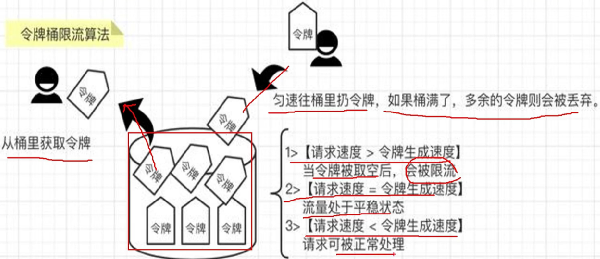

# Study Note

作者：Shijie Yan

---

## 1. 分布式限流

### 1.1 疑问

#### 1.1.1 为什么要做限流？

​	为了防止远超系统承载能力的流量（活动、DDos恶意攻击、突发流量削峰），导致**服务雪崩**（一个服务挂了 -> 拖垮一堆服务 -> 最后整个服务都挂了）。

#### 1.1.2 不是有负载均衡吗，为什么还要做限流？

​	当大流量来时，负载均衡只会“平均分配灾难”，它不会减少总流量！服务器改挂还得挂。但是限流会把总流量限制住，保证整个集群的高可用。

#### 1.1.3 为什么单机限流在分布式环境下会失效？

​	分布式限流主要为了保护**下游资源**（数据库、缓存、第三方入口），如果**单机限流**，下游资源承受的流量就是每台服务器的总和，进而导致流量过大而被击垮。

#### 1.1.4 那为什么不把每台服务器的限流调小点？

​	比如流量大的时候K8s自动扩容，限流阈值总和提高下游资源承受不住；固定服务器数量的话流量小的时候，会导致资源的浪费；运维还要根据流量动态调整，灰度发布延迟生效.......，所以分布式限流是最完美的解决方式。

### 1.2 分布式限流策略

#### 1.2.1 令牌桶算法



```java
/**
 * @Classname TokenBucketRateLimiter
 * @Description 令牌桶限流器
 * @Date 2025/11/14 20:39
 * @Created by YanShijie
 */
@RequiredArgsConstructor
public class TokenBucketRateLimiter implements RateLimiter {

    private final RedissonClient redissonClient;

    /**
     * 尝试获取一次访问权限
     *
     * @param key         Redis 中的限流 key（通常是接口名 + 用户ID 等组合）
     * @param limit       窗口内允许的最大请求数（即令牌桶容量 + 每秒生成令牌数）
     * @param windowSize  窗口大小（秒），也就是每 windowSize 秒补充 limit 个令牌
     * @return true 表示获取成功（允许通过），false 表示被限流
     */
    public Boolean tryAcquire(String key, int limit, int windowSize) {
        // 获取或创建一个分布式限流器对象
        RRateLimiter rateLimiter = redissonClient.getRateLimiter(key);

        // 尝试设置限流速率（只会真正设置一次，后续调用无效）
        // RateType.PER_CLIENT 表示每个客户端（这里其实是每个 key）独立限流
        // limit 个令牌，每 windowSize 秒产生一次（相当于每秒产生 limit / windowSize 个令牌）
        rateLimiter.trySetRate(RateType.PER_CLIENT, limit, windowSize, RateIntervalUnit.SECONDS);

        // 尝试消费 1 个令牌（默认就是1个）
        // 有令牌返回 true，无令牌返回 false
        return rateLimiter.tryAcquire();
    }
}
```

## 2. 可重入锁

### 2.1 疑问

#### 2.1.1 为什么要有可重入锁？

​	解决线程对自己**已经持有的锁再次获取**时不会发送**死锁**的问题。可重入锁不是为了性能，而是为了正确性与编程的便利性。没有可重入性，多线程代码会到处埋雷，几乎没法写复杂逻辑。这也是为什么 Java 的 synchronized 和 ReentrantLock 默认都是可重入的——因为实际开发中不可重入锁基本用不了。

#### 2.1.2 为什么使用计数器这种方式？

​	既可以实现**可重入**避免**死锁**（每次`unlock`后`count`只减少`1`），也可以实现**精确释放**避免锁**过早释放**（只有`count`归`0`时才可以释放）。

#### 2.1.3 有计数器为什么还要设置有效期？

​	分布式环境下几乎所有锁都要设置有效期，方式线程获取到锁了，但是因为一些原因（进程崩溃、机器掉电、网络分区、GC 长停顿、容器被 kill......）线程还没来得及释放锁就挂了，导致新的线程一直访问不了，自己也无法释放。所以要加上有效期防止这种情况。

#### 2.1.4 为什么要使用Lua脚本？

​	分布式锁最怕的就是**部分失败**导致**锁的状态不一致**，Lua脚本把这个流程整体打包为一个**原子性操作**，由Redis服务器一次性执行完是打断不了的。（例如：线程A拿到锁，准备释放，可能中间业务问题锁过期自动删除了，B抢到锁，然后A执行最后的del删除锁结果吧B的锁删除了。）

1. 经典场景：方法间的互相调用

```java
class Widget {
    private final ReentrantLock lock = new ReentrantLock();

    public void methodA() {
        lock.lock();
        System.out.println("做一些事");
        methodB();  // 同一个线程调用 methodB
        lock.unlock();
    }

    public void methodB() {
        lock.lock();   // ← 如果锁不可重入，这里会死锁！
        System.out.println("做另外的事");
        lock.unlock();
    }
}
```

### 2.2 原理 

> Redisson中可重入锁原理。

#### 2.2.1 存储结构

1. `Redisson`使用`Hash`结构存储锁信息


#### 2.2.2 执行流程


