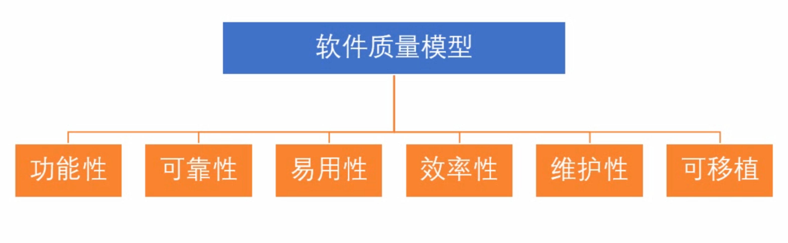
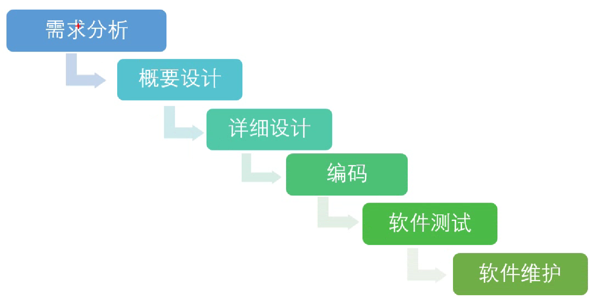
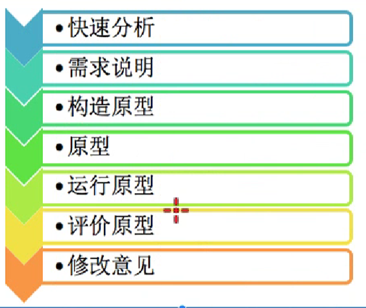
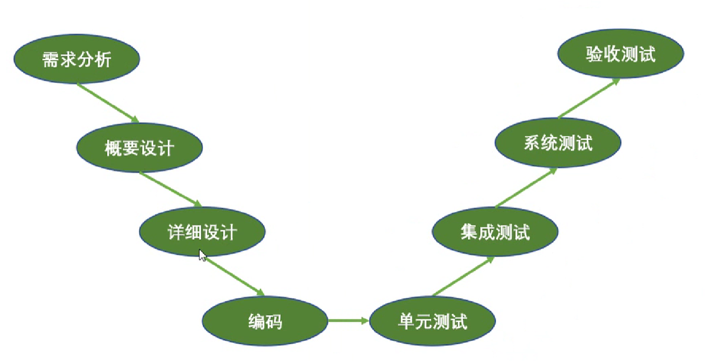
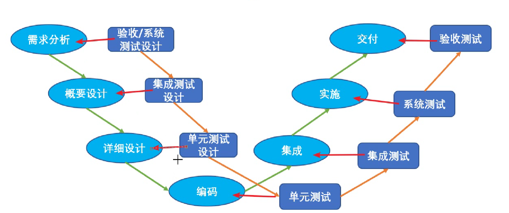

# 基础知识

作者：YanShijie

---

## 1. 软件产品质量模型

### 1.1 六大特性

1. 功能性：能够满足明确和隐含的要求
2. 可靠性：能够处理异常情况，在错误中很快恢复
3. 易用性：易懂、易学、易用
4. 效率性：占用少量资源，提供适当功能
5. 维护性：产品可被修改的能力
6. 可移植：产品从不同环境迁移的能力

## 2. 软件测试分类

### 2.1 按照是否覆盖源代码分类

1. 黑盒测试：不关注底层代码怎么实现的，只关注输入输出满足需求，需求可不可以实现。

2. 白盒测试：关注实现的代码细节

3. 灰盒测试：即关注用户需求可不可以实现，又关注技术的实现，但是不像白盒一样只关注到代码中的细节。

### 2.2 按照阶段划分

1. 单元测试：对软件中最小可测单元进行的测试
2. 集成测试：在单元测试的基础上，对多个单元组装后的产物进行测试
3. 系统测试：在集成测试的基础上，把软件看作一个整体进行测试。
4. 验收测试：也叫交付测试，以最终用户的角度确认软件是否符合日期。

### 2.3 按照是否运行划分

1. 静态测试：不运行代码的情况下。
2. 动态测试：运行代码的情况下。

### 2.4 按照是否自动化划分

1. 手工测试
2. 自动化测试

### 2.5 更多分类

1. 冒烟测试：对基本功能，主要功能进行的测试，避免测试资源的浪费。
2. 回归测试：验证在代码发生修改之后，原来“已经正常工作的功能”有没有被破坏。
3. 随机测试：假设第一次接触软件进行的测试，避免惯性思维。
4. 探索测试：同时做测试设计，测试执行，探索复杂场景，容易被忽略的场景。

## 3. 软件开发过程（模型）

### 3.1 瀑布模型

### 3.2 快速模型

        
     

## 4. 软件测试模型

### 4.1 V模型

### 4.2 W模型

## 5. 软件缺陷（BUG）

### 5.1 定义与标准

1. 软件程序中存在的各种问题以及错误
   - 未达到需求规格说明书标明的功能。
   - 出现了需求指明不会出现的错误。
   - 超出了需求范围。
   - 未达到需求虽未指明，但应该达到的目标。
   - 软件难以理解，不易使用，运行速度慢。

### 5.2 缺陷报告

1. 关键因素
   - 缺陷ID
   - 缺陷状态
   - 缺陷标题
   - 严重程度
   - 优先级
   - 详细信息

